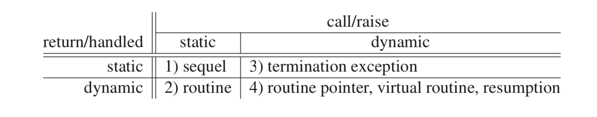
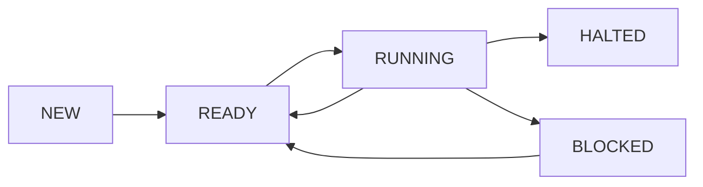

# CS 343: Concurrent and Parallel Programming

## Intro

- Peter Buhr
- website: https://www.student.cs.uwaterloo.ca/~cs343/people.shtml
- office: DC 2504
- instructional support coordinator: Olga Zorin (doctor notes, missing stuff, etc)
- grading question? go and see IA
- use buttons on assignment page to test / confirm compilation
- one late day for assignment 6 (Wednesday is the real due date)
- use FAQ
- see sample code-files; don't need to cite [link](https://www.student.cs.uwaterloo.ca/~cs343/codeExamples.shtml)
- c++17, gcc 9 for microC++

## Review

- routine documentation; comments to give overview AND to explain tricky portions of the code
- variables should be accompanied by a comment describing their purpose if that is not obvious
- Group of statements performing a non-trivial task should be preceded by a comment summarizing that task
- always use modularity - break down code into its functional components
- routine should perform exactly one operation
- for command line operations: must handle errors, print messages, and terminate
- ==premature optimization is the root of all evil==
- align comments at a particular column
- Global macros and types are allowed while global variables are strongly discouraged
- one situation where global variables can be used: simulation a module or package
- ==dynamic allocation must only be used when a variable's storage must outlive the block in which it is allocated OR for dynamic allocation of objects where you must use the constructor and pass in a param==
- use `const float PI = 3.14` instead of `#define PI3.14`
- closing brackets must start on a separate line, ==good habbit to leabel them== like `} // end if`
- ++, -- can only be used as statements, they cannot be used as part of expressions
- prefer += 1 to ++ etc
- only use `this` if you have to

```
// instead of this (which is illegal)
[x, y] = f(a, b)
do f(&x, &y, a, b) and set x's, y's values there
```

***

## Chapter 0: Intro
- why concurrency?
    - processor speed has stalled
    - need parallelism to increase speed
    - Moore's laws: every 18 months you can double the number of transistors
    - can't make them run faster (speed of light, heat); use more cores
    - can't keep writing sequential programs

****

## Chapter 1: Control Flow (Review)

### Advanced Control Flow
- multi-loop exit: 
    - one or more exit locations within the body of a loop; not just top or bottom
    - eliminates duplicated code
    - a loop exit should never have an else clause
    - eliminate flag variables
    - allow multiple exit conditions

```c++
// Ex 1
cin >> d
while (good) {
    cin >> d
}

vs

for (;;) {
    cin >> d
    if (!good) break
}

// Ex 2
// Bad:
for (;;) 
    S1
    if (C1) then S2
    else break
    S3

// Better
for (;;)
    S1
    if (!C1) break
    S2
    S3
```

### Static Multi-Level Exit
- exit multiple control structures where exit point is KNOWN at compile time
- label all exits (`break LX // exit LX`)
- tip, forget indentation. line up break statements with the loop or block they are breaking from!
- occasionally a flag var is useful

```c++
// works in uC++ and Java; not in C / C++
L1: {
    L2: switch () {
        L3: for () {
            break L1 // exit block
            break L2 // exit switch
            break L3 // exit loop
        }
    }
}
```

### Dynamic Memory Allocation
- use the stack, not the heap (in general)
- going to heap is expensive; must delete

```c++
// GOOD
cin >> size
int arr[size]

// BAD
cin >> size
int * arr = new int[size]
...
delete [] arr
```

- DO use heap in these cases

```c++
// variable's storage must outlive the block
Foo * getFoo() {
    Foo * f = new Foo();
    return f;
}

// amount of data read is unknown
vector<int> input // DYNAMIC sized data structure, uses heap
int temp
for (;;)
    cin >> temp
    input.push_back(temp) // implicit dynamic allocation
    
// when an array of objects must be initialized using object's constructor
// recall --> use unique_ptr's
Foo * data[size]
for (...)
    data[i] = new Foo(id) // Foo constructor needs a param
...
for (...)
    delete data[i] 

// when large local variables are allocated on a small stack
void small_routine() {
    int arr[100000] // overflow, BAD
}
void small_routine() {
    int * arr = new int[100000] // GOOD
}
```


## Chapter 2: Dynamic Multi-Level Exit

- routine activation (call, invocation) has complex control flow
- among routines (h calls g calls f returns to g returns to h)
- cannot return from f to h directly ??????
- modularization

```c++
// modularization
// ex: labels have routine scope
B1: for ...
    B2: for ...
        if (...) break B1
        
to

int rtn() {
    B2: for ...
        if (...) break B1 // CANNOT FIND B1
}
B1: for ...
    w = rtn()
```

- example of ==non-local transfer==
  - h calls g calls f
  - h wants to set a place that f will transfer back to (recall: labels are local scope) (we can skip g)
  - but what you can do is have a global variable label
  - these labels are constants; at compile time it knows where to go; this is why using a variable label helps you change where to go at compile time
  - sometimes we can have recursive functions. if L1 is declared in the recursive function h, then there are multiple L1 variables that have been declared! in which frame do you go? but what if you set the variable only on the 6th recursive call? this means you want to transfer to the L1 in the 6th call, and skip the first 5
  - also, when g (which is recursive) gets skipped as f skips over it to h, then f will skip over ALL recursive calls of g
  - so, we also need to store the FRAME on the STACK for the variable (location within the frame) then you know where to jump to
  - if you're in C++ and you want to go from f to h and skip over all g frames, then it might be more of a walk than a go-to because, as you go, you need to call all of the destructors for memory allocated on the heap
  - C has this capability (jmp_buf, setjmp, longjmp)

```
label L
void c(int i) {
	if (i == 1) goto L;
}
void b(int i) {
	c(i)
}
void a() {
	L = L1
	b(1)
L2:
	print("bye")
L1: // ---> f jumps to here from c; doesn't return from b
	print("hi")
}
```


### 2.1 Implementation

- compares throw/catch to variable label and goto
- TIP: see slide 11 for help on assignment 1

### 2.2 Traditional Approaches

- return code: returns a value indicating normal or exceptioonal execution
- status flag: like `errno` variable in UNIX; this is the place where errors put additional information
- Fix-up routine: global or local routine called for an exceptional event to fix-up and return a corrective result so a computation can continue

- can we force the programmer to look at these return codes?
- `optional` type is one option; `variant` is better
- varaint: you can have many things inside of it; helps to force checking, but still possible to ignore; still can only return 1 level at a time

### 2.3 Exception Handling

- is a dynamic multi-level exit (don't really know where the thrown exception will be caught)
- exception usually occurs with low frequency
- EHM execution handling mechanism

### 2.4 Execution Environment

- when you exit a {} (which is, basically, a local lambda function) and if code inside of it creates a variable, then when you exit that stack from (which it basically is) you need to call dfestructors for all of those variables
- when you have multiple stacks, the execution environment gets even more complex
- 1 stack: exception thrown, goes down stack trying to be caught. if not caught, program has error
- many stacks: get to bottom of 1 stack, should you cause error for all other stacks? you have a new dimension for you can do with exceptions

### 2.5 Terminology

- execution: language unit in which an exception can be raised, usually with its own runtime stack (any routine)

### 2.6 Static/Dynamic Call/Return



- Static: things that you can tell about your program when it is not running
- dynamic: program must be running to know
- dynamic return AND static call: **routine call**
  - you call foo() -> you know where you are going
  - you return from foo(): if it is called from multiple places, it must know where it must return to
- Dynamic return AND dynamic call: **routine pointer, virtual routines**
  - dynamic call: you don't know which routine is going to be called until you evaluate the pointer (think of inheritance)

### 2.7 Static Propagation (Sequel)(Static Return)

- sequel: has a static call AND a static return; you always know statically where it is going to go after
- rule: after is finishes, it goes to the just outside the END of the block in which it was DECLARED
- sequel is a nested routine
- ==If break X is going to break out of innermost for-loop, then the corresponding sequel for it must be written in that innermost for-loop==
- Disadvantage: only works for monolithic programs

```
for ... {
	sequel S1(...) { ... } // nested routine
	void M1(...) { // assume you can declare a nested function here
		...
		S1()...
	}
	... other stuff ...
	... other stuff ...
}
// S1 statically returns here!!!!
```

### 2.8 Dynamic Propogation

- Cases 3 (termination exception), 4

- Static return, dynamic call (dynamic multi level exit)

- Termination:

  ```
  void f {
  	throw E() // dynamical call, needs to find which catch clause
  }
  int main {
  	try {
  		f()
  	} catch (E) {
  		...
  	}
  	
  	try {
  		f()
  	} catch (E) {
  		...
  	}
  	
  	try {
  		// copy the code from f
  		// f
  		...
  		...
  		//throw --> instead of throw you call sequel()
  		sequel()
  	}
  }
  ```

  - Don't know statically where it will return to
  - **Throw: This is a dynamic call (a strange call)**. Throw E is supposed to find the appropriate handler (catch clause), then it executes the code in the catch clause (which is a routine). O(n) call.
  - Now we finish a catch, where do we return to? The next line. This is a static return.
  - Sequels: you pick them up, and put them in the block you want to terminate. So if you want to terminate the try block, then you make the catch a sequel, and put it inside the try block

- ==Note: microC++, don't try and check the return code of opening a file. You need to check for exceptions.==

  - Except for end of file

- **Retry**: each func has a contract it must fulfill; instead of catch, call retry, and then do try again, unless you break to finish to exit; can be simulated using a while loop

- **Resumption**: provides a limited mechanism to generate new blocks on call stack

  - Instead of throw, do resume(E). While looking for the catch in O(n), it does NOT unwind the stack
  - ==In catch, you are to FIX the problem, and after the catch it goes back to next line after the resume call==
  - Better, just use a fixup function pointer (pass it all the way up to fix the code if there is an error)

- Throws do recovery; fixups do correction

- Exceptional Example

  - unGuarded block = no catch clauses
  - When you `throw` you start on the NEXT block on the stack, don't continue in current block you are in (look at throw in C5, it does not go and check C6) 
    - Option 1: Want to do a resumption? Initial throw should have be a `resume` (and so would not have unwound the stack)
    - Option 2: retry, you go back to B2 and retry
    - Option 3: terminate, exit out of B2 and continue to next line of code in B1
  - Note: can never put anything in middle of stack, must go to top of stack
  - You can pass a pointer from the block of the exception down the stack to the catch clause


## Chapter 3: Coroutine

- Coroutine: a routine that can also be suspended at some point and resumed from that point when control returns

  - Execution location:

  - Execution state:

  - Execution status:

  - H -> G -> F -----> H' -> G' -> F (original F)

  - Does not start from the beginning of each activation; it is activated at the point of last suspension

  - In contrast, a routine always starts at the top for new activation

    ```
    call G (starts at 0)
    at G line 10, G co-calls F
    F runs from line 0 to 15, then suspends back to G
    G starts at 0 again
    at G line 10, G co-calls F (starts at line 16)
    F run from line 16 to 25, then suspends back to G
    G starts at 0 again
    at G line 10, G co-calls F
    F run from line 26 to termination
    ```

  - Coroutines execute synchronously (no concurrency)

- Recall: a variable that tells you where to transfer to is a flag variable (typically a global var)

- Semi-Coroutine:

  - It's how you use it that makes it a semi

- Full-Coroutine:

  - It's how you use it that makes it a full

- `_Coroutine`

  - Must have member routine called **main** (is the actual co-routine)
  - Main routine must be private
  - `suspend()`, `resume()` (hide these from the interface)
  - Inherits from type `uBaseCoroutine` magically
    - Can give it a name, adjust the stack size (uses that name for error messages)
    - You can ask who resumed you, which coroutine resumed me?
  - Only ever remembers the **last resumer; no stack growth**; just context switches
  - first resume is a co-call; always starts at the top of the coroutine main function. before it can do this it has to create the co-routine stack.
  - when deleted, a co-routines stack unwinds and all destructors are executed. even if it is running through an infinite loop, when you are finished with the object then it will be deleted and everything will be okay
  - ==do NOT use catch(...) in a co-routine==
  - ==you CAN talk to a coroutine after its main ends... but just make sure those public member routines do NOT call `main` as that will cause an error==
  - trick: put `resume()` in the coroutine constructor (for example, to get the ready for the first input)
  - most of the time, you only need to put variables in the `main`, but if you want them to be accessible inside of the destructor then they need to be class private variables
  
- Correct Coroutine Usage

  - flag variables aren't like they used to be; they look different now, and we still want to avoid them; need to let the coroutine do the work (it knows its previous state)

  ```
  for i from 0 to 10
  	if i is even // --> this is a state calculation, no zen no chill
  		even += digit
  	if i is odd // --> this is a state calulcation, no zen no chill
  		odd += digit
  	suspend()
  ```

  ```
  fn1 fn2
  fn1 = 0
  fn = 0
  fn1 = fn
  suspend()
  fn = 1, fn2 = fn1, fn1 = fn
  suspend()
  for (;;)
  	fn = fn1 + fn2
  	fn2 = fn1
  	fn1 = fn
  	suspend() // this is zen
  ```

- coroutine construction

#### 3.2 uC++ EHM:

- exception handling mechanism
- superset of C++
- **must use a specific type to throw** (CPU caught fire, disk explosion, etc)

#### 3.3 Exception Type

- u++ restricts exception types to those defined by`_Event`
- has all the properties of a class

#### 3.4 Inherited Members

- msg is printed if the exception is not caught
- `sourceName` find out who sent the exception
- you can get the ADDRESS of the source (must be sure that the source still exists) and you can send something back to it
- defaultTerminate, defaultResume, you get to decide what to do if this is not caught
- two full passes ? first go and see if someone can fix it, then see if someone can recover

#### 3.5 Raising

- `_Throw`
- `_Resume` [exception type] [ `_At` uBaseCoroutineID]
- _At allows the specified exception or the currently propagating exception tobe raised at another coroutine or task
- you can only resume an exception at someone else; you can't throw at someone else
- when you resume at someone else, it does NOT unwind their stack

```
class B
class D extends B
void f(B t)
	throw t
D m
f(m)
// f throws a B, not a D. truncates the information to the base class

if you did _Throw t using uC++ then it will throw a D!!! So you can catch a child class by throwing a child class
```


#### 3.6 Handlers

- termination: just done with catch clauses; ==_Throw -> _Catch==
- resumption: ==_Resume --> _CatchResume== (try to fix things)(must appear BEFORE catch clauses)
- ==handlers are routines. when you run a handler it doesn't get shoved in the middle of the stack, it gets put at the top of the stack==
- In Foo / CatchResume example, you can access i even though its out of the scope of the CatchResume (because that is a routine, put at top of stack, i is WAY down the stack) but magic lets it work...
- resumption handler cannot perform a break, continue, return, or rethrow; 
- recall: _CatchReturn DO NOT rewind the stack!! if they can leave, then that's a static return, but a _CatchResume is a dynamic return
- ??? recall that when you throw in a handler... it doesn't look at the other handlers in that current scope ???? ish
- this is a mess ;(
- default resume does a throw of R??? noone can fix it, then it goes back to top of stack and throws, so it can match with a catch; **so you get 2 changes to first try and fixup and, if that fails, then throw**

#### 3.7 Nonlocal Exceptions

- `_Resume`, ..., `_At`
- resume exception A at c (Coroutine c)
- you've sent an exception to that Coroutine
- non-local exceptions and texting:; sent a text message E over to friend c
- E gets hooked onto c... then you call c (call a member function to make it resume)
- recall: not concurrent yet; only 1 thing running at once right now
- suppose you had just called suspend from coroutine... when you wake up from suspend() it checks if you have received an error texted to you... if so, then you resume the text message.. once you've handled the error (catchresume)... then you go back to suspend and continue from next line
- if A sends B a _Resume E, then B is the one that resumes it, not A
- you have to OPT IN to getting these messages; you don't need to to opt out
- `_Enable` allows nonlocal exceptions
- exceptions are queued up, delivered in FIFO order
- _Resume E means you will go down your stack (throw it, look for a handler)
- "you catch it with a catch resume" --> in this example, he doesn't have a catch resume.
- 1. it looks for a catch resume
  2. if it goes down stack and doesn't find it, it will go back to top and throw and try and recover???
- handlers are routines; routines have params;
- if coroutine terminates, then stack is cleared, and so are all the exceptions that have been hooked

- magically throw an exception to another coroutine?
  - throw e, gets to bottom of stack, not handled, so it throws the default terminate, and it terminates the program... but, uC++ says NO, we still have options. so it will ignore the default terminate and for this special coroutine case it will instead do an `_resume unhandled exception`.  
  - forces you to do the right thing; the resumer is the one that can probably recover the best
  - this is where you hook an exception from FAULT loc to the SOURCE
  - **Exception UnhandledException are always enabled**


#### 3.8 Memory Management

- each coroutine has its own stack; default is 64K; if you want it to be larger then you need to say so in ints constructor (recall each coroutine inherits from uBaseCoroutine)
- `verify()` checks for stack overflow and if error then prints a message

#### 3.9 Device Driver

#### 3.9.3 Producer-Consumer

- producer needs to know who the consumer is, so producer is constructed with the consumer
- in the semi-co routine version, producer wouldn't need to be a coroutine
- false statement from before: when a coroutine goes off end of main, it suspends and resumes at resumer
  - wrong
  - instead, it automagically goes to end of starter, which is coroutine that first resumed
  - so prod started cons, so prod is the starter
  - coroutine knows who that starter and resumer is
  - so go to end of main, you suspend to the STARTER
  - if I start you, and I resume you, then I cant tell the difference when you come back to me (starter and resumer are the same)
  - but what if the 2 are different?
- who started prod? (main did)

#### 3.10 Full Coroutines

- full-coroutine has a cycle

- come in to front:

  - make some coroutine inactive (the current coroutine)
  - `uThisCoroutine` tells you which coroutine you woke up in, or which coroutine you are going to sleep in
  - `uThisCoroutine` tells you which stack you are in (who does it belong to)

- back part:

  - suspend() --> wake up the last resumer (hidden away inside the coroutine)
  - resume() --> wake up this

  ```
  create fc
  call fc.mem()
  that calls resume() // this is fc, uThisCoroutine() is main
  // you only do context switches at suspends and resumes
  enter front of resume()
  make something inactive (which is uThisCoroutine, which is main in this CONTEXT)
  make something active (make this active, which is fc)
  context switch to fc
  create the stack; enter fc::main, uThisCorotuine now points to this
  now enter resume() (#2)
  make something inactive (this)
  make something active (this)
  // context switch in and out back and forth to itself
  
  ```

- anytime you want to create a cycle, you need to have a special case that takes the two ends of the cycle and connects them
- stopping it hard too, because a coroutine goes back to its starter
- its ok to delete a co-routine that still has a stack; it will clean up its stack

##### Ping Pong

- first resume is magic, remembers who the starter is (main)

```
ping came into cycle, called resume()
```

- when pong ends, it goes to end of main, goes back to start (ping), and pong deletes its stack
  - then ping finishes, runs off end of main, and goes back to its starter (which is main)
  - then main deletes both ping and pong, which are just objects at that point (because both of them have run off the end of their main and their stacks are gone)
- if ping ends first
  - runs off end of ping::main, goes back to starter (main)
  - main then deletes ping and pong
  - ping is an object (ran off its main)
  - pong is a coroutine (has not run off its main)
  - but this is okay :) 


## Chapter 4: More Exceptions (Oct 1)

- Derived exceptions

  - There is a hierarchy of exceptions (File -> IO -> Exception, etc)
  - Now if I catch IO, then I can also catch any children of IO (like File, Network)
  - Now 1 exception --> many possible catchers
  - ==Now, ordering is important==

- Catch by value or by reference?

  ```
  struct B {}
  struct D : public B {}
  
  try {
  	throw D()
  } catch (B e) { // D is truncated into a B (child parts chiopped off)
  
  }
  
  try {
  	throw D()
  } catch (B & e) { // caught by reference, will preserve that it is a D
  	is e a D ? you can cast and check, it still has that information
  	dynamic_cast...
  }
  ```

- Recall: `_Throw` does NOT truncate

- Catch Any

  - `catch(...)`

- Cool

  - Catch errors my reference, and also store information inside of errors by reference. That way you can send a struct, catch resume it, change a value, and then resume it from the next line, but its error-causing value has been changed

- Exception list

  - Part of a routine's prototype which specifies which exception types may propagate from the routine to its caller

  - ```
    // java
    int foo() throws DivideByZeroException, FooException, ..., ... {
    
    }
    ```

  - Checked exceptions: happen at compile time
    - What's wrong with this? Java developers just ignore them (catch(Exception e) {})
      - Also, can't write generic functions template<class T>....
      - What if different T's throw different exceptions?
      - Pointers, virtual, resumption are dynamic calls dynamic returns
      - Also bad for inheritance. Parent function doesn't throw. Child function does. What a mess
  - Unchecked exceptions: happen at run time

### 4.5 Destructor

- You can raise exception from destructor in c++ ???

- Currently, all destructors are marked as noexcept

- `~C() noexcept(false) { throw E(); }`

- ```
  try {
  	C x;
  } catch (E) { // when x reaches the end of the bracket, its destructor is called
  	// so then it is caught here
  	
  }
  ```

- Destructors are the ONLY thing that can intervene during propagation (going down stack, try to match exception with a catch clause)

- While it's going down, it doesn't execute any code, unless its a destructor

- Propagating down, run a destructor, it throw, and now you have 2 exceptions going down!!!!

- What do you do with > 1 exceptions?

  - How do you start another exception?

## Chapter 5: Concurrency (Sept 26)

- Thread: independent sequential execution path through a program
  - Scheduled for execution separately and independently from other threads
  - Sequential execution
  - Exists in "theory", our application does not SEE it or touch it or manipulate it
- Process: program component (like a routine) that has its own thread
  - Usually has its own memory, has its own address space
  - A human is a process with its own address space
- Task: small process; similar to a process except
  - Reduced along some particular dimension (boat vs ship)
  - Tasks share common memory
  - Sometimes called a light weight process (LWP)
  - Tasks appear IN an address space
  - Al of the thoughts going on inside a human are the tasks in that human
- Parallel Execution: 2 or more operations occur simultaneously, needs multiple CPUs
- Concurrent Execution: any situation in which execution of multiple threads appears to be performed in parallel
  - NOTE: coroutines are NOT concurrent, but they have their own stack (so, multiple stacks but only one thread)
  - Next, we will go to multiple stacks AND multiple threads
  - A concurrent program can run on a computer with 1 CPU
  - Ideally, you write a concurrent program and it runs on multiple CPUs

### 5.1 Why Write Concurrent Programs?

- Sometimes its the best way to solve a problem; need to take advantage of all of the cores that computers now have
- How to divide a problem into multiple tasks?

### 5.2 Why Concurrency is Difficult...

- To understand
- To specify
- To debug
  - Different speeds, different orders, execution is not repeatable
  - "Heisenbug" -> the act of using debug statements (looking at your program) changes it

### 5.3 Concurrent Hardware

- Tasks can access the same shared memory
- Tasks can be on different CPUs
- Network vs distributed system
  - Different laptops, want them each to interact, you can have parallelism but there are separate address spaces, no shared memory

### 5.4 Execution States



- `inc I` instruction, increments I, and transitions can only occur before or after instruction, not during (not during loads, adds, set assembler code)
  - Recall: can only do arithmetic in registers

### 5.5 Threading Model

- Defines relationship between threads and CPUs
- Can go down a level, and have a virtual machine
- Can go up a level, and have nano threads
- Why have user threads? Application to kernel boundary is very expensive; but from user threads to user scheduler, we don't need to go through the kernel, much lighter weight. Also, locking is much faster there too

### 5.6 Concurrent Systems

1. Give concurrent program to a parallel compiler, and it does magic (IMPLICIT)

   1. A sequential program can never take advantage of parallelism
   2. Must transform sequential to concurrent

   3. These magic compilers only work on certain types of problems

2. Write some of it in concurrent mindset, give hints about what should be concurrent, then let the magic compiler do it (IMPLICIT, but slightly less)
3. White concurrency through explicit constructs (EXPLICIT)

- As concurrency increases so does the complexity

### 5.7 Speedup

- Program Speedup is $S_c = T_1/T_c$ where C is number of CPUs and $T_1$ is the sequential execution
- Typically we have non-linear (log, sort) speedup
  - Bottlenecks
- Always tiny bits of sequential code in a parallel program
- Ex
  - Matrix multiplication
  - Multiply all in parallel
  - But you need to read it in sequentially
  - Need to sum up totals, and print, and that is sequential too
- Amdahl's Law:
  - $S_C = \frac{1}{(1 - P) + P/C}$
- Critical Path: the path of operations which is the bottleneck for code; if you want to speed up your code, you need to speed up the critical path
- Sometimes your scheduler will mess everything up for you always :/


### 5.8 Thread Creation

- 


