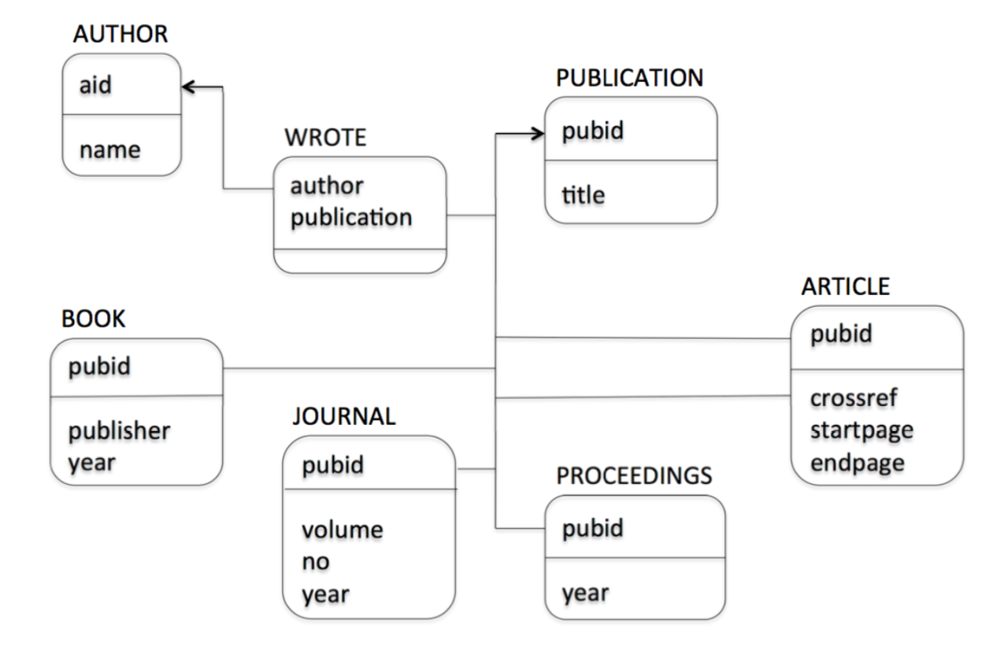

# CS 348: Intro to Databases

- David Toman; office hours Wed 4-5pm DC 3344
- Key Parts
    - Why do we use databases?
    - How do we use a Database Management System?
    - How do we design a database?

## Lec 01: Intro to Database Management (Sept 5)

- persistent data: information is stored long-term, persists after power is turned off
- early data management: lots of redundancy, duplication
- file processing
    - data stored in files located on disk drives with a file system interface that supports various access methods
    - one file used by many programs
- database approach: another layer of abstraction; records of data; programmers don't need to worry about DB implementation; just program to an interface
- what is a database?
    - a large and persistent collection of data and metadata organized in a way that allows efficient retrieval and revision
    - data: John's age is 43
    - metadata: there is a concept of an employee that has a name and an age
- what is a data model?
    - determines the nature of the metadata and how retrieval and revision is expressed
    - defn: Database Management Systems (DBMS): a program (or set of programs) that implement a data model
    - ex: db = file cabinet; data model = folders and papers; dbms = system that determines how data is inserted 
- Database Management System (DBMS)
    - ==main idea==: abstract common functions and create a defined interface
    - supports an underlying data model (all data stored and manipulated in a defined way)
    - access control (data can only be accessed or changed by authorized people)
    - concurrency control (multiple concurrent applications can access data)
    - database recovery (reliability; backups done in organized way)
    - database maintenance (revising metadata)
- Schema and Instance
    - defn: Schema: collection of metadata conforming to an underlying data model
    - defn: Instance: collection of defined data (records) conforming to the schema
- History
    - Hierarchical data model: only allows 1:N parent-child relationships (tree)
    - Object-Oriented DBMSs
        - you can create an object, and it can be persisted (entire object stored on DB)
        - supports inheritence
- Three Level Schema Architecture
    - external schema: what the application programs and users see
    - conceptual schema: description of the logical structure of ALL data in the db; all the rules ==(Abstract Data Type; the interface)==
    - physical schema: description of physical aspects (how data is mapped to data-structures); storage algorithms
- Data Independence
    - idea: TODO
    - physical: TODO
    - logical: modularity; WAREHOUSE table cannot be accessed from payroll app; EMPLOYEE table cannot be accessed from inventory app
- Transactions
    - when multiple apps access same data, bad things can happen
    - idea: every app thinks it is the sole app accessing the data; DBMS should guarantee correct execution
    - defn: transaction: an application-specific atomic and durable unit of work
    - properties (ACID)
        - Atomic: TODO
        - Consistency:
        - Isolated:
        - Durable:
- Interfacing to the DBMS
    - Data Definition Language (DDL): for specifying schemas
        - may have different DDLs for external schema, conceptual schema, physical schema
        - make tables, what attributes do they have?
    - Data Manipulation Language (DML): for specifying retrieval and revision requests
        - what are the contents of the tables? what records exist? question the instances
        - navigational (procedural)
        - non-navigational (declarative)
- Types of DB Users
    - end user:
        - access to db indirectly; uses query-generating applications or generates ad-hoc queries using the DML
    - app developer:
        - designs and implements app that access the db
    - database administrators (DBA)
        - manage schema; defines internal schema; loads and re-formats db; responsible for security and reliability

## Lec 02: The Relational Model (Sept 10, 12)

- How to ask the right questions?
  - Ex: Find all pairs of natural numbers that add to 5 --> {(x,y) | x >= 0 and y >= 0 and x + y = 5}
    - you can just have an edition table of x, y, and their sum; don't need to know anything about addition
  - Ex: Find all employees who work for Bob? 
    - again, have another table from employee name -> Boss
    - EMP(name, dept, boss)
    - query: {(x,y) | EMP(x,y,Bob)}
  - Ex: Find pairs of employees working for the same boss!
    - query: $\{(x1, x2) | \exists y1, y2, z | EMP(x1,y1,z) \and EMP(x2,y2,z)\}$

- The relational model

  - all information is organized in (a finite number of) relations
  - features:
    - simple and clean data model
    - powerful, declarative query languages

- Relational Databases

  - Universe: a set of values **D** with equality (=)
  - Relation: 
    - a predicate name R, and arity k of R (the number of columns) (==schema, table declaration==)
    - Instance: a relation R contained in $D^k$
  - Database 
    - Signature: finite set $p$ of predicate names (symbols, table names)
    - Instance: **R_i** for each R_i // yes, boldness matters
  - Notation:
    - Signature $p = (R1, R2, \dots, Rn)$
    - ==Instance **DB = (D, =, R_1, ..., R_n)**==
    - ==Clarification: R1 is the TABLE R1, **R1** is the entire instance inside of R1==

- Example of relational Databases: Bibliography

- >  What is the difference between a relation name and a relation instance?
  - relation name is what do you call it (part of meta-data, part of schema)
  - Relation instance is the actual data

- Common Visualization for Relational Database Schemata

  - boxes for each schema; bold text title on top; identification fields (ex: pubid) separated from extra detail fields

  - also, these lines imply that whenever 1 pubid exists, then all of those different instances in those different tables for those different data types will exist, too

- Simple (Atomic) "Truth"

  - relationships between objects (tuples) that are present in an instance are true, relationships absent are false

- Query Conditions:

  - idea 1: use variables to generalize conditions
    - AUTHOR(x,y) will be true of any valuation where $\{x \rightarrow a, y \rightarrow b\}$ exactly when the pair (a,b) in **AUTHOR**
  - idea 2: build more complex conditions from simpler ones using 
    - conjunction (and), disjunction (or), negation
    - quantifiers: existential (there is), exists...

- Conditions in the Relational Calculus

- ==First-Order Variables and Valuations==

  -  ==Valuation function is a function $\theta$== that maps variable names to values in the universe $\theta: \{ x1, x2 \rightarrow \textbf{D}\}$
  - $a \models  b$ means that a entails b (a being true makes b be true)
  - $\theta \models R(x1,...,xk)$ means that the tuple (x1, ..., xk) exists in some table with name R??
    - is (a, b, c) record in table R -> maybe it means a partial record, too?

- Example:

  - find pair of employees working for the same boss

- Equivalences TODO

- Relational Calculus TODO

- Free Variables TODO

  - basically just the variables used in a eqn / formula / query

### Sample Queries

- list all composite numbers (you have an addition and multiplication table)
  - Composite: all non-prime numbers
  - need to find two factors (none of them 1) that multiply together to create the number x
  - $composite = \{ x | \exists y,z | TIMES(y,z,x) \and \neg(x = y) \and \neg(x = z)\}$
  - can't use the constant 1 (don't have that symbol available)
- list of all prime numbers
  - $\{ x | \neg(composite(x))\}$
- list all publications (all their IDs): $\{ x | \exists y | PUBLICATION(x,y) \}$
- titles of all books: 
  - $\{ x | \exists y,z,w | PUBLICATION(y,x) and BOOK(y,z,w)\}$
  -  x is title from PUBLICATION, and book and publication both share same id y
- all publications without an author:
  - $\{ x : (\exists y : PUBLICATION(x,y)) \and \neg(\exists z,w : WROTE(z,x) \and AUTHOR(z,w))\}$
  - Where: y is the publication title, z is author that wrote the publication, w is the name of author
  - Don't actually need the AUTHOR part; if there's no WROTE record relating an author to a publication, then clearly no author write that publication
- All pairs of coauthor names
  - $\{ (x,y) : (\exists w,z : AUTH(w,x) \and AUTH(z,y) \and \neg(w = z)) \and (\exists v,t : PUBL(v,t) \and WROTE(w,v) \and WROTE(z,v)\}$
  - W is the authID of name x
  - Y is the authID of name y
- Titles of publications written by a single author
  - $\{ x : (\exists y : PUBL(y,x)) \and (\exists z : WROTE(z,y)) \and (\forall z' : WROTE(z',y) \implies z'=z)\}$
  - Recall: can't use $\forall$, need to convert it to an $\exists$ 
  - $\neg(\exists z' : \neg(WROTE(z',y) \implies z'=z))$
  - $\neg(\exists z' : (WROTE(z',y) \and \neg(z'=z))$ // should convert implication to logical equivalent instead
  - ==Recall: $\forall x : \beta$ is the same as $\neg (\exists x : \neg \Beta)$==
  - x is publication name
  - Y is publication ID
  - Skip the author table because if z' exists in WROTE then

- Asking Questions and Understanding Answers
  - Find the neutral element of addition: just do PLUS(x,x,x) don't need to do exists y such that PLUS(y,x,x) and PLUS(x,y,x) because addition is COMMUTATIVE and those two are the same

- Laws (aka Integrity Constraints)
  - Addition is commutative
  - Addition is a total function

### Integrity Constraints

- In addition to having the names of our tables, and structure of our tuples, we also have some restrictions on what combinations of value can appear in some instances (because they have to obey our laws)
- For example, in PLUS if you find 0,1,1 then this guarantees that you will find 1,0,1
- Yes/no conditions that must be true in every valid database instance
- Examples
  - Every boss is an employee
    - $\{ \forall x,y,z : EMP(x,y,z) \implies \exists u,w : EMP(z,u,w)\}$
    - For all bosses z this implies there exists other roles (u,w) such that boss z is also an employee
  - Every boss manages a unique department
- Relational signature captures only the structure of relations
  - Valid database instances satisfy additional integrity constraints
    - For all x,y then PUBLICATION(y,x) implies STRING(x)
  - Values of attributes are unique among tuples in a relation (**keys**)
  - Values appearing in one relation must also appear in another relation (ex: bosses must be employees) (**referential integrity**)
  - Values cannot appear simultaneously in certain relations (**disjointness**) (ex: author IDs do not look like publication IDs, so if you see an authorID x then you know that x is not an ID in the publication table)
  - Values in a certain relation must appear in at least one of another set of relations (**coverage**)
- More examples to do (exercise)
  - TODO...
- Views and Integrity Constraints
  - Idea: answers to queries can be used to define derived relations (views); an extension of a DB schema
  - **[UNDERSTAND THIS BETTER]**
- Database Instances and Integrity Constraints
  - Relational database schema:
  - Relational database instance **DB**:

### Safety and Finiteness

- Important: database instances must be **finite**
- Unsafe Queries
  - All y that are not the names of authors (so all strings in your database that aren't names of authors)
  - All x,y,z such that BOOK(x,y,z) or PROCEEDINGS(x,y)
    - Image you have no books and 1 proceedings, then z can be ANY value (infinite results)
  - All x,y such that x = y (returns everything)
  - Domain-Independent Query:
    - The above unsafe queries will end up using all or most of the domain
    - ==If you fix the instance (contents) of the DB, but you fiddle with the domain (currently just English strings, next you put all Chinese strings into it too) then the query better return the SAME answer==
    - TODO write equations
    - Recall: Domain **D1** all of the information (**single values**) (SUE, BOB, ..., ...)
    - All the contents of **R1** must also be in **D1** and **D2**...
    - Unary relations (just 1 value) are a subset of a domain
    - Can only query the intersection of those two domains
  - Domain-Independent Theorem: answers to domain-independent queries contain only values that exist in **R1, R2,...,Rk** (the active domain)
  - active domain: the domain you construct just from the DATA (finite file) I've told you about
  - ==Domain-Independent and finite database implies safe==
- Safety and Query Satisfiability
  - theorem: satisfiability of first-order formulas is undecidable
    - co-r.e. in general
    - r.e. for finite databases
  - theorem: domain-independence of first-order queries is undecidable
    - you cannot write a program to answer "is this db domain-independent?"
- Range-Restricted Queries
  - see defn slide 38
  - want to ensure finite input ==> finite output
  - conjunction: answer to p1 is finite, p2 is finite, so intersection of them is finite
  - equality with conjunction: if one of the equality variables is in p1 then the output is finite
  - existential:
  - disjunction: we require that the free variables (FV) or p1 = the FV(p2); solves the problem of having ANY value fill one of the variable values
  - negations must be stuck in a conjunction: p1 and not(p2); FV(p2) must be a subset of the FV(p1)
  - NOTE: 3 types of conjunction (regular, with equality, with negation)
  - ==Theorem: range-restricted ==> domain-independent==
- What have we lost?
  - (P(x,y) AND Q1(x)) OR (P(x,y) and Q2(y)) (GOOD)
  - <==>
  - P(x,y) AND (Q1(x) OR Q2(y)) // BAD, FV(Q1(x)) = x is not contained in FV(Q2(y)) = y
  - **Look at Q1(x) OR Q2(y)**
    - one way to solve this is (Q1(x) AND ActiveDomain(y)) or (Q2(y) and ActiveDomain(y))
    - ANDing x with the activeDomain(y) (all the possible values of y) restrict the values of x

- computational properties
  - evaluation of every query terminates
  - data complexity:
    - in the size of the database and for a fixed query
    - runs in polynomial time
    - using log space (for every query, you don't need to make copies of the database every, just needs a bunch of pointers to the db)
    - AC_0 (constant time if CPUs running in parallel)
  - combined complexity
    - polynomial space
- Query Evaluation vs Theorem Proving
  - theorem proving: proving for all queries
  - query evaluation: easier, just for this one query
- Query Equivalence and DB Schema
  - TODO
- What Queries cannot be expressed in RC?
  - built-in operations (ordering, arithmetic, string stuff)
  - counting
  - reachability/connectivity
    - much harder

## Lec 03: SQL (Sept 17)

- good: conjunctive queries, set operations
- bad: multiset semantics; null values
- ugly: committee design standards 
- major parts
  - DML (Data Manipulation Language): query and update
    - also, embedded SQL (JDBC); useful for application development
    - help reduce injection attacks (SQL statements compiled ahead of time, can't send strings to attack)
  - DDL (Data Definition Language): define schema for relations; create objects
  - DCL (Data Control Language): access control

## Assignment Talk

### A1

- "course with department D"
  - convoluted rule through PROFs ? (TERRIBLE)
  - missing "dept" in course? if cnum is CS247 then dept is CS; just use SUBSTR --> state your assumptions (YUP)
    - use SUBSTR(X,Y,"CS") pretend there's a substring table
  - put 2 attributes as the key for course, the course number and the depart; lots of repercussions  (need to apply to rest of diagram) (NOT GREAT)
- q3: "among" means for ALL the students that have achieved the highest grade (maybe multiple)
- q6: the max and min for all classes for a given term where that class is in a course taught by a CS or CO professor; all courses in terms
- q10: take all pairs of professors

