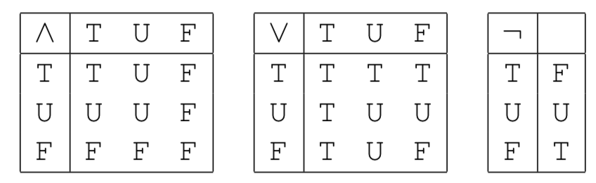

# CS 348: Intro to Databases

- David Toman; office hours Wed 4-5pm DC 3344
- Key Parts
    - Why do we use databases?
    - How do we use a Database Management System?
    - How do we design a database?


## Lec 01: Intro to Database Management (Sept 5)

- persistent data: information is stored long-term, persists after power is turned off
- early data management: lots of redundancy, duplication
- file processing
    - data stored in files located on disk drives with a file system interface that supports various access methods
    - one file used by many programs
- database approach: another layer of abstraction; records of data; programmers don't need to worry about DB implementation; just program to an interface
- what is a database?
    - a large and persistent collection of data and metadata organized in a way that allows efficient retrieval and revision
    - data: John's age is 43
    - metadata: there is a concept of an employee that has a name and an age
- what is a data model?
    - determines the nature of the metadata and how retrieval and revision is expressed
    - defn: Database Management Systems (DBMS): a program (or set of programs) that implement a data model
    - ex: db = file cabinet; data model = folders and papers; dbms = system that determines how data is inserted 
- Database Management System (DBMS)
    - ==main idea==: abstract common functions and create a defined interface
    - supports an underlying data model (all data stored and manipulated in a defined way)
    - access control (data can only be accessed or changed by authorized people)
    - concurrency control (multiple concurrent applications can access data)
    - database recovery (reliability; backups done in organized way)
    - database maintenance (revising metadata)
- Schema and Instance
    - defn: Schema: collection of metadata conforming to an underlying data model
    - defn: Instance: collection of defined data (records) conforming to the schema
- History
    - Hierarchical data model: only allows 1:N parent-child relationships (tree)
    - Object-Oriented DBMSs
        - you can create an object, and it can be persisted (entire object stored on DB)
        - supports inheritence
- Three Level Schema Architecture
    - external schema: what the application programs and users see
    - conceptual schema: description of the logical structure of ALL data in the db; all the rules ==(Abstract Data Type; the interface)==
    - physical schema: description of physical aspects (how data is mapped to data-structures); storage algorithms
- Data Independence
    - idea: TODO
    - physical: TODO
    - logical: modularity; WAREHOUSE table cannot be accessed from payroll app; EMPLOYEE table cannot be accessed from inventory app
- Transactions
    - when multiple apps access same data, bad things can happen
    - idea: every app thinks it is the sole app accessing the data; DBMS should guarantee correct execution
    - defn: transaction: an application-specific atomic and durable unit of work
    - properties (ACID)
        - Atomic: TODO
        - Consistency:
        - Isolated:
        - Durable:
- Interfacing to the DBMS
    - Data Definition Language (DDL): for specifying schemas
        - may have different DDLs for external schema, conceptual schema, physical schema
        - make tables, what attributes do they have?
    - Data Manipulation Language (DML): for specifying retrieval and revision requests
        - what are the contents of the tables? what records exist? question the instances
        - navigational (procedural)
        - non-navigational (declarative)
- Types of DB Users
    - end user:
        - access to db indirectly; uses query-generating applications or generates ad-hoc queries using the DML
    - app developer:
        - designs and implements app that access the db
    - database administrators (DBA)
        - manage schema; defines internal schema; loads and re-formats db; responsible for security and reliability


## Lec 02: The Relational Model (Sept 10, 12, 17)

- How to ask the right questions?
  - Ex: Find all pairs of natural numbers that add to 5 --> {(x,y) | x >= 0 and y >= 0 and x + y = 5}
    - you can just have an edition table of x, y, and their sum; don't need to know anything about addition
  - Ex: Find all employees who work for Bob? 
    - again, have another table from employee name -> Boss
    - EMP(name, dept, boss)
    - query: {(x,y) | EMP(x,y,Bob)}
  - Ex: Find pairs of employees working for the same boss!
    - query: $\{(x1, x2) | \exists y1, y2, z | EMP(x1,y1,z) \and EMP(x2,y2,z)\}$

- The relational model

  - all information is organized in (a finite number of) relations
  - features:
    - simple and clean data model
    - powerful, declarative query languages

- Relational Databases

  - Universe: a set of values **D** with equality (=)
  - Relation: 
    - a predicate name R, and arity k of R (the number of columns) (==schema, table declaration==)
    - Instance: a relation R contained in $D^k$
  - Database 
    - Signature: finite set $p$ of predicate names (symbols, table names)
    - Instance: **R_i** for each R_i // yes, boldness matters
  - Notation:
    - Signature $p = (R1, R2, \dots, Rn)$
    - ==Instance **DB = (D, =, R_1, ..., R_n)**==
    - ==Clarification: R1 is the TABLE R1, **R1** is the entire instance inside of R1==

- Example of relational Databases: Bibliography

- >  What is the difference between a relation name and a relation instance?
  - relation name is what do you call it (part of meta-data, part of schema) R1
  - Relation instance is the actual data **R2**

- Common Visualization for Relational Database Schemata

  - boxes for each schema; bold text title on top; identification fields (ex: pubid) separated from extra detail fields

  - also, these lines imply that whenever 1 pubid exists, then all of those different instances in those different tables for those different data types will exist, too

- Simple (Atomic) "Truth"

  - relationships between objects (tuples) that are present in an instance are true, relationships absent are false

- Query Conditions:

  - idea 1: use variables to generalize conditions
    - AUTHOR(x,y) will be true of any valuation where $\{x \rightarrow a, y \rightarrow b\}$ exactly when the pair (a,b) in **AUTHOR**
  - idea 2: build more complex conditions from simpler ones using 
    - conjunction (and), disjunction (or), negation
    - quantifiers: existential (there is), exists...

- Conditions in the Relational Calculus

- ==First-Order Variables and Valuations==

  -  ==Valuation function is a function $\theta$== that maps variable names to values in the universe $\theta: \{ x1, x2 \rightarrow \textbf{D}\}$
  - $a \models  b$ means that a entails b (a being true makes b be true)
  - $\theta \models R(x1,...,xk)$ means that the tuple (x1, ..., xk) exists in some table with name R??
    - is (a, b, c) record in table R -> maybe it means a partial record, too?

- Example:

  - find pair of employees working for the same boss

- Equivalences TODO

- Relational Calculus TODO

- Free Variables TODO

  - basically just the variables used in a eqn / formula / query

### Sample Queries


- list all composite numbers (you have an addition and multiplication table)
  - Composite: all non-prime numbers
  - need to find two factors (none of them 1) that multiply together to create the number x
  - $composite = \{ x | \exists y,z | TIMES(y,z,x) \and \neg(x = y) \and \neg(x = z)\}$
  - can't use the constant 1 (don't have that symbol available)
- list of all prime numbers
  - $\{ x | \neg(composite(x))\}$
- list all publications (all their IDs): $\{ x | \exists y | PUBLICATION(x,y) \}$
- titles of all books: 
  - $\{ x | \exists y,z,w | PUBLICATION(y,x) and BOOK(y,z,w)\}$
  -  x is title from PUBLICATION, and book and publication both share same id y
- all publications without an author:
  - $\{ x : (\exists y : PUBLICATION(x,y)) \and \neg(\exists z,w : WROTE(z,x) \and AUTHOR(z,w))\}$
  - Where: y is the publication title, z is author that wrote the publication, w is the name of author
  - Don't actually need the AUTHOR part; if there's no WROTE record relating an author to a publication, then clearly no author write that publication
- All pairs of coauthor names
  - $\{ (x,y) : (\exists w,z : AUTH(w,x) \and AUTH(z,y) \and \neg(w = z)) \and (\exists v,t : PUBL(v,t) \and WROTE(w,v) \and WROTE(z,v)\}$
  - W is the authID of name x
  - Y is the authID of name y
- Titles of publications written by a single author
  - $\{ x : (\exists y : PUBL(y,x)) \and (\exists z : WROTE(z,y)) \and (\forall z' : WROTE(z',y) \implies z'=z)\}$
  - Recall: can't use $\forall$, need to convert it to an $\exists$ 
  - $\neg(\exists z' : \neg(WROTE(z',y) \implies z'=z))$
  - $\neg(\exists z' : (WROTE(z',y) \and \neg(z'=z))$ // should convert implication to logical equivalent instead
  - ==Recall: $\forall x : \beta$ is the same as $\neg (\exists x : \neg \Beta)$==
  - x is publication name
  - Y is publication ID
  - Skip the author table because if z' exists in WROTE then

- Asking Questions and Understanding Answers
  - Find the neutral element of addition: just do PLUS(x,x,x) don't need to do exists y such that PLUS(y,x,x) and PLUS(x,y,x) because addition is COMMUTATIVE and those two are the same

- Laws (aka Integrity Constraints)
  - Addition is commutative
  - Addition is a total function

### Integrity Constraints

- In addition to having the names of our tables, and structure of our tuples, we also have some restrictions on what combinations of value can appear in some instances (because they have to obey our laws)
- For example, in PLUS if you find 0,1,1 then this guarantees that you will find 1,0,1
- Yes/no conditions that must be true in every valid database instance
- Examples
  - Every boss is an employee
    - $\{ \forall x,y,z : EMP(x,y,z) \implies \exists u,w : EMP(z,u,w)\}$
    - For all bosses z this implies there exists other roles (u,w) such that boss z is also an employee
  - Every boss manages a unique department
- Relational signature captures only the structure of relations
  - Valid database instances satisfy additional integrity constraints
    - For all x,y then PUBLICATION(y,x) implies STRING(x)
  - Values of attributes are unique among tuples in a relation (**keys**)
  - Values appearing in one relation must also appear in another relation (ex: bosses must be employees) (**referential integrity**)
  - Values cannot appear simultaneously in certain relations (**disjointness**) (ex: author IDs do not look like publication IDs, so if you see an authorID x then you know that x is not an ID in the publication table)
  - Values in a certain relation must appear in at least one of another set of relations (**coverage**)
- More examples to do (exercise)
  - TODO...
- Views and Integrity Constraints
  - Idea: answers to queries can be used to define derived relations (views); an extension of a DB schema
  - **[UNDERSTAND THIS BETTER]**
- Database Instances and Integrity Constraints
  - Relational database schema:
  - Relational database instance **DB**:

### Safety and Finiteness

- Important: database instances must be **finite**
- Unsafe Queries
  - All y that are not the names of authors (so all strings in your database that aren't names of authors)
  - All x,y,z such that BOOK(x,y,z) or PROCEEDINGS(x,y)
    - Image you have no books and 1 proceedings, then z can be ANY value (infinite results)
  - All x,y such that x = y (returns everything)
  - Domain-Independent Query:
    - The above unsafe queries will end up using all or most of the domain
    - ==If you fix the instance (contents) of the DB, but you fiddle with the domain (currently just English strings, next you put all Chinese strings into it too) then the query better return the SAME answer==
    - TODO write equations
    - Recall: Domain **D1** all of the information (**single values**) (SUE, BOB, ..., ...)
    - All the contents of **R1** must also be in **D1** and **D2**...
    - Unary relations (just 1 value) are a subset of a domain
    - Can only query the intersection of those two domains
  - Domain-Independent Theorem: answers to domain-independent queries contain only values that exist in **R1, R2,...,Rk** (the active domain)
  - active domain: the domain you construct just from the DATA (finite file) I've told you about
  - ==Domain-Independent and finite database implies safe==
- Safety and Query Satisfiability
  - theorem: satisfiability of first-order formulas is undecidable
    - co-r.e. in general
    - r.e. for finite databases
  - theorem: domain-independence of first-order queries is undecidable
    - you cannot write a program to answer "is this db domain-independent?"
- Range-Restricted Queries
  - see defn slide 38
  - want to ensure finite input ==> finite output
  - conjunction: answer to p1 is finite, p2 is finite, so intersection of them is finite
  - equality with conjunction: if one of the equality variables is in p1 then the output is finite
  - existential:
  - disjunction: we require that the free variables (FV) or p1 = the FV(p2); solves the problem of having ANY value fill one of the variable values
  - negations must be stuck in a conjunction: p1 and not(p2); FV(p2) must be a subset of the FV(p1)
  - NOTE: 3 types of conjunction (regular, with equality, with negation)
  - ==Theorem: range-restricted ==> domain-independent==
- What have we lost?
  - (P(x,y) AND Q1(x)) OR (P(x,y) and Q2(y)) (GOOD)
  - <==>
  - P(x,y) AND (Q1(x) OR Q2(y)) // BAD, FV(Q1(x)) = x is not contained in FV(Q2(y)) = y
  - **Look at Q1(x) OR Q2(y)**
    - one way to solve this is (Q1(x) AND ActiveDomain(y)) or (Q2(y) and ActiveDomain(y))
    - ANDing x with the activeDomain(y) (all the possible values of y) restrict the values of x

- computational properties
  - evaluation of every query terminates
  - data complexity:
    - in the size of the database and for a fixed query
    - runs in polynomial time
    - using log space (for every query, you don't need to make copies of the database every, just needs a bunch of pointers to the db)
    - AC_0 (constant time if CPUs running in parallel)
  - combined complexity
    - polynomial space
- Query Evaluation vs Theorem Proving
  - theorem proving: proving for all queries
  - query evaluation: easier, just for this one query
- Query Equivalence and DB Schema
  - TODO
- What Queries cannot be expressed in RC?
  - built-in operations (ordering, arithmetic, string stuff)
  - counting
  - reachability/connectivity
    - much harder


## Lec 03: SQL (Sept 17, 19, 24)

- good: conjunctive queries, set operations

- bad: multiset semantics; null values

- ugly: committee design standards 

- major parts
  - DML (Data Manipulation Language): query and update
    - also, embedded SQL (JDBC); useful for application development
    - help reduce injection attacks (SQL statements compiled ahead of time, can't send strings to attack)
  - DDL (Data Definition Language): define schema for relations; create objects
  - DCL (Data Control Language): access control
  
- Data Types
  
  - varchar(n) variable length string (at most n)
  
- Example schema: `AUTHOR(aud integer, name char(20))`

- `SELET DISTINCT <results> FROM <tables> WHERE <condition>`

- Variables vs Attributes

  - usually have many columns; in relational calculus you would need to use lots of variable names
  - corelations in SQL: for every table you only need to invent variable names for what you want, SQL will generate rest of variables for you
  - `{ (p.AID, .NAME : AUTHOR(p.AID, p.NAME\}​`

- Example: List all publications with at least two authors

  ```sql
  select distinct r1.publication
  from wrote [as] rl, wrote r2 // table name and correlation variable
  where r1.publication = r2.publication
  and r1.author != r2.author
  ```

- Example: List titles of all books

  ```sql
  select distinct title
  from publication, book // did not declare correlation variable
  											 // used table name as corr. var. itself
  where publication.pubid = book.pubid
  ```

- **FROM Clause (summary)**

  - `FROM R1 [[as] n1], ..., Rk[[as] nk]`
  - ==where `Ri` is the table, [] means optional, so you don't need `ni` unless you have duplicate table names, and the [as] is optional, too==
  - ==clause represents the CONJUNCTION of R1 AND ... AND Rk==
  - all ni need to be distinct

- **SELECT Clause (summary)**

  - `SELECT DISTINCT e1[[AS] n1], ..., ek [[AS] nk]`
  - you can give names ni to the attributes in the answer
  - e1 is the variable name, n1 is the new name we have given it to use in our output

- Example: for every article list the number of pages

  ```
  select distinct pubid as id, 
  			 endpage-startpage+1 as numpages
  	from article
  ```

- **WHERE Clause**

  - additional conditions on tuples that qualify for the answer
    - standard atomic conditions =, !=, <. <=, ...
    - **conditionals may involve expressions**
      - similar conditions as in the SELECT clause

- Example: find all journals printed since 1997

  ```
  select * from journal where year >= 1997
  ```

- Boolean Connectives: AND, OR, NOT

- Complex Queries in SQL:

  - so far we can write only EXISTS, AND queries
  - remaining:
    - OR, NOT (expressed using SET operations)
    - forall: re-write using negation and EXISTS; same for `==>` and `<==>`

- **Set Operations**

  - note: answers to select blocks are relations (sets of tuples); we an apply set operations on them
  - union: Q1 UNION Q1
  - difference: Q1 EXCEPT Q2 (everything in q1 that's not in q2)
    - ==p1 and not(p2) ==> we said earlier that the FV(p1) must be a subset of FV(p2)==
    - so, we just change it to p1 and not(p1 and p2)
    - now it meets the requirement above
  - intersection: Q1 INTERSECT Q2
  - ==Q1, Q2 must have union-compatible signatures; same number and types of attributes==
    - this means that the free variables are the same on both sides
    - but it's flexible; can do 1 column of smallint with 1 column of largeint

- Example: Union >> List of all publication ids for books or journals

  ```sql
  (select distinct pubid from book)
  union
  (select distinct public from journal);
  ```

- Nesting of Queries

  - we can use select blocks as arguments of set operations
  - but what if we need to use a set operation inside of a select block?

- Solution: Naming Sub-Queries

  - queries denote relations
  - we provide a naming mechanism that allows us to assign names to results of queries; can be used later in place of base relations

  ```
  with foo1 [opt schema 1] AS <query 1 goes here>
  	...
  	foon [opt schema n] AS <query n goes here>
  	...
  	query that uses foo1 and foon as table names
  ```

- example: list of all publication titles for books or journals

  ```
  with bookorjournal(publid) as
  	(
  		(select distinct pubid from book)
  		UNION
  		(select distinct pubid from journal)
  	)
  select distinct title
  from publication, bookorjournal
  where publication.pubid = bookorjournal.pubid
  ```

- can also do it inline!

  ```
  select distinct title
  from publication,
  	(
  		(select distinct pubid from book)
  		UNION
  		(select distinct pubid from journal)
  	) as bj
  where publication.pubid = bj.pubid
  ```

- can't we just use OR instead of UNION?

  ```
  select distinct title
  from publication, book, journal
  where pub.id = book.id
  or pub.id = journal.id // what if no journals?
  ```

  - if journals is empty, then FROM PUBL, BOOK, JOURNAL will return empty set, because FROM is a CONJUNCTION
  
- Summary of First-Order SQL

  - captures all of relational calculus (RC)
  - shortcomings
    - some queries are had to write
    - no counting
    - no path in graph (recursion)

### Syntactic Sugar

- WHERE subqueries

  - so far, WHERE clause cannot introduce new variables (must use variables from FROM tables)
  - what kind of yes/no questions can you ask about sets?
    - is it empty or not empty?
    - does it contain some element?
  - EX: select distinct title from publication where pubid in (select pubid from article)

- Parametric Subqueries

  - before: all variables in WHERE clauses come from the FROM tables
  - you can communicate variables as params into those where clauses

- Examples

  ```
  select *
  from wrote r
  where exists (
  	select * from wrote as s
  	where r.publication = s.publication
  	and r.author <> s.author // <> == != 
  // same publication, diff author, therefore it was at least 2 authors
  )
  ```

- more levels of nesting

  - recall: these subqueries in the where clause are just yes, no queries with params; we cannot use those values as output in our outer SELECT statement; we can just use them to compare

- Ex: all authors who always publish with someone else (the same person)
- Summary of WHERE clause
  
  - slide 50

### Updates

- tables are large but updates are small ==> incremental updates
- commands: INSERT, DELETE, UPDATE
- INSERT
  - `INSERT INTO table_name[attr1, ..., attrk] VALUES (vl,...,vk)`
  - recall that [...] means its optional
  - `INSERT into table_name(Q)` where Q is some query
- DELETE
  - `DELETE FROM r WHERE condition`; deletes all tuples that match condition
  - deletion using cursors (later) ==> only way to delete one out of two duplicate tuples
- UPDATE
  - `UPDATE r SET <update statement> WHERE <condition>`


> Recall: no values from WHERE clause can "escape" and be used in output


- Support for Transactions
  - transactions starts with first access of the database until it sees **COMMIT** (make changes permanent) or **ROLLBACK** (discard changes)
  - read SQL specification: there are certain commands that start a transaction (select, etc) but there are some that do NOT start a transaction
  - NOTE: DB2 has an AUTO COMMIT feature turned on automatically

### Aggregates

- Aggregate (column) functions are introduced
  - Find number of tuples, find min or max values of an attribute, add values of an attribute (over the whole relation)
  - canNOT be expressed in relational calculus
  - Can apply to pieces of the tables (groups of tuples)
  - ==Syntax looks similar, but it is totally different==
  - ==All non-aggregate variables (x1,..., xk) that appear in the SELECT clause must also appear in the GROUP BY clause==

```
SELECT x1,...,xk, agg1, ..., aggn
FROM Q
GROUP BY x1,..., xk
```

- example

```
for each publication coun the number of authors
select publication, count(author)
from wrote
group by publication

// here, publication is NOT part of the aggregation so it must appear in the group by

// what about publications with 0 authors?

SOLUTION:

another select clause (unioned) to get all publications that don't have authors
```

```
SELECT author, sum(e - s + 1) as pages
FROM (
	SELECT w.author, startpage as s, endpage as e
	FROM wrote as w, article as a
	WHERE pubid = publication // ==== a.pubid = w.publication
)
GROUP BY author
// HAVING pages >= 70

what if we want only pages >= 70?

do this

SELECT * FROM (
  SELECT author, sum(e - s + 1) as pages
  FROM (
    SELECT w.author, startpage as s, endpage as e
    FROM wrote as w, article as a
    WHERE pubid = publication // ==== a.pubid = w.publication
  ) as t1
  GROUP BY author
) as t2
WHERE pages >= 70

but this is stupid and silly.

use HABING
```


- HAVING clause
  - WHERE can't impose conditions on values of aggregates

```
all publications with 1 author
select publication, count(author)
from wrote
group by publication
having count(author) = 1
```


## Lec 04: SQL 2 (Ordering, Duplicates, NULL) (Sept 26)

### Ordering

- Ordering results

  - Can't assume any order of rows in tables
  - Can't assume any order of intermediate result in query
  - But you can use ORDER BY
  - `ORDER BY e1 [dir1], ..., ek [dirk]`, `diri = ASC | DESC, ASC default`

  - ==ORDER BY, needs to be at end==

- Aside

  - LIMIT 1 is bad -> allowed to return an arbitrary row each time
  - TOP 1 is bad -> if there are multiple tops, allowed to return arbitrary one each time

### Duplicate Semantics

- Multisets and Duplicates

  - SQL lets you use a MULTISET/BAG semantics instead of SET semantics
  - Bolt, bolt, bolt, bolt, nut, nut =====> bolt (count 4), nut (count 2)

- Range-Restricted Queries for Multisets

  - Using DISTINCT
  - A finite valuation (tuple) can appear k times (k > 0) as a query answer
  - **DB**, theta, k entails phi reads "finite evaluation theta appears k times in phi's answer"

  ```
  T(x,y)
  1 2
  1 2
  1 3
  1 4
  ====
  T(x,y)
  1 2 (2)
  1 3 (1)
  1 4 (1)
  
  All x such that there exists a y such that T(x,y)
  returns 1, 4 times
  ```

  ```
  Range restricted formulas:
  
  assuming p1, p2 are range restricted:
  
  1. p1 and p2
  2. p1 and (xi == xj) // one x is in FV(p1)
  	Good example: all x . cat(x) and x == "bob"
  	Bad example: all x . cat(x) and y == "bob" // unlimited values for y
  3. exists x . p1 // x must be in FV(p1)
  	Good example: exists x . (forall y in cat x.name = y.name)
  	Bad example: exists x . (forall y in cat z.name = y.name) // x can be anything
  4. p1 or p2 // FV(p1) must equal FV(p2)
  	Good example: x . cat(x) or dog(x)
  	Bad example: x . cat(x) or dog(y) // y can be anything
  ```

  

- Ex: One problem with duplicates

  - (A(x) and B(x)) or C(x) === (A(x) or C(x)) AND (B(x) or C(x))
  - Assume all A,B,C contains a (but in different quantities) (n, m, l respectively)
  - LHS Result is (n m) + 1 // conjunction is product, disjunction is plus
  - RHS Result is (n + l)(m + l) THESE ARE NOT EQUIVALENT

- SELECT DISTINCT 

  - Duplicate elimination operator

- Bag Operations

  - UNION ALL
  - EXCEPT ALL
  - INTERSECT ALL

- EX

  ```
  select r.g
  from s
  where r.a in ( select b from s)
  
  different than
  select r.b
  from r, s
  where r.a = s.b
  
  // if s contains duplicate b values, then for every r.a values equal to that b value then it will return ALL those duplicates from s
  ```


### NULL values

- What is a null value?

  ```
  PHONE
  NAME OFFICE HOME
  john 123    ?
  ```

  - Does John have a phone? Or we do we just not know John's phone number?
  - "Value inapplicable" --> this is what most NULLs mean
    - Bad schema design; should instead separate into 2 tables for Name->OFFICE  and Name -> HOME, and then John would not have an entry in the HOME
    - Why don't we do this? Efficiency
  - "Value unknown" 
    - John does have some home number, but we don't know what it is
    - Does John have a home phone? Yes
    - Can you give me John's home phone? No
    - Many possibilities / possible worlds
    - Solution: use certain answers such that the answer is the same in all worlds

- What to do with NULLs in SQL?

  - Nodes, edges. Is there an edge such that those 2 nodes have same colours?
  - If node colours are all ?, then it gets crazy hard to figure out does there exist a colour evaluation for each ?1, ?2, ?3, ... that satisfies the predicate?
  - table without nulls; is this graph 3 colour? just search for an edge where the edge point colours are the same
  - but what if we allow null? then it has to guess how to assign the colours to the nodes. if for all possible cases you find a bad edge, then return NO. else, return YES. (this is all for null unknown). If we can solve this, then we can solve an intractable problem, best algorithms are exponential. ==so NPH. so no SQL implements value unknown for nulls==
  
- More to do with NULL in SQL

  - general rule: NULL as a parameter to an operation makes the result NULL
  - set operations
    - unique special value for duplicates, just ONE NULL value (not different from each other)
  - aggregate operations
    - doesn't count;
  - predicates / comparisons
    - **Three-valued logic**

- Comparison Revisited 

  - 1 == NULL ? Uknown ? UNKNOWN is the 3rd truth value (TRUE, FALSE, UNKNOWN)



- UNKNOWN in WHERE clause

  - WHERE `<cond>` IS TRUE | IS FALSE | IS UNKNOWN

- Counting

  - if some table has a row with a URL as null, then count(*) vs count (URL) can return 3, 2

- ex:

  ```
  select aid, publication
  from author left join wrote
  									on aid=author
  									
  // lenient to authors
  
  vs
  
  UNION ALL
  	SELECT aid, 0 (the number zero)
  	FROM author WHERE aid not in (select author from wrote)
  ```

- Joins
  - allow null-padded answers that fail to satisfy a conjuct in a conjunction
  - `FROM R <j-type> JOIN S ON C`
  - j-type is FULL, LEFT, RIGHT, or INNER


## Lec 05: Application Programming

- don't want to write SQL; you want some better programming langauge to interact and connect for you
- write SQL in a string? only find out errors at run time
  - watch out for sql injection attacks

### Embedded SQL (in C)

- considerations
  - how can SQL be parameterized?
    - how to pass params, how to get results, errors?

- declarations

  - `EXEC SQL INCLUDE SQLCA`;
  - `EXEC SQL <sql statement>`;

- HOST variable

  - how do we communicate values between C and SQL?
  - identifiers (in C, variables; in SQL, params)

  ```
  EXEC SQL BEGIN DECLARE SECTION;
  declarations of variables to be used
  in SQL statements go here
  EXEC SQL END DECLARE SECTION;
  ```

  - put a : in front of a host variable to use it inside of a query

- ERRORS

  - check sqlcode, or use exception handling with go to's

- Prepare you application

  - pre process compile ..
  - use the makefile from the website

- Real SQL Statements

- NULLS ?

  - use INDICATOR variable

- Dealing with multiple return results (Impedance mismatch)

  - basically like reading one by one from a file (**CURSOR**)
  - CURSOR holds the result of a query as if it was a file
  - `EXEC SQL FETCH AUTHOR INTO :name, title, ...;`
    - Supposed to be more :'s there according to the standard, but there is a bug in the preprocessor and so that will not compile
    - Just takes one colon; everything after that is a host variable. Against the standard, but that's life

### Stored Procedures

- A stored procedure executes application logic directly inside the DBMS process
- Don't want to be transferring large amount of data back and forth (between application and the server)
- Part of your application that runs ON the server
- Advantages of stored procedures
  - Minimize data transfer costs
  - Centralize application code
  - Logical independence


## Lec 06: Dynamic SQL

- Overview:

  - Execute a string as a SQL statement
  - How do we know if a string is a valid statement? 
  - How do we execute?

- PREPARE

  - `EXEC SQL PREPARE stmt from :string`
  - Stmt is NOT a host variable; it's an identified the statement used by the preprocessor

- Using Parameters?

  - Use the parameter marker "?" In the string
  - then

  ```
  EXEC SQL EXECUTE stmt
  	USING :var1 [, ..., :vark];
  	// colons before the param names
  ```

- Unknown number / types of variables?
  
  - Use a dynamic descriptor area
- Putting it all together: `adhoc.sqc`
  - Start up and prepare the statement
  - init_da sets the `i` value; if it is greater than 0 then it is a query
  - Else, if it is 0 then it's just a normal statement (not a query) and you can execute it (since it has no return values, not a special case)


## Lec 07: ODBC

- Want to talk to other databases? Tell your favourite database about the other ones, let it handle talking to the other ones
- That's the old way
- ODBC let's you talk to multiple databases
- 3 fundamental objects
  - environments
  - connections
  - Statements 
- Have to set up a lot more stuff yourself


## Lec 08: Data Modelling and the Entity-Relationship Model

### Graphical Notation

- Entity: a distinguishable object (student) [BOX]
- Attributes: describe properties of entities (student name)[CIRCLE]
- Relationship: representation of the face that certain entities are related to each other [DIAMOND]
- Example
  - `[COURSE] ---- (Course Number)`
  - `[COURSE] ---- <Course Number Relationship> --- [Integer]`
  - forall x course(x) ==> exists y . coruse_nnumber(x,y) and integer(y)
  - Formal x,y,z courseNum(x,y) and courseNum(x,z) ==> y = z
- Multiple relationships and role names
  - Role: function of an entity set in a relationship set
  - Role name: an explicit indication of a role
  - Include multiple lines from a relation to an entity where each line has a home name
  - Always assume entity sets are disjoint, until you get into inheritance 

### Constraints

- each entity must be distinguishable from any other entity in an entity set of its attributes
- Primary key: selection of attribute(s) which determine a particular entity (*underline*)
- Relationship types:
  - One to many:
    - `Employe ---> <works in> --- department`
  - One to one
    - `employe --> manages <-- department`
- General cardinality constraints
  - `E ------- (lower, user) ----- <R>`
  - `student --(3,5) -- <takes> -- (6,100) -- course`
  - Table of entries, LHS = studentID; appears between 3 to 5 times
  - RHS = courseID, appears between 6 to 100 times
- Existence dependencies
  - What if you want unique IDs per account, not unique IDs globally
  - `[[ transaction ]] ---> << Log >> ---- account`
  - So a transaction is related to an account via a log relationship. And a transaction is identified by its transaction id with respect to an account (so different accounts can have duplicate transaction IDs)

### Extensions to ER Modelling

- Structured attributes
  - Address --> street, --> city, --> ....
  - Really just means address_street, address_city, ...
- aggregation
  - Relationships can be viewed as higher level entities
  - Make entities (objects) out of relationships
  - Draw a box around the relationship and all its participating entities
- specialization
  - Triangle; inheritance
  - `Graduate ----|> ---- Student`
  - Also, COVERS means disjoint, OVERLAPS means not disjoint
  - TRUCK ----|> COVERS ---- Vehicle
  - CAR ----|> COVERS ---- Vehicle
  - Means all vehicles are either a car or a truck, and there is no such thing as something which is both a car and a truck (it is disjoint)
- disjointness
  - Specialized entity sets are usually disjoint but can be declared to have entities in common
- example
  - E --(1,1) --<R>---(2,2)----E; either E is empty or E is infinite. Each E needs 2 R relationships entering it
- Summary
  - [P] ====> P(x)
  - `<R>` ===> R(x_1, ..., x_k)
  - (A) ===> A(x,y)
  - () attribute
  - [] entity
  - `<>` relationship
  - Assume that if S inherits from Q, S inherits from R, and Q inherits from P, and R inherits from P, and P has an attribute A, then S only has ONE A, not TWO
- Designing An E-R Schema

- Attributes or Entity Sets?
  - Ex: employee database, what to do with PhoneNumber
  - Make it an attribute of an employee?
  - Make it its own set? Relate it to an employee using a relationship
  - Rules of thumb to use an entity set:
    - Is it a separate object?
    - Do we maintain information about it?
    - Can several of its kind belong to a single entity?
    - Does it make sense to delete one?
    - Can it be shared by different entities?
- Entity Sets or Relationships?
- Binary vs N-Ary relationships?
  - Accounts can exist without customers and branches (slide 31)
  - `<CAB> --- other stuff` means they all exist
  - [CAB] --- other relationships; that CAB could exist by itself
  - Slide 32:
    - B1, C1, A1
    - CAB1, CAB2
    - The 2 different CAB objects can be linked to the same triple of Branch, Account, Customer
    - You typically do NOT want to allow this


## Lec 09: Translating Entity-Relationship Diagrams to Relational Tables

- ER to Relational Schema
  - Each entity set maps to a new table
  - Each attribute maps to a new table column
  - Each relationship set maps to either new table columns OR a new table
  
- Weak Entity Sets
  - Need to contain the primary key of their dominant entities
  - Ex
    - Transaction is based on an account
    - Account has an accountnum
    - So transaction ALSO needs to have an account num (as well as a transaction num) as its 2 primary keys
    - `[[Transaction]] -- << Log >> -- Account`
  
- Representing Relationship Sets
  - Columns contain
    - Attributes of the relationship set
    - Primary key attributes of EACH COMPONENT ENTITY SET
  - Cardinality constraint (Middle case)
    - `(key) -- [ENTITY] -- <Relationship> -- numerous other stuff`
    - If entity to relationship is 1-1 then every entity maps perfectly to relationship tuples 
    - Table E: contains key, as primary key
    - Table R: contains E key as primary key
    - 1 to 1 mapping between each entry in E to each entry in R (1-1)
    - ==Then what its saying in you can just COMBINE THESE TABLES==
    - Just make bigger tuples
    - ==Don't need 2 different tables==
  - Many to many
    - Need to have a table for the relationship
    - Team --- MATCH --- Location
    - Match table contains: LHS keys, RHS keys, match attributes
  
- Representing Aggrigation

- Representing Specialization
  - Why do we need the professor table?
  - Because what if a professor doesn't supervise any graduate students?
  - They still need to be able to exist
  - Also, you want a separate professor table because you want to be able to add more properties to it later
  - Also, if you add the telephone number to the graduate table instead (for the professor via professor name), then you will have lots of duplication if that professor supervises multiple students

- SQL Code to create all these things

  ```
  CREATE TABLE <name>
  	(
  		attr1		integer NOT NULL,
  		name		char(20),
  		PRIMARY KEY (<subset of attributes>)
  	)
  	
  create table EMP
  ( SSN			integer not NULL,
  	NAME 		char(20),
  	PRIMARY KEY (SSN),
  	FOREIGN KEY (Dept) references DEPT(ID)
  		on delete cascade
  		on update restrict
  ```

  

- Foreign key
  - EMP can only be made if the appropriate DEPT exists
  - `on delete cascade` => if you delete the DEPT, then delete all employees in that DEPT too
  - `on update restrict`: can only update the DEPT ID of an existing DEPT if it has no EMP
  - Actions can be: RESTRICT (produce an error), CASCADE (propagate the delete), SET NULL
  
- What if you want more than just primary and foreign keys?
  - CHECK constraints
  - `check (salary > 0)`
  
- Views and View Management
  - View: relation whose instance is determined by the instances of other relations
  - Has schema, has attributes, has access controls, other views can be defined in terms of it
  - Not a table, though
  - They are VIRTUAL: only used for querying, not stored in db
  - Or, sometimes, can be MATERIALIZED: the query that makes up the view is executed, the view constructed and stored in db
    - Sits on a disk;
    - Sometimes if you change the actual data (small changes) you can just construct a query to construct what are the necessary changes to the view, don't re-construct the whole view
  
- Updating Views
  - Ex: PersonalPastimes (view)
  - Can't just insert (Darryl, Hockey) because we don't know Darry's country
  - Can't just delete (Dave, Curling) because we can't delete Dave, and we can't delete Curling
  
- Data control language


## Lec 10: Normalization Theory

- Supplied Items example

  - Want to change a supplier name? Need to change it for all row entries in the table
  - Insert a new item --> well, it's supposed to have a supplier but it doesn't
  - Splitting them up seems good, but not too far; fully split is bad
  - Completely combined is bad too
  - What's the middle ground?
  - Look for pairs of columns that are always matched together 
    - Supplier number and supplier name, city always the same
    - Item number and item name always the same

- How to find and fix anomalies

  - Find: We have some Integrity Constraints
  - Fix: have schema decompositions

- Functional Dependencies

  - Express the fact that in a relation schema
    - Some values of attributes uniquely determine the values of another set
  - implications
    - TODO

- Example

  ```
  R(A1,...,An,B1,...,Bn)
  F = { Ai -> Bi, Bi -> Ai for all 1 <= i <= n}
  for every i we have to choose either Ai or Bi, so there are 2^n candidate keys
  ```

- Amstrong's Axioms

  - Reflexivity: Y contained in X entails X -> Y

  - augmentation: X -> Y entails XZ -> YZ

  - transitivity: X -> Y, Y->Z entails X -> Z

  - Union: X->Y and X->Z entails X->YZ

    ```
    X -> Y ====> X -> XY (augmentation)
    X -> Z ====> XY -> YZ
    
    X -> YZ (transitivity)
    ```

  - Decomposition: X->YZ entails X->Y

  - -> means "determines"

  - AB is "A union B"

- Algorithm for Efficient Reasoning

  ```
  Compute+
  set X' = X ====> X -> X'
  	while true
  		pick a Y -> Z from F such that
  			Y contained in X' =====> X -> X'Y
  			Z not contained in X'
  			also, from the selection, 
  				Y -> Z =====> X'Y -> ZY
  			from transitivity we get X -> ZY
  ```

  ```
  another example:
  
  ```

  

- Theorems

  - X is a super key of R if and only if ComputeX+(X,F) = R
  - X -> Y element of F+ if and only if Y contained in ComputeX+(X,F)

- Computing a Decomposition

  - Let R be a relation schema (a set of attributes)
  - R1 to Rn is a decomposition of R if union of all of them = R
  - A good decomposition does not  lose information or complicate checking of constraints

- Lossless-Join Decompositions

  - A decomposition { R1, R2 } of R is lossless if and only if the common attributes of R1 and R2 form a super key for one of them
    - R1 intersect R2 -> R1 
    - OR
    - R1 intersect R2 -> R2

  ```
  R(x,y,z)
  R1: all y,z, such that exists x : R(x,y,z)
  R2: all x,y such that exists z : R(x,y,z)
  is this true? for all x,y,z R(x,y,z) <==> R1 and R2
  
  ex: 1
  suppose (a,b,c) in R
  then (b,c) in R1
  then (a,b) in R2
  
  ex: 2
  suppose (b,c) in R1
  suppose (a,b) in R2
  then (a',b,c) in R // a' unknown
  then (a,b,c') in R // c' unknown
  
  From lossless-join decomposition:
  intersection of R1, R2 is the y column in R
  i) y -> z then c = c'
  or
  ii) y -> x then a = a'
  ```

- Dependency Preservation

  ```
  FD1: A -> B (each B has 1 A)
  FD2: B -> C
  FD3: A -> C
  
  Decomp D1: R1 = (A,B), R2 = (B,C)
  	enforces FD1 and FD2
  Decomp D2: R1 = (A,B), R2 = (A,C)
  	enforces FD1 and FD3
  	
  well, FD3 is just a natural consequence of FD1 and FD2
  so D1 is better
  
  Both lossless:
  
  Preserving: the Func Dependencies from the selected schemas imply the rest of the func dependencies
  ```

- Avoiding Anomalies

  - Fule of thumb: independent facts in separate tables
  - Each relation schema should consist of a primary key and a set of mutually independent attributes

- Boyce-Codd Normal Form (BCNF)

  - Schema *R* is in **BCNF** (w.r.t. *F* ) if and only if whenever (*X* → *Y*) ∈ *F*+ and *XY* ⊆ *R*, then either 
  - (*X* → *Y*) is trivial (i.e., *Y* ⊆ *X*), or 
  - X is a superkey of *R* 
  - A database schema {*R*1 , . . . , Rn } is in BCNF if each relation schema *R**i* is in BCNF. 

  ```
  R: s_no s_name s_city i_no i_name price
  
  Our initial design: 
  s_no -> s_name, s_city // not a super key, must FIX
  i_no -> i_name // not a super key, must FIX
  s_no, i_no -> price // IS a super key
  ```

  - algorithm

  ```
  function ComputeBCNF (R, F )
  begin
  	Result := {R};
  	whilesomeRi ∈Resultand(X →Y)∈F+
  		violate the BCNF condition do begin
  		Replace Ri by Ri − (Y − X );
  		Add {X , Y } to Result;
  	end;
  return Result; 
  end
  ```

  ```
  we have 2 schemas to fix; we choose [s_no -> s_name, s_city]
  (s_no is NOT a super key in R)
  [s_no -> s_name, s_city] = A
  becomes (using the algorithm)
  [s_no -> s_name, s_city] and [s_no, i_no -> i_name, price]
  s_no is a super key in A, DONE
  
  Note: A, B -> C, D is just a scheuma (A,B,C,D) where A,B is primary key
  
  not finished
  
  [s_no, i_no -> i_name, price]
  becomes
  [i_no -> i_name] // binary, done
  and 
  [s_no, i_no -> price]
  ```

- Example

  ```
  R: sin, pnum -> hours, ename, pname, ploc, allowance
  
  FD:
  sin -> ename // doesn't use a superkey, must fix
  pnum -> pname, ploc // doesn't use a superkey, must fix
  ploc, hours -> allowance // doesn't use a superkey, must fix
  
  ```

- 3rd Normal Form (3NF)

  - Same as before, but now "each attribute of Y contained is a candidate key of R"

  ```
  ex:
  R(A,B,C)
  FD: AB -> C, C -> B (each attribute of Y (which is B) is contained in a candidate key of R, AB)
  
  R1(BC)
  R2(AC)
  ```

- Minimal Cover

  - Two sets of dependencies F and G are equivalent if and only if F+ == G+
  - A set of dependencies F is minimal if:
    - TODO

- Finding Minimal Covers

  - TODO

- Computing 3NF Decomposition

  - TODO
  - example

  ```
  R(A,B,C,D); AC is key
  A -> B;  ----> AB
  C -> D;  ----> CD
  candidate key -----> AC
  
  3NF: AB CD AC
  ```


- [cont oct 29]
  - midterm is up to lec 10 slide 16

### Normal forms recap (slide set 10, oct 29)

- slide 4: some issues with this table, inter-dependencies
- functional dependencies: constraints which tell you about relationship between touples
- functional dependency algorithm
- lossless-join decomposition: if we split it apart, then we can get the pieces and put them together to get the orignal
- avoiding anomolies: each set have a primary key and mutually independent attributes (not shared or stored in other tables)

```
sin pnum hours ename pname ploc allowance
[s p] h e n l a
s p -> h // s p is a superkey, all good
s -> e // s is not a superkey
p -> n, l // p is not a super key, branch p
l, h -> a
											[s p] h e n l a
											// S is not a superkey, branch S E
							[S] E										  [S P] H N L A
											// P is not a superkey, branch P N L
							                 [P] N L     					  S P H A
							                                [P H] A          [S P] H
```

- 3NF
  - 


## Database Turning and Physical Design: Basics of Query Execution

- Transaction manager (manage requests from different request processors into one stream), such that they satisfy ACID properties
- Recovery manager: responsibly for durability and atomicity
- Basics of Query Execution
  - How is data physically represented? Csv? Json? Xml? Nodes?
  - How to compute answers to complex queries
  - How to store intermediate results (they can be quite large)
    - We want to avoid storing most of them
    - Much like a CURSOR
    - Operators on top implement a cursor protocol; application asks for next (calls fetch)
    - Operator might have subqueries; it then asks them for the next one too
    - Product: pick from left, go and grab every one from the right; now go and get the 2nd from the left, and repeat to go and get every one from the right etc
- We define relational algebra: a calculator over finite relation instances
- How to make it faster?
  - Use disk-based data structures for efficient search using INDEXING
    - Doing to database is expensive. Doing anything else in memory is essentially free
  - Use sorting or hashing
  - Re-write the relational algebra query to make it use more efficient algorithms
    - Re-write it to an equivalent one that performs better
- Query plan: pick an implementation for each operator
  - Can't just run them though to figure out which is fastest; so most operating systems / disks provide a simple cost model based on uniformity and independence
  - Cost model: in general, how many times do we have to go to disk and read a page?
    - Blocking factor: how many records fit into one page? (Because we already read data page by page)
- Strategies
- Parallelism in Query Execution:
  - Bottleneck is not CPU; it is getting the data from the database
  - Parallelize the mass storage of data
- Summary
  - Correctness just depends on the conceptual layer


## Database Tuning and Physical Design: Execution of Transactions

- Concurrent assumptions

  - Fix a set of reads / writes that can be performed on db
  - Define a transaction as a set of reads and writes, followed by a commit/abort
  - We want to schedule the individual transactions in the transaction set

- DEFN: an execution of S is serializable if it is equivalent to a serial execution of the same transactions

- DEFN Conflict Equivalence

  - Conflict if there are from different transactions, access same data x, and at least one of them is a write

  - Require conflict-equivalent histories: always have the same ordering

- Other properties of schedules

  - Recoverable schedules (RC):
    - Tj reads a value Ti has written. Tj succeeds to commit, and Ti tries to abort (in this order)
    - If T2 has read something from T1, then T2 has to wait for T1 to commit before it can commit
    - Can result in cascading aborts (T1 writes, T2 reads that, and then writes, and then T3 reads that .. and so on ... and then T1 aborts, so all others need to abort now too)

- Serializable schedules

  - Ex: ignore it
    - T1 and T2 come (in that order) to write into X. Somehow T2 goes first. We can now just ignore T1.
    - Conservative schedulers (like db2)
    - Aggressive schedulers (more like distributed systems)

- Two Phase Locking (2PL)

  - Read: requires a shared lock
  - Write: requires an exclusive lock
  - A transaction needs to acquire all of the locks that it needs before it releases any of them
  - Recall: serializable iff no cycles in dependency graph

- Deadlocks and What to do:

  - Use deadlock prevention: grant locks in correct order
  - Use deadlock detection:
    - Use a "wait for" graph. Indicates which transactions are waiting for other transactions
    - Arrows indicate ordering. Use a topological sort

- Variations on Locking:

  - Multi-granularity locking:
    - Tuple | Table | Page level locks

  - Tree locking
    - If you need the lock for some root in a b-tree then you will need to get a lock on the top level page. Completely destroys concurrency control
  - Predicate locking ?
    - Lock on actual values; some query is creating v=1; and another query has a predicate lock on v=1

- Inserts and Deletes:

  - We have assumed a fixed set of data so far
  - One transaction counts while another transactions adds/deletes
  - Phantom problem
    - Solution: operations that ask for all records have to lock against insertion/deletion of a qualifying record

- Isolation Levels

  - 0:
  - 1: Cursor Stability
    - Tuple-level exclusive locks and ignore share locks
    - Reading the database ==> don't need a lock
    - Go to the same cursor twice, can see different values
  - 2: same as above, but if you go to the same cursor twice you will see the SAME values

- Recovery:

  - Goal 1: allow transactions to be committed and aborts
  - Goal 2: Allow database to be recovered to a consistent state in case of some power failure. Any previously committed transaction will be there. Any transactions that were aborted or still running will not be there

- Approaches to recovery

  - Shadowing: 

    - abandoned completely; after a while the disk will be fragmented
    - Copy on write
- Logging:
  
  - Read disk (optimized for reading)
    - Write disk (optimized for writing)
    - Need to keep them reasonably synced
  - How does it work? Recall there is a buffer (RAM) (basically a cache) that is checked first
  - Optimize for successful transactions
    - Authoritative copy
    - Minimal amount of information to commit and abort a transaction
      - Ex: redo information; undo information;
      - Contains OLD image of the data; NEW image of the data
    - To commit:
      - Everything up to the commit needs to be added to log
    - To abort:
      - Part is on disk; part is in memory;
      - Go backwards and undo all actions; no forced writes
      - Undo everything since your transaction started
  - Write-ahead logging
    - Up to previous commit is on the LOG
    - Go backwards; undo all abort transactions; then go forwards and redo all commit transactions
  - Issue: eventually this log grows and grows; and gets too large;
    - Checkpoint: special records in the log that say everything older than this has already been correctly propagated into the DB
  
- Summary

  - Abstracted application logic; only cared about reads and writes and on which items we are operating
  - Developed sequences of operations; ends with commit | abort
  - Scheduling them together
    - Conditions to determine if sequences of scheduled transactions are OK
    - OK ==> equivalence histories; all conflict the same way
    - Conflict serializable: conflicts; but they are all ordered the same; lets us still perform all of the operations
  - How to implement scheduling?
    - Two Phase Locking (2PL) (shared and exclusive locks)
    - 2PL protocol
  - Recovery
  - Physical DB Overview

  ```mermaid
  graph TD;
  	user1 --> transaction_manager;
  	transaction_manager --> rm_bc
    rm_bc --> disks
  	rm_bc --> LOG
  ```
  - Rm = recovery manager; bc = buffer cache

## Data Base Tuning and Physical Design (continued)

- ```mermaid
  graph TD;
  	conceptual-->physical
  ```

- Conceptual is tables; physical is data structures

- Workload modeling

  - A description (succinct) of your typical workload; most important and popular queries / updates

- What to optimize? Response time or throughput

- Physical design:

  - Storage strategy (holds the actual data): hash file, sorted file
  - Indexing strategy (helps you go and find that file): B+ trees

- Creating Indexes

  - `create index lastnameindex on employee(lastname)`
  - Only one cluster index per relation
    - Cluster index: Records with same or similar IDs go together
    - Fixes the data pages to be optimized for indexing via some attribute; therefore won't be nicely indexed on other attributes
    - (Cluster index by IDs; nicely organized by IDs; but searching for name is harder)
  - ==Significantly speeds up your queries; but slows down insertions==
  - Possible to index on multiple attributes (like; last name, first name)

- Using Multi-Attribute INdices

  - NameIndex is on last name; first name
  - If searching for all first names for employees with last name smith; then you don't even need to go to disk because the last name, and then first name, will be contained in the index data (data contained in the non-leaf nodes of the tree); root -> last name nodes -> first name joins -> disk pages

- You can run `db2explain` to see what the physical plan is to implement that query

- More complex designs

  - You can keep physically optimizing; but the more you do the harder it is for the db to know how to use those optimizations to its advantage during querires

- Index Design / Selection

  - Consider all possible physical designs; pick the best one for the given user workload (expected queries and updates)

- Schema Turning / Normal Forms

  - What if we have added data structures to improve performance, but this still isn't enough?
  - Change the conceptual design to use fewer physical disk operations
  - Denormalize relations so you can retrieve related data in fewer operations
  - Techniques:
    - Column stores? https://en.wikipedia.org/wiki/Column-oriented_DBMS


## Nov 19 New Developments Lecture

- Scaling

  - Parallel databases
    - Query processing and algorithms
    - Distribute data to different devices under the same system
  - Distributed databases
    - How to make transactions atomic when they are running on several systems? (A master system and 2 slave systems)
    - 2PC: 2 phase commit protocol
      - Coordinate commits between different systems
      - Master first sends (and waits for response) the first commit message to all slaves
      - Then waits for responses; and confirms all are YES; and seconds 2nd actual commit message to all slaves
      - Uncertainty between slave responses

- New circumstances

  - Memory is available and cheap
  - Workloads are different (constant streams of user data; twitter; Facebook; instagram)
  - What if you put the entire database into RAM?
    - Well, 1 disk read approx = 10,000 instructions
    - So they are NOT optimized to be efficient (in terms of running instructions) because they assume that running thousands of instructions costs nothing compared to reading from disk

  - New systems want to get rid of this overhead

- Time improvements

  - Single threading vs multicore (multicore has expensive process switches to other CPUs)
  - Replication vs logging (you can have both)
  - Variations on isolation: how separate can the users be ???
  - Cache-conscious data structures: want to reduce reading from the disk

- New DB Systems

  - NoSQL
    - Flexible schema (don't need to have it pre-defined)
    - Easy horizontal scale (adding new machines)
    - Representation
      - Key Value Store: distributed b-tree; tightly coupled to system
      - Document store: json/xml
      - Wide Column Store: key -> multiple values (just an array? A set?)
      - Graph DBMS: vertices and edges; query language is targeted toward the graph structure
      - Similarities: key idea allows for horizontal scaling

- Schemaless Design

  - Data warehouse: curated data; you know what's in it; after the data-cleaning phase
  - Data lake: mass collection of data; good for data collection (just observe it; dump it into the lake; format it later)

- Scale Out and CAP Theorem

  - SQL queries scale up with more cheap hardware; transaction requirements do not

- ACID vs BASE

  - Session consistency: just point and use and refer to a slave (a replication) so from your perspective everything is in sync
    - Only issue is when you write
    - 