# CS 486 

- Prof 1: Kate Larson (AI Lab)
- Prof 2: Mathieu Doucet (Philisophy)
- Tutorials: ~every second Friday
    - 8:30 - 9:20 RCH 207 MUST ATTEND THIS ONE
- Office Hours: Mondays 1:30 - 3:30 DC2518
- can submit assignments up to 48 hours late (and tutorial assignments)
- assignments
    - A1 out Sept 18, due Oct 2
    - A2 out Oct 2, due Nov 6
    - A3 out Nov 6, 

## Intro

- What is AI?
    - reasoning vs behaviour
    - fidelity to humans vs rationality
- We are interested in intelligent systems where ==a system is intelligent if and only if it acts rationally==
- Rational Agent Paradigm
    - agent: a function that maps from perceptions/information/input to actions
    - want them do be doing the right thing
    - performance measures: dependeont on context; goal achievement, resource consumption, etc
    - requires a task environment
- Task Environment
    - performance measures
    - environment
    - actuators: what actions are available
    - sensors: what information does it receive from the environment
- Properties of the Task Environment
    - Fully Observable vs Partially Observable
        - do sensors give agent access to complete state of environment?
    - Deterministic vs Stochastic
        - is next state completely determined by current state and action executed? or is there randomness?
    - Episodic vs Dynamic
    - Discrete vs Continuous
    - Static vs Dynamic: static means only we are changing the environment
    - Single Agent vs MultiAgent

From Textbook:

- Agent: anything that perceives its environment through sensors and acts on it using actuators
- Percepts: anything an agent perceives
- What is rational depends on 4 things
  - The performance measure that defines agent success
  - Agent's prior knowledge of the environment
  - Allowed actions
  - Percept sequence to date

> DEFN Rational Agent: for each possible percept sequence, a RA selects an action that is expected to maximize its performance measure, given the evidence provided by the percept sequence and whatever built-in knowledge it has

## Chapter 2: Search

### Search Problem

- Search Problem:
  - consists of
    - a **state space**
      - **world state**: includes every last detail of the environment
      - **search state**: keeps only the details needed for planning (is an abstraction)
    - a **successor** functon(actions, cost)
    - a **start state** and a **goal test**
  - a **solution** is a sequence of actions (plan) from the start state to a goal state
- E.g. Sliding Tile Toy Problem
  - states: all configs of tiles
  - actions: slide a tile to a legal adjacent space; must move blank tile NSEW (this way, you only ever need to look at blank spot, you don't need to scan all other spots and find out which of their NSEW moves are legal)
  - 3x3 grid has ~181,000 states
  - 4x4 grid has ~ 1.3 trillion states
  - 5x5 grid has ~ $10^{25}$ states

| [7]     | [2]       | [4]     |
| ------- | --------- | ------- |
| **[5]** | **BLANK** | **[6]** |
| **[8]** | **[3]**   | **[1]** |

- E.g. 8 Queen Problem
  - goal: place n queens on a n x n grid such that no queen can attack another
  - representation 1:
    - states v1: 0 to n queens on the board
    - initial: 0 on board
    - actions v1: add a queen to the board
    - state space: $1.8 \times 10^{14}$
  - representation 2: we know that, in the final solution, there must be 1 queen per column
    - states v2: 0 to n queens on the board in the first j columns, not attacking one another
    - actions v2: place a queen in the next empty column, not attacking another
    - state space: 2000
  - goal: place n queens on a n x n grid such that no queen can attack another

### Representing Search

- state space graph
  - vertex corresponds to states
  - one vertex for each state
  - edge correspond to successors
- we search for a solution by building a **search tree** and traversing it to find a goal state
- Search Tree
  - state start is the root
  - children are successors
  - a "plan" is a path in the tree
  - a "solution" is a path from root to a goal node
  - hopefully we don't actually generate the entire tree


- Expanding Nodes
  - apply all legal operators to the state contained in the node
  - genereate nodes for all corresponding successor states

### Search Implementations

- Generic Search Algorithm

  - types: start node, explored nodes, ==frontier==, unexplored nodes
  - if no candidate nodes can be expanded, report FAILURE
  - choose a leaf for expansion according to **search strategy**
  - if node contains goal, return SOLUTION

- Implementation Details

  ```
  insert start node to queue
  repeat:
  	if q empty then return FAIL
  	f = dequeue
  	if f goal state then return SUCCESS
  	add all of f's children to queue
  ```


#### DFS (LIFO)

- recall: we transform our problem graph into our search graph

- Key Properties
  - completeness: is the algorithm guaranteed to find a solution if one exists? YES
  - optimality: does the algorithm find the optimal solution? NO
  - time complexity: suppose we have $b$, our branching factor (max number of nodes you can branch to) and $m$, our maximum depth. Then the time complexity of our algorithm is $O(b^m)$ as there are just about $2*b^m$ nodes
    - time complexity is equivalent to the number of nodes traversed
  - space complexity
    - store **path** from start -> current node (at most m)
    - store **fringe**, these are the unexplored siblings of each node on the path (b for each node on the path) (there are $m$ levels, and on each level we store at most $b$ nodes, so $O(bm)$)
    - $\in O(bm)$

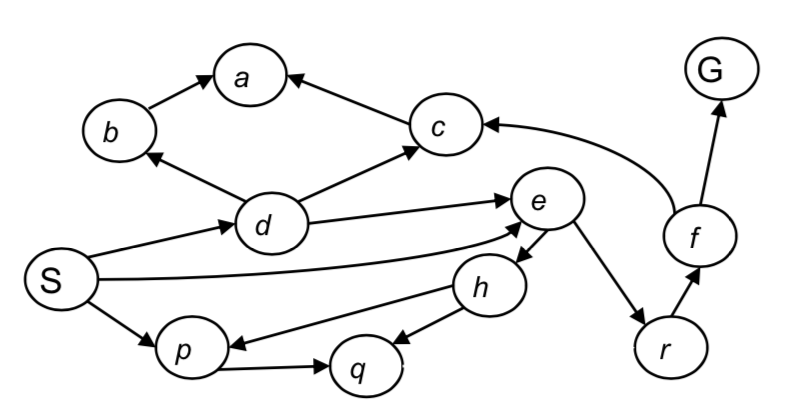

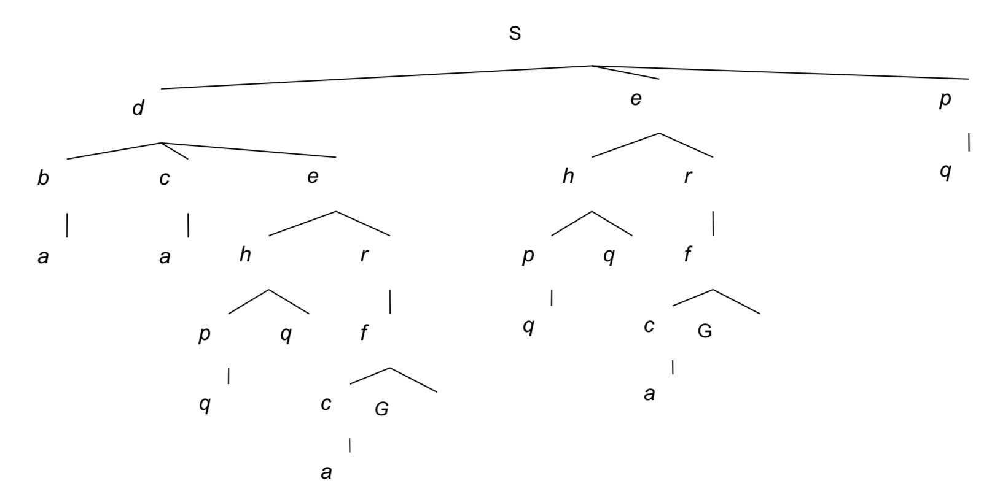

#### BFS (FIFO)

- time complexity: 
  - $O(b^d)$ where $d$ is the depth of the goal node
  - total number of nodes traversed until the shallowest solution is found
- space complexity: $O(b^{d})$
- optimal if all edges equal
- Memory is a bigger problem here than time

#### Iterative Deepening Search

- combines DFS and BFS
- outer loop which inreases depth of how far you are willing to search (do DFS but only expand down to some depth, then increase depth and repeat)
- Complete: yes
- optimal: will find the shallowest goal node fastest
- time complexity: $O(b^d)$,
- space complexity: uses less space than BFS; $\in O(bd)$ where $d$ is the depth of the goal. it is only ever engaged in a depth-first search, so only needs to store nodes which represent the current path it is exploring. since it is optimal, and finds the shallowest goal at depth $d$, then the length of this path is only ever $d$
- comparisons:
  - $b = 10, d = 5$
  - N(BFS) = 1,111,000
  - N(IDS) = 125,000

#### Cost-Sensitive Search: Uniform Cost Search (Priority Queue)

- ==expand cheapest node first (use a cost function; in BFS, the cost function is just the depth)==
- Sort the frontier using a priority queue
- complete: yes
- optimal: yes (as long as they aren't all 0; no negative costs)
- biased on little paths that have low-cost actions and puts-off larger costs branches
- Uses minimum-cumulative cost as the priority in the priority queue, as opposed to depth as the priority in the queue for DFS
- Goal test when a node is selected for expansion instead of when it is first generated (why? Multiple goal nodes can be generated and added on to the frontier; but the goal node that is selected for expansion is only selected when it is at the front of the queue, and therefore it has the minimum cost)

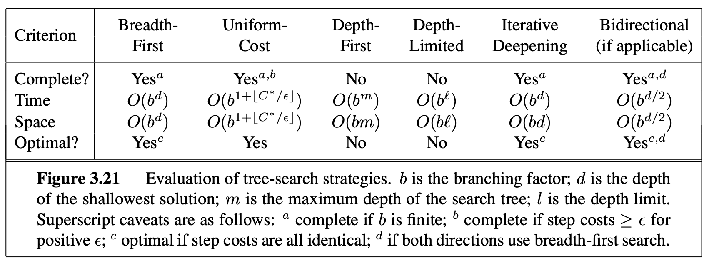


## Chapter 3: Informed Search

### Using Knowledge

- uninformed search uses no knowledge about the problem (looks at cost or distance, never looks ahead to the goal); very general and expensive
- informed search
  - we often have additional knowledge about the problem
  - want to encode that knowledge into the nodes
  - different notions of merit
    - cost of solution
    - minimize computation
- Uninformed vs Informed search
  - uninformed expands based on distance from start node - ==why not expand on distance to goal?==
- ==Heuristic: is a function that estimates the cost of reaching a goal from a given state==
  - estimate; doesn't need to be correct
  - E.g. euclidian distance (hypotenuse)
  - manhatten distance (distance you would have to travel if you could only travel NSEW)
- Heuristics: Structure
  - If $h(n1) < h(n2)$ we guess it is cheaper to reach the goal from $n1$ than from $n2$
  - We require $h(n, goal) = 0$

### Best-First Search (bad algorithm)

- Search Strategy: expand the most promising node according to the heuristic
- S(4) --> 2 --> A(3) --> 1 --> B(2) --> 1 --> C(1) --> 2 --> G(0)
  - Also, A(3) --> 4 --> C(1)
- S --> A --> (can go to B or C. C has lower heuristic) so --> C --> G
- Always compare the heuristic values of the nodes on the fringe to one another
- Properties:
  - Complete: no
  - Optimal: no
  - Time complexity: worst case explores entire graph, $O(b^m)$
  - Space complexity: $O(b^m)$

### A* Search

- Observations:

  - Best first search ordered nodes by forward cost to goal, h(n)
  - Uniform cost search ordered nodes by backward cost of path so far, g(n) (cost at node n was the cost of getting to that node from the start node)

- A* Search expand nodes in order of f(n) = g(n) + h(n)

- Example:

  ```mermaid
  graph LR
  S4 -- 2 -->A3 
  A3 -- 1 --> B2
  B2 -- 1 --> C1
  C1 -- 2 --> G
  A3 -- 4 --> C1
  
  ```

  ```
  start at S (f(S) = 4)
  calculate f(A) = 3 + 2 = 5
  go to A 
  consider B and C
  calculate f(B) = (2 + 1) + 2 = 5
  calculate f(C) = (2 + 4) + 1 = 7
  choose B
  go to B
  calculate f(C2) = (2 + 1 + 1) + 1 = 5
  compare C to C2 (same C, but different paths). C2 is lower
  go to C2 (using path SABC)
  f(G) = 6 + 0 = 6
  go to G
  ```

- ==When do you do your goal test?==

  - For A* search, always do goal test when you are expanding a node (remove it from front of queue)
  - If you check goal test when you GET to a node, then you could get wrong answer. Just add it on the queue like any other node.
  - Then you choose which node to expand based off of minimum value (f) on the queue, and THEN you check if it is the goal state

- NOTE: with a good heuristic, when A* finds the goal state (removes it from front of queue) then that is the optimal path

- ==Admissible Heuristics==

  - An optimistic heuristic, always under-estimating
  - A heuristic function $h(n)$ is ==admissible== if $0 \leq h(n) \leq h^*(n)$ where $h^*(n)$ is the TRUE, god-given value
  - Note that $h(i) = 0$ for all $i$ is admissible (this is just cost-sensitive search)

- Optimality of A*

  - If the heuristic is admissible then A* with tree search is optimal
  - If we have a graph (**multiple paths to the goal**), then we require a stronger property for the heuristic function
  - A heuristic is ==consistent== if $h(n) \leq cost(n,n') + h(n')$
  - Cost of getting to goal state from n is less than cost of going from n to n' + cost of getting to goal state from n'

- Example

  Let G be optimal goal. Let G2 be suboptimal goal. cost(G) < cost(G2). Let n be on queue and is on path to G. Assume G2 is on queue and assume G2 is selected (which it shouldn't be)

  Recall g(x) is distance from start to x, h(x) is heuristic from x to goal

  ```
  G2 is selected over n, so this means f(G2) < f(n).
  f(G2) = g(G2) + h(G2)
  			= g(G2) // as h(G2) = 0
  			> g(G) // G2 is suboptimal
  			= cost(S,n) + cost(n, G) // because n is on optimal path to G
  			>= g(n) + h(n) = f(n)
  			contradiction as we have shown that f(G2) >= f(n)
  ```

- A* is Optimally Efficient
  
  - A* expands the fewest nodes compared to all algorithms that start at the same node and use the same heuristic function
  
- **A* Search Properties**
  
  - Optimal: yes
  - Time complexity: $O(b^{\Delta*d})$ where $d$ is the depth of the shallowest goal node and $\Delta$ is the relative error of heuristic; $\Delta = \frac{h^* - h}{h^*}$
  - Space complexity: has to remember every node that has been expanded in memory (need to keep all possible paths)
  - In our graph example (country, Austria) the perfect heuristic function $h^*$ is the actual distance required to travel from node n to the goal (not the straight line distance, but the distance from travelling through all of the roads in the optimal way)
  - But, getting that perfect heuristic, in this example, requires solving the problem before-hand. Pointless.

### Heuristic Functions

- Extremely important to have a good heuristic function

- 8 Puzzle Toy Problem Example:

  - Relax the game; change the rules?
  - Option 1: you can move A to B (swap) if A is next to B
  - Option 2: you can move A to B (swap) if B is blank
  - Option 3: you can move A to B (swap)
  - Count the number of moves it would require to win the game using those options; clearly an under-estimate of the real value played using the games' real rules
  - ==use these relaxed forms using relaxed rules to get under-estimates of moves required to reach goal==

- Dominating Heuristic: Given heuristics $h_1, h_2$ we say $h_2$ dominates $h_1$ if $\forall \, n \, h_2(n) \geq h_1(n)$ and $\exists \, n \, | h_2(n) > h_1(n)$

- Dominating Heuristic Theorem: If h2(n) dominates h1(n) then A* using h2(n) will never expand more nodes than A* using h1(n)

- Notes

  ```
  C* = cost of optimal solution, constant
  recall: f(n) = g(n) + h(n)
  A* expands all n where f(n) < C* 
  ==> g(n) + h(n) < C*
  ==> h(n) < C* - g(n) // g(n) using either heuristic is the same!
  ==> h1(n) < h2(n) < C* - g(n) // because h2(n) > h1(n)
  
  conclusion: 0o a node was expanded in the h2 heuristic then it must ALSO have been expanded in the h1 heuristic
  ```

- Designing Heuristics
  - Relax the problem
  - Pre-compute solution costs of sub-problems and store them in a pattern-database
  - Tradeoff between accuracy of heuristic (and therefore amount of search) and amount of computation needed to compute it

## Chapter 4: Constraint Satisfaction Problems (CSPs)

### CSPs and Constraint Graphs

- Intro
  - Standard search: 
    - state, black box, state is just a node in our graph, don't really care what the underlying state structure is
    - goal test: any function over states
    - successor function: anything that let you move from one state to another
  - CSP
    - subset of search problems
    - states have a specific definition; defined by **variables** $X_i$ with **values** from domains $D_i$
    - goal test: set of specific constraints
- CSP Examples
  - Map Colouring
    - variables (provinces)
    - domains (colours R, G, B, Y that are assigned to variables)
    - constraints: adjacent provinces must have different colours
    - solution: an assignment of domain elements to variables that satisfies all constraints
  - N Queens
    - variables (cell $C_{i,j}$)
    - domains (QUEEN, EMPTY)
    - constraints ...
  - N Queens p2 (far fewer states, far faster to solve)
    - variables (columns $C_i$)
    - domains (1, ..., N) where $C_i = x$ means that the x'th row in the i'th column is a queen
    - constraints ...
  - 3SAT
    - variable ($v_1, ..., v_n$)
    - domains (true, false)
    - constraints: satisfy the input equation which is disjunctions of conjunctions of clauses of 3 variables
- Types of CSPs
  - discrete variables
    - finite domains: with $n$ variables and $d$ domain elements then there are $O(d^n)$ complete assignments
    - infinite domains
  - continuous variables
- Types of Constraints
  - unary: single variable; this variable $x_1$ cannot be $d_1$
  - binary: variable $x_1$ cannot equal variable $x_2$
  - higher-order: involve multiple variables
  - soft constraints (preferences):
    - "red" is better than "green"
    - constrained optimization problems
- Constraint Graphs
  - binary constraints: nodes are variables, edges are constraints
  - higher order constraints: hypergraphs
- CSPs and Search: Map Colouring Example
  - state: partial assignment of domain values to the different variables
  - initial state: {}
  - successor function: assign a domain value to some unassigned variable
  - goal test: complete assignment and constraints satisfied
  - BFS doesn't work well:
    - too many starting states here ($|Domain Vals|^{|Variables|}$)
  - Commutativity
    - ==important: CSPs are commutative; order of actions does not effect outcome; can assign variables in any order==

### Solving CSPs

#### Backtracking Search (basic)

```
select unassigned variable x(j)
	for each domain value d1,..., dn that can be assigned to x
		if value satisfies constraints, assign x = di
		break
	if assignment found
		continue to next variable x(j + 1)
	if assignment not found
		go back to previous variable x(j - 1)
```


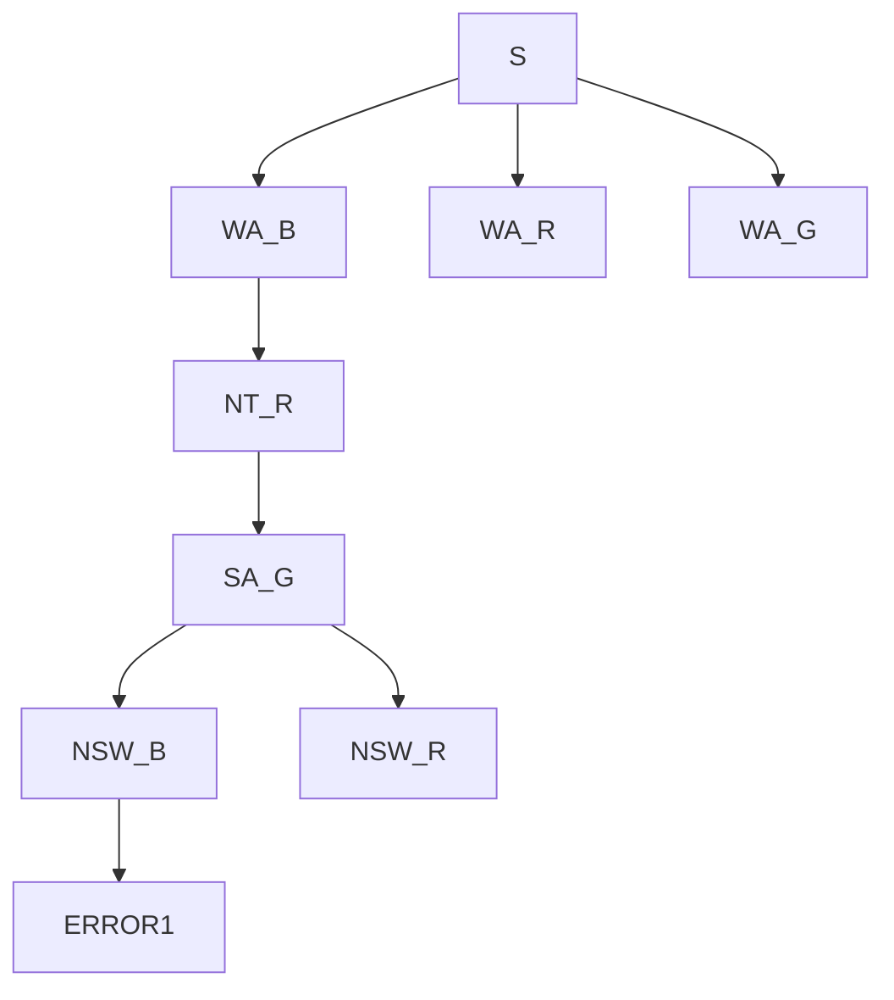

NOTE: don't actually draw an ERROR state (just visual helper here)

```
colours = [B,R,G]
start at WA. it can be blue
go to NT. can't be blue. can be red.
go to SA. can't be blue or red. can be green
go to NSW. can't be green. can be blue
go to Q. can't be blue or red or green. ERROR

go back to NSW. try a different domain value. can be red
```

- Notes
  - DFS with some small improvements (can detect states that break constraints, and fail early)
  - correctness: will find a correct answer
  - ordering: which variables should be tried first?
  - filtering: can we detect failure early?
  - structure: can we exploit the problem structure?

### Improving Our Solution

- ordering: **most constrainED variable**

  - choose the **variable** which has the fewest legal moves (MRV minimum remaining values)

  - assign first variable. then look at other variables. surely, one of the first variable's neighbours will have fewer possible legal values than a variable on the other side of the graph.

    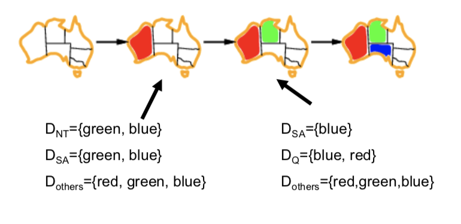 

- ordering: **most constrainING variable**

  - TIE BREAKER for most constrained variable
  - choose variable with most constraints on remaining variables
  - ex: most neighbours (if there are constraints between all neighbours, like in Map Colouring)

  - we want to detect failure as quickly as possible.

  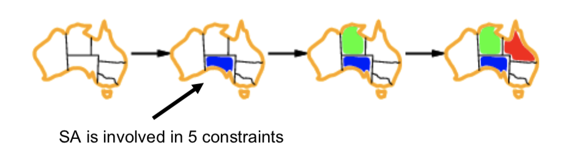

- ordering: **least-constraining value**

  - choose the value that rules out the fewest values in the remaining variables

  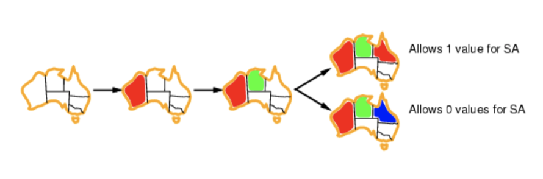

- filtering: **forward checking**

  - keep track of remaining legal values for unassigned variables
  - done at runtime
  - terminate (go back) when any variable has no legal values

  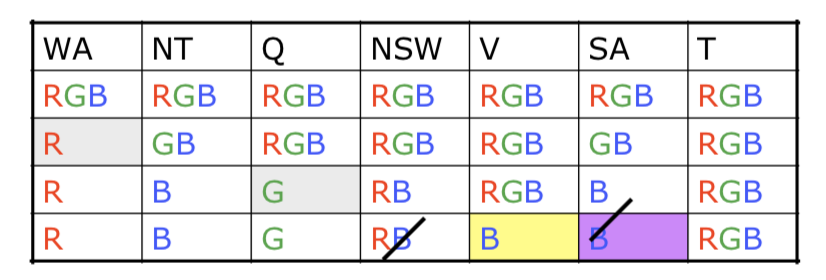


- Note: node consistency

  - A single variable is node consistent if all of the values in the variable's domain satisfy the variable's unary constraints
  
- Filtering: **domain consistency**

  - A variable x in X with possible values $D' \subseteq D$ is domain consistent if all values in $D'$ are allowed values for x. If some of them aren't, remove them to make it domain consistent. Should have at least 1 value.

- filtering: **arc consistency**

  - forward checking propagates information from assigned to unassigned variables, but it cannot detect all future failures early
  - run a pre-processing step to get consistency across variables
  - arc: directed edge
  - Given domains D1, D2 an arc is consistent if for all x in D1 there is a y in D2 such that x and y are consistent with the given constraints

  ```mermaid
  graph LR;
  	A --> B
  	B --> A
  ```

  ```
  D(A) = { blue }
  D(B) = { blue, red }
  A -> B is consistent
  B -> A is not consistent. remove { blue } from D(B)
  ```

  - if you can't make an arc consistent, then there is no solution
  - works for 2 variables at a time

  > For a relationship r(X,Y), the arc (X, r(X,Y)) is consistent if for all values x in X there is a y in Y such that r(X,Y) is constant

- k-consistency

  - forall sets of k - 1 variables, and consistent assignment of values; a consistent value can always be found for any kth variable

### Structure

- look for independent subproblems

  - ex: tasmania is not connected to other components in australia map
- idea: break down the graph into its connected components; solve each component separately
  - big savings: if each component has $c$ variables then there are $n/c$ components and ==worst case cost is now $O(d^c \times n/c)$==
- Tree Structures
- no loops
  - CSPs can be solved in $O(nd^2)$ if there are no loops in the constraint graph
  - $d^2$ because for each node you need to check all of its relationships d times

- Non-Tree Structures

  - **Cutsets**
- choose a subset S of variables such that the constraint graph becomes a tree when S is removed
    - for each possible valid assignment to the variables in S
      - remove from the domains of remaining variables all values are are inconsistent with S
      - if the remaining CSP has a solution, return it
    - runtime $O(d^c \times (n - c)d^2)$
    - $d^c$ because there are c variables in your cutset and there are d domain assignments you can do for each variable
    - $(n - c)d^2$ because its not just a tree, and there are $n - c$ remaining variables that need to be assigned
    
- **Tree Decomposition**
  
  - create a new graph that will be a tree by introducing mega-nodes
    - each mega-node is going to contain a subset of the original nodes in the graph
    - properties
      - each variable occurs in at least 1 mega-node
      - if 2 vars are connected by a constraints, then they must appear together in at least one mega-node
      - if a var appears in different mega-nodes, then it must appear in all between them in the path
    - want to make the subproblems as small as possible
      - tree width is largest subproblem - 1
  
  - runtime is $O(nd^{w + 1})$
  
- recall: variables are nodes in these constraint graphs


## Chapter 5: Local Search (with some Constraints)

- intro
  - recall that before, solution was typically a path to the goal
  - but, for many problems, the path is 
  - Instead you just consider a single state (node) at a time
- informal characterization
  - constraints must still be satisfied
  - cost function helps us find a good solution
  - searching all possible states is NOT possible
  - often easy to find some solution, but not the best solution (no problem hard)
- N Queens example
  - instead of starting from scratch, start with queens on the board
  - works well except for certain ratio of constraints to variables (**critical ratio**)
- TSP
  - constructive method: start from scratch
  - iterative improvement method: start with a solution (suboptimal) and then improve it

### Iterative Improvement Methods

- imagine all possible solutions laid out on a landscape

- find the highest (or lowest) point

- simple method

  - start at some point (potential solution)
  - generate all possible points to move to
  - if set not empty, move to a point
  - else, restart (you are stuck)

- **Hill Climbing (Gradient Descent)**

  - ==main idea: always take a step in the direction that improves the current solution value the most==
  
  > Like trying to find the top of Mount Everest in a thick fog while suffering from amnesia

  - (variation of Best first search); this is a greedy local search
  - impl
  
  ```
  start with some initial configuration S, with value V(S)
    generate MoveSet(S) = {m1, ..., mN}
    Smax = max(V(move_set_i))
    // instead of generating moveset, just call getHighestValSuccessor1(curr)
  if V(Smax) < V(S) return S // local optimum, not a GLOBAL optimum
    S = Smax (navigate to node)
    repeat from line 2
  ```
  
  - why "gradient ascent"? well, for f(x1, x2), if you want an optimal value, you take the $\nabla f(x1,x2) = 0$ (take derivative with respect to x1 ,x2)
  - Performance
    - easy to program; no memory of where we have been
    - not complete; not optimal; ==it can get stuck in local optima/plateaus==
    - plateau solver: allow for sideways moves
    - local maxima / minimum solution: record it, then randomly restart
      - If the probability of finding the global maximum is $p$ then the number of restarts required is $1/p$
  
- runtime distribution

  - Normal Distributions
  - Exponential Decay $P[X > t] = Ce^{-t^2}$
  - Heavy Tail Distributions $P[X > t] = Ct^{-\alpha}$

- **simulated annealing:**

  > Want a ping-pong ball to go to deepest crevice. If we don't shake it, it will go to a local minimum. If we shake it too hard, it could bounce out of the global min. So we want to shake it such that it can escape local minimums but not the global minimum.

  - escape local maxima by allowing downhill moves (consider sub-optimal moves)

  ```
  start with some initial configuration S, with value V(S)
    generate MoveSet(S) = {m1, ..., mN}
    Si = random from MoveSet(S)
    deltaV = V(Si) - V(s)
    if deltaV > 0 
    	then S = Si // go to Si node
    else
    	then S = si with probability p // how to choose p??
    repeat from line 2
  ```

  - how to choose p?
  - selecting p smartly in Simulated Annealing
    - if $V(S_{new}) > V(S)$ then definitely move to $S_{new}$
    - else if $V(S_{new}) < V(S)$ then move to $S_{new}$ with some probability
    - **Boltzmann Distribution** $p = e^{\frac{\Delta V}{T}}$
    - T is the temperature parameter; starts high and decreases over time towards 0
    - high T: 
      - **exploratory phase**: even bad moves have a chance of being picked
    - low T: 
      - **exploitation phase**: bad moves have a low probability of being chosen
    - if T is decreased slowly enough then simulated annealing is theoretically guaranteed to reach optimal solution

- **genetic algorithms**

  - individual: an encoded candidate solution
  - each individual has a fitness
  - population: set of individuals
  - populations change over generations by applying operators to them (selection, mutation, crossover)
  - Schema: a substring in which some of the positions are left unspecified
    - Ex: in the 8-queens problem, the string is 8 integers from 1-8 inclusive, specifying the row to put the queen at for each column $I$ in the string
    - A **schema** could be: `246*****`, and any string that matches that schema is called an **instance** of that schema


## Chapter 6: Adversarial Search

- there will be another agent that changes the environment as we search

### Games

- parts
  - Initial state
  - players(s) = for a state s, is the current player (they can make a move)
  - actions(s) = for a state s, is the set of legal moves for the current player
  - Results(state, move) is the next state after making a move on some current state
  - Terminal test
  - Utility function: determines the final numeric evaluation for a terminal state

- easy to evaluate
- types of games
  - perfect vs imperfect information
  - deterministic vs stochastic
    - d: change in state is fully controlled by the players
    - s: partially determined by chance
- game search challenge
  - what makes this hard? there is an opponent which wants to win and make you lose
  - need to take this into account when choosing moves
  - MAX player wants to maximize its utility
  - MIN player (enemy)
- utility function: helps us determine who won / lost / if it's a draw
- optimal strategies
  - optimal solution is sequence of moves leading to a goal state
  - MAX strategy
    - specify the move for all possible states arising from MIN's response (max goes first, then min goes, and now max has a pre-defined choice given the current state of the board)(tic tac toe example)
  - what does optimal mean? strategy that leads to outcomes at least as good as any other strategy, given that MIN is playing optimally
- game thoery
  - formal way of reasoning about interactions between multiple agents
  - game
    - players, N
    - possible strategies or actions, $S_i$
    - utility functions $u_i(s_1, \dots, s_n)$ // utility of agent i depends on all strategies of all players
  - nash equilibrium: 
    - mutual best response
    - vector which specifies a strategy for every agent
    - if an individual decides to play NOT according to the given NE then it ruins everything
- subgame perfect equilibria
- existence of SPE

### Minimax Search

- MINIMAX-VAL =
  - utility(n) if n is a terminal state
  - $MAX_{s \in Succ(s)} (MINIMAXVALUE(s))$ if n is a MAX node
  - MIN ... if n is a MIN node
  - sub-game perfect equilibrium outcomes
- performance
  - complete: yes
  - time complexity: need to go through entire tree $O(b^m)$
  - space complexity: $O(bm)$ (just doing DFS basically)
  - optimal: yes
  - SPE iff assuming optimal adversary
- what is the size of the game tree generated? 
  - $m$ levels in the game tree ==> $m$ moves in the game
- summary 
  - assume it already exists, we traverse it in DFS-manner
  - go down to terminal node; check the outcome (win, lose)
  - derive utility from perspective of MAX agent
  - take that information, bring it back up the tree
  - strategy: which action to take for every possible state it is in
  - if MIN player does not play according to the equilibrium, then it is possible that there exists a better strategy for the MAX agent to play
  - does not JUST apply to zero-sum two-player games
  - multiple agent ==> utility vectors instead of utility values
  - ==this is the IDEAL, perfect process. But, it is very expensive==

### Alpha-beta Pruning

- add-on to minimax search

> Trick is that we can compute the correct minimax value without searching the entire tree

- pruning: eliminate large parts of the game tree from consideration
- alpha: value of best choice we have found so far on path for MAX
- beta: value of best choice we have found so far on path for MIN
- insights
  - some actions are really stupid - so don't continue searching that part of the tree?
- implementation
  - use alpha and beta to determine if you can prune


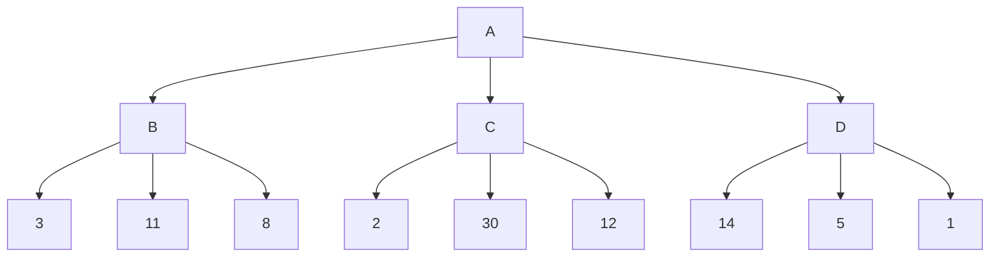

```
Look at A --> B --> 3 ====> [3, infinity]
Look at A --> C --> 2
	STOP (dont search 30 or 12)
	Here, min can force me to get at most a 2
	But, one level up, at the max level, MAX can select at least a 3
	so even if the next numbers under C were -1, or -100, max will still ignore them
Look at A --> D --> 14 // need to keep searching
Look at A --> D --> 5 // need to keep searching
Look at A --> D --> 1 // min can force me to get at most a 1
```

- properties
  - results in the same outcome as full minimax search
  - how much can be pruned while searching? worst case, nothing.
- real-time decisions
  - still not good enough -> need to search down to terminal state to get terminal nodes to get utility values
  - need to make decisions quickly
  - solution? heuristic evaluation function + cutoff tests
  - Only search down to some depth $d$ and then apply a heuristic for the estimated value of that state at depth $d$; drastically reduces how many states you need to search
- Optimal order? When MAXs turn, views states from high to low. 
  - When MINs turn, views states from low to high

### Evaluation Functions

- apply an evaluation function to a state
  - if terminal state, function returns actual utility
  - else, function returns estimate of expected utility
  - must be fast to compute
- creating an evaluation function
  - expert knowledge (talk to grandmasters)
  - learn from experience (machine learning)
  - clusters of pieces, relative positions, etc
- often, some sort of **weighted function**
- cutting off search
  - don't need to search to bottom of the tree
  - arbitrarily - but deeper is better
  - quiescent (quiet) state: usually okay to terminate 
  - singular extensions
    - search deeper when you have a move that is clearly good
    - can avoid the **horizon effect**
      - haven't searched far enough, get surprised by some bad state
  - how deep to go?
    - x ply means search down x levels from start
    - novice: search down 5 ply
    - master: 10-ply with alpha-beta pruning
- checkers
  - is solved
  - they have brute-forced the game tree, and have the optimal solution sitting in a db

### Coping with Chance

- stochastic game
  - need to consider best/worst cases + probability that they will occur
  - introduce a 3rd player to minimax, called "chance" or "nature"
  - "chance" makes moves just like MAX and MIN, world will transition accordingly
  - expectiminimax: minimax but at chances nodes compute the expected value
  - recall: expected value of a random variable x is $E[X] = \sum_{x \in X}(P(x)x)$
  - exact values matter in expectiminimax
  - From textbook:
    - Must include chance nodes that occur in between MAX and MIN nodes
    - Instead we have to compute the expected minimax value (the minimax value x the chance that that is the next move that the opponent makes)

### Monte-Carlo Tree Search (MCTS)

- build search tree according to outcomes of simulated players
- slowly build up a search / "statistics" tree
- steps
  - **selection**: look through already-generated search tree
    - each node: 
      - whose turn it was
      - number times we have seen this node
      - number of times we have reached a winning state passing through this node
    - move using some policy: Upper Confidence Bounds
      - $v_i + C \sqrt{\frac{ln(N)}{n_i}}$
      - $v_i$ is the expected value of the node given the values we have seen so far = `numWins/numVisits`
      - exploration bonus: 
        - N number total runs so far
        - $n_i$ is number of times we have visited this state
        - $n_i$ is small ==> bonus is LARGE
        - $n_i$ is large ==> bonus is SMALL
        - haven't seen it often before? i'm inclined to explore it more
  - **expansion**: 
    - eventually, we have no statistics about some node. So, chose one of its children to expand
  - **simulation**: from that node, simulate a game
    - use a **rollout policy** play out to the end of the game (choosing actions at random), or something more sophisticated. SIMPLE policy, FAST policy
  - **back-propagation**: 
    - use that information from simulation and update statistics for all node from the child back to the root


## Chapter 7: Machine Learning

- Learning
  - Ability to improve one's behaviour based on experience
  - Range of behaviours expanded; speed and accuracy improved
- Definition: A computer program learns if its performance at tasks T, as measured by some performance measure P, improves as it gains experience
- Common Learning Tasks
  - Supervised Classification
  - Unsupervised Learning
    - Look for patterns / natural classes in large, un-labelled data set
  - Reinforcement Learning (rewards and punishments)
    - What action to take under certain circumstances
  - Transfer Learning (learn from an expert)
  - Active Learning (seek to learn)
- Feedback
  - Supervised: what has to be learned is specified for each example
  - Unsupervised: needs to discover categories and patterns
  - Reinforcement: feedback occurs after taking a sequence of actions
- Representation
  - Richer the representation, the more useful it is for subsequent problem solving
  - Richer the representation, the more difficult it is to learn
  - Examples: Polynomial Function, Linear Thresholds, Decision Trees, Neural Network
- Measuring Performance
  - Need a performance measure to judge and evaluate the learning
  - Don't measure how well you are doing on the data in front of you
  - You want to learn to be able to solve OTHER sets of new data, on other problem sets
- Bias
  - Can have bias in our data, or bias that we have engineered into our systems
  - Bias: a tendency to prefer one hypothesis over another
- Learning as Search
  - Components: a representation, data, and bias ===> we have a search problem
  - Search through space of possible representations looking for the representation that best fits the data given the bias
  - Can't do a systematic search (too large)
  - Instead: use an iterative improvement algorithm
- Notes on Data
  - Is not perfect (labelled incorrectly, incomplete)
  - Don't overfit: find patterns in data where there is no actual pattern

### Supervised Learning

> Given a training set of N examples (x_1, y_1), ..., (x_n, y_n) where each y_i is generated by an unknown function y=f(x), output a function h that approximates the true function f
>
> To evaluate the hypothesis h, we give it a test set that is distinct (separate) from the training set

- Terms
  - Input features: $X_1, \dots, X_n$ (**this set of features will describe 1 example**)
  - Target features f(X) or $Y_1, \dots, Y_k$ (this set of target features described 1 example)
  - Training examples (pairs of input features, correct target features for each example)
    - Input is pairs of $(x_1, y_1), ..., (x_k, y_k)$
  - Test examples, only input is given
  - Goal: predict the values for the target features for the test examples
    - Classification: $Y_i$ are discrete
    - Regression: $Y_i$ are continuous
  - ==MUST keep training and tests separate==
- Implementation
  - Want to return a hypothesis function h(x) that hopefully approximates f(x) (f(x) is the true, god-given function, where it already knows exactly what the output is supposed to be)
- Types of Supervised Learning
  - Classification: when the output is of a finite set of values
  - Regression: when the output is a number
- Inductive Learning Hypothesis

> Any h(x) found to approximate the target function well over a sufficiently large set of training examples will also approximate the target function well over any unobserved examples

- Inductive Learning
  - Construct / adjust h to agree with f on training set (curve fitting)
  - You can have several hypothesis fit the given labels; prefer the simplest hypothesis that is consistent with the data
- Evaluating Performance of a Supervised Learning Algorithm
  - Y is a target feature, e is an example
  - Y(e) is the true value of feature Y for example e
  - Y*(e) is the predicated value of feature Y for example e
  - Error: some function involving Y(e) and Y*(e) (absolute error, sum of squares error, etc)
    - T is set of all target features
    - E is set of all examples
    - Absolute Error: $\sum_{e \in E} \sum_{Y \in T} | Y(e) - Y^*(e)|$
    - Sum of Squares Error: $\sum_{e \in E} \sum_{Y \in T} (Y(e) - Y^*(e))^2$
- Receiver Operating Characteristic Curve (ROC Curve)
  - Not all errors are equal
    - Predict patient has a disease when they actually do not
    - Predict patient does not have a disease when they actually do
  - Actual A, Predicted P
  - A(T) and P(T) => True Positive
  - A(T) and P(F) => False Negative
  - A(F) and P(T) => False positive
  - A(F) and P(F) True Negative
  - Sensitivity = TP / (TP = FN)
  - Specificity = TN / (TN + FP)
  - Precision = TP / (TP + FP)
  - F-Measure: 2 * precision * recall / (precision + recall)

### Decision Trees

- Comments from textbook
  
- Good for some types of problems, bad for others (ex: the majority function (are half of the inputs true); requires an exponentially large decision tree)
  
- General
  - Classify instances by sorting them down the tree from root to leaf
  - Nodes correspond to a test of some attribute
  - Each branch corresponds to some value an attribute can take
  - Algorithm: start at root. At each node, test attribute to that node, take branch corresponding to value of that attribute, stop at leaf
  - If you have continuous data, you need to find a way to discretize it
  
- Inducing a Decision Tree (Implementation)
  - Examples: each example e has a list of attributes and a label
  - Attributes (features)
  - Default classification
  - Best = best_attribute
    - Each attribute can take on multiple values, like, OUTLOOK can take on Sunny, Rain, Overcast ($v_1, v_2, v_3$)

- Decision Tree Learning Algorithm:

  - Greedy, divide and conquer approach
  - At each stage, always test the most important attribute first (the attribute that makes the biggest difference in our classification; has the most distinct subgroups)
  - Need to define `IMPORTANCE(attribute)` which returns how good that attribute is at making a difference in our classification; this requires using Information Gain / Entropy

- Restaurant Wait or Not Decision Tree Example

  - Root = Patrons? Or Root = Food Type?

  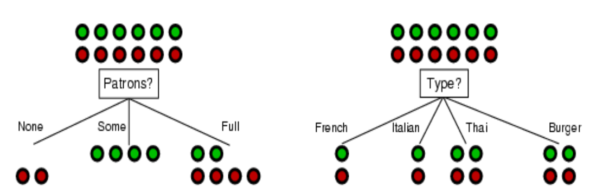

- Entropy

  - ==Measure of unpredictability; uncertainty of a random variable==
  - Have an underlying stochastic source generating your data
  - Entropy: average rate at which information is produced
  - X is a random variable, $\{ x_1, \dots, x_n\}$
  - Probability of X ==> $P(X) = $ probability X = x_i ??
  - I is information, is entropy?
  - ==$H(x) = I(X) = \sum_{i=1}^n -P(x_i)log_2P(x_i)$==
  - We assume 0*log(0) = 0
  - Heads or Tails: I(1, 0) = 0 (low entropy)
  - Heads or Tails: I(0.5,0.5) = 1 (high entropy)
  - X = (0.9H, 0.1T)
  - I(X) = -0.9log(0.9) - 0.1log(0.1) = 0.46
  - Example:
    - Coin that always lands head up: has entropy of 0 (gain no information by observing that value)(not uncertain at all)
    - Coin that is always 50/50: has entropy of 1 (extremely uncertain)
    - Coin that lands heads 99% of the time: $H(0.99, 0.01) = -0.99*log(0.99) + -0.01*log(0.01) = 0.08$ (once again, don't get much information from seeing the result)

- **Information Gain** (uses log_2)

  > The information gain on an attribute A is the expected reduction in entropy
  >
  > Recall: for probabilities $a, b$, entropy $H(a, b) = -a\log(a) -b\log(b)$
  >
  > Define: remainder(A) = $\sum_{i = 1}^n (\frac{p_i + n_i}{p + n} \times I(\frac{p_i}{p_i + n_i}, \frac{n_i}{p_i + n_i}))$
  >
  > $p$ = number of positive examples
  >
  > $n$ = number of negative examples
  >
  > remainder(A) is the sum of probabiliti es of each attribute value ($a_i \in A$) times the entropy of that attribute value
  >
  > $Gain(A) = I(\frac{p}{p + n}) - remainder(A)$

  - Compute expected entropy for each subset of the attribute?
  - remainder(A) is the expected information we have, once we have sorted our examples by the attribute A

  ```
  Let Attribute A have possible values a1, ..., an
  then remainder(A) = sum(probability(a1) * I(a1))
  so if there are 10 samples, and A = a1, a2, a3
  and a1 = T T F
  and a2 = T T T
  and a3 = T F F F
  then remainder(A) = 
  3/10 * I(2,1) + 3/10 * I(1,0) + 4/10  * I(1,4)
  ```

  - Choose your attribute by using your Information Gain measure
  - ==Choose attribute which has the highest information gain; the attribute which is reducing the amount of information that we have left further in our process==

- Back to restaurant example...

  - Before we start, there are 6 Ts and 6 Fs
  - Root = Patron [None(2F), Some(4T), Full(2 T, 4 F)]
  - Root = 

  ```
  IG(Patron) = I(0.5,0.5) - Remainder(Patron)
  	= 1 - Remainder(Patron)
  	= 1 - ([P(NONE)I(NONE)] + [P(SOME)I(SOME)] + [P(FULL)I(FULL)])
  	= 1 - ((2/12)(I(0,1))  + (4/12)(I(1,0))  +  (6/12)(I(2/6, 4/6)))
  	= 1 - ((2/12)0 + (4/12)0 + 0.459)
  	= 1 - 0.459
  	= 0.541
  IG(Type) = I(0.5,0.5) - Remainder(Type)
  	= 1 - Remainder(Type)
  	= 1 - (2/12*I(1,1) + 2/12*I(1,1) + 4/12*I(1,1) + 4/12*I(1,1))
  	= 1 - 1
  	= 0
  So patron is best
  ```


### Assessing Performance

- Test Set and Training Set
  - Collect a large set of examples, divide them into 2 disjoint sets (training and test sets)
  - Apply learning algorithm to training set to get $h$
  - Measure percentage of examples in the test set that are correctly classified by $h$
  - Typically, as training set grows, accuracy increases
  - ==Algorithm CANNOT look at the test set, each time you want to evaluate performance you need to use a different test set==
- Overfitting
  - Example: suppose you have some massive training set that you use to try and predict the result of a die roll (attributes include die colour, time of day, die weight). ==This is over-fitting to that training set, and can be expected to have a high error rate on a test set==
  - Causes 10-25% decrease in accuracy on average
  - Terms; these things cause test errors
    - Bias: error due to algorithm finding an imperfect model (ex: model is too simple)
    - Variance: error due to lack of data
    - Noise: error due to data depending on features that were NOT modelled
    - Bias-Variance Trade Off:
      - Complicated model ==> not enough data; low bias, high variance
      - Simple mode ==> lots of data; high bias, low variance
- Avoiding Overfitting
  - Regularization:
    - Prefer small decision trees over large ones so add a complexity penalty to the stopping criteria (each attribute has a penalty, encourages smaller trees)
    - Pseudo counts: add data based on prior knowledge
- Cross Validation
  - Split data into test and training set
  - Split training set into training and validation set
  - Validation is a pretend test set
  - ==K-Fold Validation: divide training set into K subsets, pull it out, train on rest, test on that subset, "leave one out" validation==

### Linear Classifiers

- Classification with linear thresholds
  - Data in the form $(x, f(x)$ where $x \in R^n$ (a point on any hyper-dimensional plane), and $f(x)$ is YES or NO; it's a classification
  - Define **w*x** where w is a weight vector $w_0, \dots, w_{n + 1}$ and **x** is our data $x_1, \dots, x_n$ and **w*x** = $w_0 + w_1x_1 + \dots w_nx_n$
  - Learning problem: find the weights **w** such that $h_w$ is a good classifier
  - $Loss(h_w) = $ Sum of squares of error
  
- Gradient Descent
  
  > Choose any starting point in the weight space, **w** = $w_1, \dots, w_n$ and then move to a neighbouring point that is downhill, repeating until we converge on the minimum possible loss
  
  - For a single example, $loss(w) = (y - h_w(x))^2$ // y is label
  - $\frac{\partial h_w}{\partial w_c} = 2(y - h_w(\bar{x}))(-x_c)$ // x bar is entire weight vector, x_c, w_c is just an element and the weight of that individual element
  - Perceptron update rule
    - If y is 1 but $h_w$ says that it's a negative sample (0) then we adjust the weight by $x_i$ and $\alpha$. 
  
  ```
  w = any point in parameter space
  loop until convergence
  	for each w_i in w do
  		w_i = w_i - alpha * partial Loss(w)/partial w_i
  		// alpha is the learning rate
  ```
  
  
  
- Update Rule (Perceptron Update Rule) (used for classification, y is 0 or 1)
  
  - ==Perfect linear separator IFF the data is linearly separable==
  - $w_i = w_i + \alpha (y - h(\bold{x}))x_i$
  - 3 cases
    - Y = h(x) then weight is not changed
    - Y = 1 and h(x) = 0; then w_i is increased proportionally to $\alpha * x_i$
      - Makes sense, h(x) is too small, we want to increase it using weight i
    - Y = 0 and h(x) = 1; then w_i is increased proportionally to $-\alpha * x_i$
      - Makes sense, h(x) is too large, we want to decrease it
  
- Ensembles
  - So far we have been solving and learning using just 1 approach
  - Choose a single hypothesis from a single hypothesis space
  - Why not use many? Individuals may make mistakes, but ensembles have elections, committees
  - Can use 3 regressions to do a classification (carve out a section in the graph)
  - Can use more regressions to do more carvings
  
- Ensembles implementation 1: **Bagging**
  - Majority vote
  - We assume each hypothesis will make an error
  - We assume each hypothesis is independent
  - Probability that $k$ make an error is $P^k(1 - p)^{n - k}$
  - For majority to be wrong: $\sum_{k - ceil(n / 2)}^n P^k(1 - p)^{n - k}$
  - Condorcet Jury Theorem
  
- Bagging Examples: Random Forests
  - Grow trees that have caps of number of features that they can look at
  - Train trees on random subsets of your training data (entries of features)
  - Trying trees on subsets of features (not all features)
  - Classify using a majority of $k$ trees
  - Trees are small, quick to train
  - Mitigates the effects of over fitting
  
- Ensembles implementation 2: **Boosting**
  - Increase weight of good hypothesis, decrease weight of bad ones
  - Increase weight of incorrectly-identified training entry; decrease the weight of a correctly-identified training entry
  - Bagging makes a number of assumptions (each hypothesis is equally correct, and independent)
  - This isn't true
  - Do a weighted majority using these weighted hypothesis
  - implementation
    - Start out with entire training set
    - Evaluate your k hypothesis on it
    - Some are right, some are wrong
    - If it got an entry right, decrease the weight of that training entry
    - If it got it wrong, increase the weight of the training entry
    - Also change the weights of the hypothesis


## Chapter 9-10: Neural Networks

- Intro 

  - Machine Learning has been (so far): approximations of **functions** that describe data
  - Sometimes the relationship between input and output can be REALLY complex
  - We want to design methods for learning arbitrary, unknown (to humans) relationships
  - Do not want to overfit the data

- Neural Networks

  - Maybe we can simulate human learning?
  - Neurons have 2 states: firing or not firing (on or off)
  - Rate at which it fires is what communicates information
  - Learning is how efficiently signals transfer across synaptic functions

- Artificial Neuron

  - Input signals, each with weights, $a_i$
  - Input Function (usually a weighted sum), $= in_i$
    - $in_i = \sum w_{i,j} a_j$
  - Activation Function $a_i = g(in_i)$
  - Output signals (fire or not) (these outputs will be weighted, too)
  - Mimic firing in real neurons (fire 1 when you have right input, 0 for bad input)
  - ==neurons are not adjusting or setting the weights of the signals==
  - ==the learning algorithm itself is setting the weights==

- Common Activation Functions

  - Ex
    - $g(x) = max(0,x)$
    - $g'(x) \in \{0, 1 \}$
  - ex
    - sigmoid $g(x) = \frac{1}{1 + e^x}$
    - $g'(x) = \frac{1}{1 + e^x}(1 - g(x))$
  - ex
    - $g(x) = \frac{e^{2x} - 1}{e^{2x} + 1}$
    - $g'(x) = 1 - g(x)^2$

- Ex Logic Gates

  ```
  // AND gate
  x_1		x_2		out
  1			1			1
  0			1			0
  1			0			0
  0			0			0
  
  // same node
  // threshold = 0
  1_bias_link (w0) --> output_node
  x_1_link (w1) -----> output_node
  x_2_link (w2) -----> output_node
  
  requirements:
  w_0 + w_1 + w_2 >= 0
  w_0 + w_1 < 0
  w_0 + w_2 < 0
  w_0 < 0
  
  
  // OR gate
  w_0 + w_1 + w_2 >= 0
  w_0 < 0
  w_0 + w_1 >= 0 
  --> if x_1 is OFF then w_0 * 1 + w_1 * x_1 = w_0 + 0 < 0 (not activated)
  --> if x_1 is ON then w_0 * 1 + w_1 * x_1 = w_0 + w_1 >= 0
  w_0 + w_2 >= 0
  ```

- Network Structure
  
  - ANN = artificial neural network
  - Feed-Forward ANN (directed acyclic graph, no internal state; maps inputs to output)
  - Recurrent ANN (directed cyclic graph, system with internal state, can remember information for future use)
  - Input units (1 for each feature)
  - Output unit (returns some value, a classification); often have multiple output units
  - Activation function g
  
- Perceptron
  - Single layer neural network
  - Inputs and outputs; no inner nodes
  - Might have multiple outputs (classifications, maybe a probability distribution)
  - Can only learn linear separators
  - If there are $m$ outputs, you can really think of it like $m$ distinct neural networks

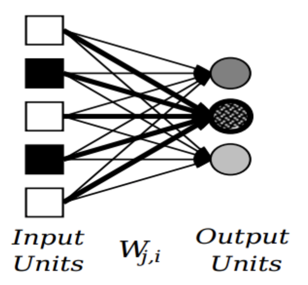

- Training Perceptrons

  - Learning means adjusting the weights ==with the goal of minimizing the loss function, or error function==. K is an example in the training set
  - What is our loss function? Sum of squares of error
    - $E = \sum_k 0.5 (y_k - h_W(x)_k)^2$
  - Learning Algorithm (gradient descent)
    - Do it iteratively, as opposed to acting on all examples at once (could do that, but we don't because error function is a function of all examples)
  - Stochastic Gradient Descent (SGD)
    - Shuffle training data at random
    - Execute Gradient Descent update algorithms for all examples in order (of that shuffled set)

- From textbook:

  - Let $\Delta k = Error_k \times g'(in_k)$
  - Where $Error_k$ Is the kth component of the error vector ***y - h_w***
  - Now, $w_{j,k} = w_{j,k}+ \alpha \times a_j \times \Delta k$
  - Where $a_j$ is the activation at node $j$ (ON or OFF)

- Multilayer Networks

  - Assume each layer is fully connected to previous and next layer
  - XOR Example

  ```mermaid
  graph LR;
  	c_1--1-->3
  	X_1--w1,3-->3
  	X_1--w1,4-->4
  	X_2--w2,3-->3
  	X_2--w2,4-->4
  	c_2--1-->4
  	3--w3,y-->Y
  	4--w4,y-->Y
  	b--1-->Y
  	Y-->0_or_1_output
  	
  ```

  ```
  c1, c2, b are the biases
  let C = [c_1, c_2]
  let W_1 represent first layer connections
  	2 inputs, 2 inner nodes ==> 4 weights total, 2x2 matrix
  let W_2 represent second layer connections
  	2 inputs (the hidden nodes) and 1 output implies 2x1 matrix
  let activation function g(x) = max(0, x)
  
  recall our function: x_1 XOR x_2
  x_1 	x_2		XOR
  1			1			0
  0			0			0
  1			0			1
  0			1			1
  
  Let W_1 =
  1 1
  1 1
  
  Let W_2 =
  1
  -2
  
  Let C = 
  0
  -1
  
  Let b = 0
  
  Example: x_1 = x_2 = 1
  Node 3: g(x) = max(0, 1 + 1 + 0) = 2
  Node 4: g(x) = max(0, 1 + 1 + -1) = 1
  Node y: g(x) = max(0, 1*2 + -2*1) = 0 --> correct output
  ```
  - Training Multi-Layer Networks
    - For weights from hidden to output later we can use gradient descent, because we know what y I supposed to be
    - But for weights from input to hidden layer, we don't know what y is? So what is the error? What should the output value be?
    - What do we use as our error function? Usually 1/2 the sum of squared errors (1/2 such that when we take the ^2 deviated )
  - Back Propagation
    - Each hidden layer has caused SOME of the error in the output layer
    - Amount of error proportionate to the connection strength (weights)

  ```mermaid
  	graph LR;
  	1-->3
  	1-->4
  	2-->3
  	2-->4
  	3-->5
  	4-->5
  ```

  ```
  1,2 are inputs
  3,4 are hidden layer
  5 is output, h(x). y is the true desired output for the given input X
  
  Step 0: Initial setup
  - have some weight values w_i_j between 0 and 1 (random)
  
  Step 1: Forward Propagation
  - input some values, compute output
  
  Step 2: Compute Error Function (Loss function) L
  error = 0.5(y - h(x))^2
  ```


  - Recall Chain Rule: $y, x$ vectors... $y = g(x)$. $z = f(y) = f(g(x))$
  - $\frac{\partial z}{\partial x} = \frac{\partial z}{\partial y} \frac{\partial y}{\partial x}$
  - $L(y, h_w(x)) = 0.5(y - h_w(x))^2$
  - $= 0.5(y - g(W_{3,5}g(in_3) + W_{4,5}g(in_4)))$
  - $in_3 = W_{1,3}x_1 + W_{2,3}x_2$
  - $in_4 = W_{1,4}x_1 + W_{2,4}x_2$
  - ...
  - ==Only for weight 1,3==
  - $\frac{\partial L(y,h_w(x))}{\partial W_{1,3}} = \frac{\partial L()}{\partial g(in_5)} \times \frac{\partial (g(in_5))}{\partial w_{1,3}}$
  - $= (y - g(in_5))(-1) (\frac{g(W_{3,5}g(in_5) + W_{4,5}g(in_4))}{\partial W_{1,3}})$
  - ...............

  - $= -1(y - g(in_5)) \times g'(in_5) \times W_{3,5} \times g'(in_3)$
  - What is this equation ???? It is the gradient descent update rule for weight $W_{1,3}$ only
  - $in_x$ Is the weighted sum of the total links coming in to your node $x$

- Deep Learning
  - Neural networks with more than 1 hidden layer
  - In theory we actually only need 1 hidden layer, but if you use multiple hidden layers then you can use fewer units
  - Example: Parity Function
    - Input vector X consists of 0s, 1s. Output is 1 if number of 1s is odd
    - x_1 XOR x_2 XOR x_3 XOR x_4 ......
    - Can do it with 1 layer, with $2^{n - 1}$ inner nodes
    - Or can do it with multiple layers

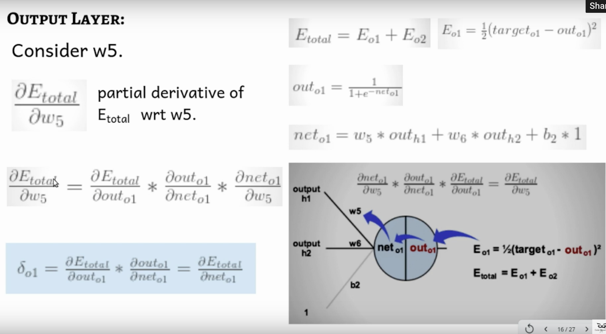


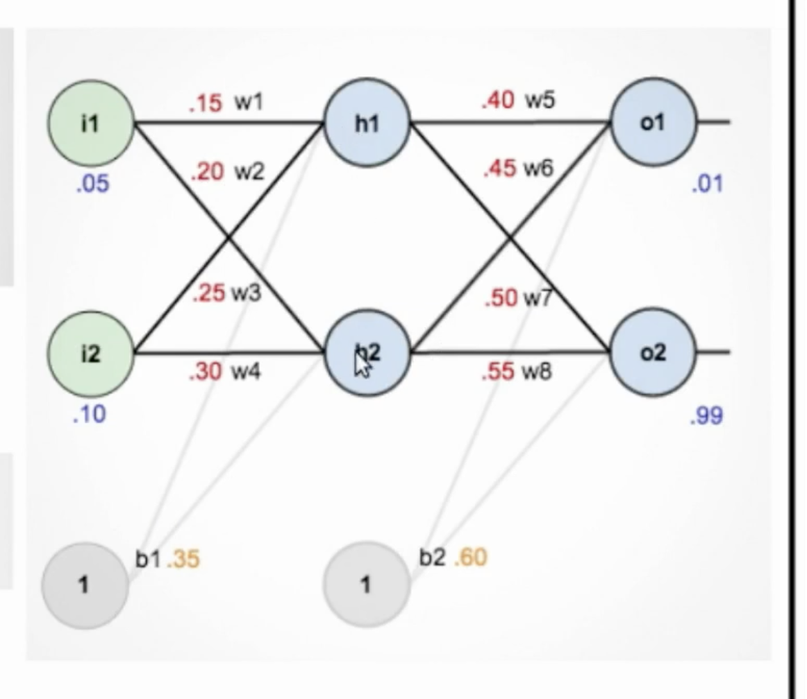

## Chapter 11: Intro to Bayes Nets

- Review
  - Discrete Random vars X,Y with finite domains $\{x_1, \dots, x_n \}$
    - Random vars always capital
  - P(X) is a distribution
  - P(X=xi) = P(x_i) is a probability
  - Joint distribution P(X,Y)
  - Marginalization / Summing Out
    - P(A and (B = x1 or B = x2 or B = x3)) = $\sum_{i = 1}^3P(A, B=xi)$
    - Generalization of OR rule
  - Conditional Probs (prob A given B)
    - P(A|B) = P(A,B) / P(B)
  - Bayes Rule
    - P(A|B) = P(B|A) P(A) / P(B); this is a family of distributions, over all values of B
    - Probability of A given that we have B evidence, is the posterior probability
    - =aprox= alpha P(B|A) P(A) where P(A) is prior, P(B|A) likelihood

- Intro

  - Probabilistic inference: query to get the probability of something

- Issues

  - Specifying the full join distribution over a set of $k$ random variables with finite domain of size $n$ is $k^n$. Huge
  - Calculating all of these probabilities is very slow

- Terms

  - Independence: two variables A and B are independent if P(A|B)=P(A) and P(B|A) = P(B) and P(A and B) = P(A)P(B)
  - If we have $k$ variables then we only need $k$ numbers to represent the complete joint distribution
  - Variable Independence ?
  - Conditional Independence
    - P(A|(B, C)) = P(A|C) for all A,B,C;
    - Ex: A = GPA, B is midterm grade in AI, C is final grade in AI
    - Basically: knowing how well you did in midterm is unneeded, since we already know your final grade in AI (which is all that matters, as that's what affects your GPA)

- Example:

  - P(S|L,G,C,E) = P(S|L)
  - P(L|G,C,E) = P(L|G)
  - P(G|C,E) = P(G|C)

  ```
  P(S,L,G,C,E) = P(S | L,G,C,E) * P(L,G,C,E) 
  						 = P(S | L) * P(L,G,C,E) 
  						 = P(S | L) * P(L | G,C,E) * P(G,C,E)
  						 = P(S|L) * P(L|G) * P(G,C,E)
  						 = P(S|L) * P(L|G) * P(G|C,E)*P(C,E)
  						 = P(S|L) * P(L|G) * P(G|C) * P(C,E)
  						 = P(S|L) * P(L|G) * P(G|C) * P(C|E) * P(E)
  ```

  ```
  P(G)  = sum ci in C of P(G, C=ci)
  			= sum ci in C of P(G|ci)P(ci)
  			= sum ci in C of P(G|ci)*(sum ei in E of P(ci|ei)P(ei))
  ```

- Bayesian Network
  
  - Graph structure of direct. Dependencies over a set of variables and a set of conditional probability distributions (CPTs) quantifying the strength of the influences