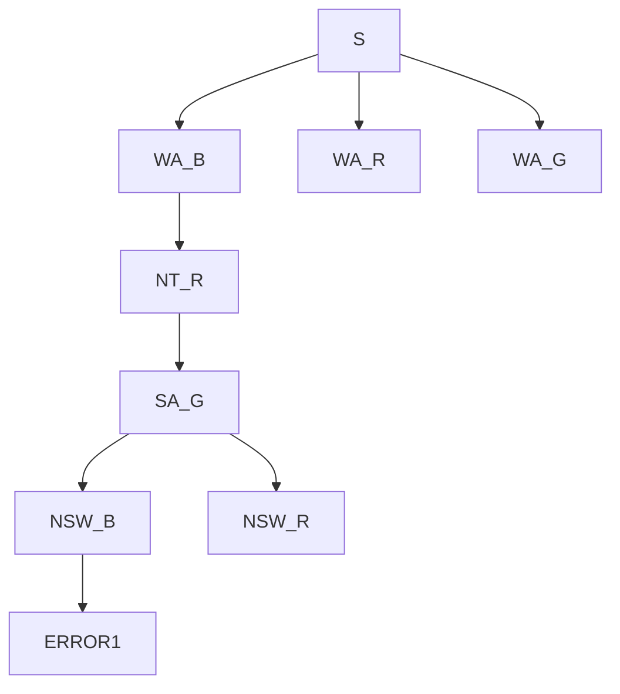

# CS 486 

- Prof 1: Kate Larson (AI Lab)
- Prof 2: Mathieu Doucet (Philisophy)
- Tutorials: ~every second Friday
    - 8:30 - 9:20 RCH 207 MUST ATTEND THIS ONE
- Office Hours: Mondays 1:30 - 3:30 DC2518
- can submit assignments up to 48 hours late (and tutorial assignments)
- assignments
    - A1 out Sept 18, due Oct 2
    - A2 out Oct 2, due Nov 6
    - A3 out Nov 6, 


## Intro

- What is AI?
    - reasoning vs behaviour
    - fidelity to humans vs rationality
- We are interested in intelligent systems where ==a system is intelligent if and only if it acts rationally==
- Rational Agent Paradigm
    - agent: a function that maps from perceptions/information/input to actions
    - want them do be doing the right thing
    - performance measures: dependeont on context; goal achievement, resource consumption, etc
    - requires a task environment
- Task Environment
    - performance measures
    - environment
    - actuators: what actions are available
    - sensors: what information does it receive from the environment
- Properties of the Task Environment
    - Fully Observable vs Partially Observable
        - do sensors give agent access to complete state of environment?
    - Deterministic vs Stochastic
        - is next state completely determined by current state and action executed? or is there randomness?
    - Episodic vs Dynamic
    - Discrete vs Continuous
    - Static vs Dynamic: static means only we are changing the environment
    - Single Agent vs MultiAgent

## Chapter 2: Search

### Search Problem

- Search Problem:
  - consists of
    - a **state space**
      - **world state**: includes every last detail of the environment
      - **search state**: keeps only the details needed for planning (is an abstraction)
    - a **successor** functon(actions, cost)
    - a **start state** and a **goal test**
  - a **solution** is a sequence of actions (plan) from the start state to a goal state
- E.g. Sliding Tile Toy Problem
  - states: all configs of tiles
  - actions: slide a tile to a legal adjacent space; must move blank tile NSEW (this way, you only ever need to look at blank spot, you don't need to scan all other spots and find out which of their NSEW moves are legal)
  - 3x3 grid has ~181,000 states
  - 4x4 grid has ~ 1.3 trillion states
  - 5x5 grid has ~ $10^{25}$ states

| [7]     | [2]       | [4]     |
| ------- | --------- | ------- |
| **[5]** | **BLANK** | **[6]** |
| **[8]** | **[3]**   | **[1]** |

- E.g. 8 Queen Problem
  - goal: place n queens on a n x n grid such that no queen can attack another
  - representation 1:
    - states v1: 0 to n queens on the board
    - initial: 0 on board
    - actions v1: add a queen to the board
    - state space: $1.8 \times 10^{14}$
  - representation 2: we know that, in the final solution, there must be 1 queen per column
    - states v2: 0 to n queens on the board in the first j columns, not attacking one another
    - actions v2: place a queen in the next empty column, not attacking another
    - state space: 2000
  - goal: place n queens on a n x n grid such that no queen can attack another

### Representing Search

- state space graph
  - vertex corresponds to states
  - one vertex for each state
  - edge correspond to successors
- we search for a solution by building a **search tree** and traversing it to find a goal state
- Search Tree
  - state start is the root
  - children are successors
  - a "plan" is a path in the tree
  - a "solution" is a path from root to a goal node
  - hopefully we don't actually generate the entire tree


- Expanding Nodes
  - apply all legal operators to the state contained in the node
  - genereate nodes for all corresponding successor states

### Search Implementations

- Generic Search Algorithm

  - types: start node, explored nodes, ==frontier==, unexplored nodes
  - if no candidate nodes can be expanded, report FAILURE
  - choose a leaf for expansion according to **search strategy**
  - if node contains goal, return SOLUTION

- Implementation Details

  ```
  insert start node to queue
  repeat:
  	if q empty then return FAIL
  	f = dequeue
  	if f goal state then return SUCCESS
  	add all of f's children to queue
  ```


#### DFS

- recall: we transform our problem graph into our search graph

- Key Properties
  - completeness: is the algorithm guaranteed to find a solution if one exists? YES
  - optimality: does the algorithm find the optimal solution? NO
  - time complexity: suppose we have $b$, our branching factor (max number of nodes you can branch to) and $m$, our maximum depth. Then the time complexity of our algorithm is $O(b^m)$ as there are just about $2*b^m$ nodes
    - time complexity is equivalent to the number of nodes traversed
  - space complexity
    - store **path** from start -> current node (at most m)
    - store **fringe**, these are the unexplored siblings of each node on the path (b for each node on the path)
    - $\in O(bm)$


#### BFS

- time complexity: $O(b^{d + 1})$ where $d$ is the depth of the goal node; total number of nodes traversed until the shallowest solution is found
- space complexity: $O(b^{d + 1})$
- optimal if all edges equal

#### Iterative Deepening Search

- combines DFS and BFS
- outer loop which inreases depth of how far you are willing to search (do DFS but only expand down to some depth, then increase depth and repeat)
- Complete: yes
- optimal: will find the shallowest goal node fastest
- time complexity: $O(b^d)$
- space complexity: uses less space than BFS; $\in O(d)$ where $d$ is the depth of the goal. it is only ever engaged in a depth-first search, so only needs to store nodes which represent the current path it is exploring. since it is optimal, and finds the shallowest goal at depth $d$, then the length of this path is only ever $d$
- comparisons:
  - $b = 10, d = 5$
  - N(BFS) = 1,111,000
  - N(IDS) = 125,000

#### Cost-Sensitive Search: Uniform Cost Search

- expand cheapest node first
- complete: yes
- optimal: yes (as long as they aren't all 0; no negative costs)
- biased on little paths that have low-cost actions and puts-off larger costs branches
- Uses minimum-cumulative cost as the priority in the priority queue, as opposed to depth as the priority in the queue for DFS

## Chapter 3: Informed Search

### Using Knowledge

- uninformed search uses no knowledge about the problem (looks at cost or distnace, never looks ahead to the goal); very general and expensive
- informed search
  - we often have additional knowledge about the problem
  - want to encode that knowledge into the nodes
  - different notions of merit
    - cost of solution
    - minimize computation
- Uninformed vs Informed search
  - uninformed expands based on distance from start node - ==why not expand on distance to goal?==
- ==Heuristic: is a function that estimates the cost of reaching a goal from a given state==
  - estimate; doesn't need to be correct
  - E.g. euclidian distance (hypotenuse)
  - manhatten distance (distance you would have to travel if you could only travel NSEW)
- Heuristics: Structure
  - If $h(n1) < h(n2)$ we guess it is cheaper to reach the goal from $n1$ than from $n2$
  - We require $h(n, goal) = 0$

### Best-First Search (bad algorithm)

- Search Strategy: expand the most promising node according to the heuristic
- S(4) --> 2 --> A(3) --> 1 --> B(2) --> 1 --> C(1) --> 2 --> G(0)
  - Also, A(3) --> 4 --> C(1)
- S --> A --> (can go to B or C. C has lower heuristic) so --> C --> G
- Always compare the heuristic values of the nodes on the fringe to one another
- Properties:
  - Complete: no
  - Optimal: no
  - Time complexity: worst case explores entire graph, $O(b^m)$
  - Space complexity: $O(b^m)$

### A* Search

- Observations:

  - Best first search ordered nodes by forward cost to goal, h(n)
  - Uniform cost search ordered nodes by backward cost of path so far, g(n) (cost at node n was the cost of getting to that node from the start node)

- A* Search expand nodes in order of f(n) = g(n) + h(n)

- Example:

  ```mermaid
  graph LR
  S4 -- 2 -->A3 
  A3 -- 1 --> B2
  B2 -- 1 --> C1
  C1 -- 2 --> G
  A3 -- 4 --> C1
  
  ```

  ```
  start at S (f(S) = 4)
  calculate f(A) = 3 + 2 = 5
  go to A 
  consider B and C
  calculate f(B) = (2 + 1) + 2 = 5
  calculate f(C) = (2 + 4) + 1 = 7
  choose B
  go to B
  calculate f(C2) = (2 + 1 + 1) + 1 = 5
  compare C to C2 (same C, but different paths). C2 is lower
  go to C2 (using path SABC)
  f(G) = 6 + 0 = 6
  go to G
  ```

- ==When do you do your goal test?==

  - For A* search, always do goal test when you are expanding a node (remove it from front of queue)
  - If you check goal test when you GET to a node, then you could get wrong answer. Just add it on the queue like any other node.
  - Then you choose which node to expand based off of minimum value (f) on the queue, and THEN you check if it is the goal state

- NOTE: with a good heuristic, when A* finds the goal state (removes it from front of queue) then that is the optimal path

- Admissible Heuristics

  - An optimistic heuristic, always under-estimating
  - A heuristic function $h(n)$ is ==admissible== if $0 \leq h(n) \leq h^*(n)$ where $h^*(n)$ is the TRUE, god-given value
  - Note that $h(i) = 0$ for all $i$ is admissible (this is just cost-sensitive search)

- Optimality of A*

  - If the heuristic is admissible then A* with tree search is optimal
  - If we have a graph (**multiple paths to the goal**), then we require a stronger property for the heuristic function
  - A heuristic is ==consistent== if $h(n) \leq cost(n,n') + h'(n)$
  - Cost of getting to goal state from n is less than cost of going from n to n' + cost of getting to goal state from n'

- Example

  Let G be optimal goal. Let G2 be suboptimal goal. cost(G) < cost(G2). Let n be on queue and is on path to G. Assume G2 is on queue and assume G2 is selected.

  Recall g(x) is distance from start to x, h(x) is heuristic from x to goal

  ```
  G2 is selected over n, so this means f(G2) < f(n).
  f(G2) = g(G2) + h(G2)
  			= g(G2) // as h(G2) = 0
  			> g(G) // G2 is suboptimal
  			= cost(S,n) + cost(n, G) // because n is on optimal path to G
  			>= g(n) + h(n) = f(n)
  			contradiction as we have shown that f(G2) >= f(n)
  ```

- A* is Optimally Efficient
  
  - A* expands the fewest nodes compared to all algorithms that start at the same node and use the same heuristic function
  
- **A* Search Properties**
  
  - Optimal: yes
  - Time complexity: $O(b^{\Delta*d})$ where $d$ is the depth of the shallowest goal node and $\Delta$ is the relative error of heuristic; $\Delta = \frac{h^* - h}{h^*}$
  - Space complexity: has to remember every node that has been expanded in memory (need to keep all possible paths)
  - In our graph example (country, Austria) the perfect heuristic function $h^*$ is the actual distance required to travel from node n to the goal (not the straight line distance, but the distance from travelling through all of the roads in the optimal way)
  - But, getting that perfect heuristic, in this example, requires solving the problem before-hand. Pointless.

### Heuristic Functions

- Extremely important to have a good heuristic function

- 8 Puzzle Toy Problem Example:

  - Relax the game; change the rules?
  - Option 1: you can move A to B (swap) if A is next to B
  - Option 2: you can move A to B (swap) if B is blank
  - Option 3: you can move A to B (swap)
  - Count the number of moves it would require to win the game using those options; clearly an under-estimate of the real value played using the games' real rules
  - ==use these relaxed forms using relaxed rules to get under-estimates of moves required to reach goal==

- Dominating Heuristic: Given heuristics $h_1, h_2$ we say $h_2$ dominates $h_1$ if $\forall \, n \, h_2(n) \geq h_1(n)$ and $\exists \, n \, | h_2(n) > h_1(n)$

- Dominating Heuristic Theorem: If h2(n) dominates h1(n) then A* using h2(n) will never expand more nodes than A* using h1(n)

- Notes

  ```
  C* = cost of optimal solution, constant
  recall: f(n) = g(n) + h(n)
  A* expands all n where f(n) < C* 
  = g(n) + h(n) < C*
  ==> h(n) < C* - g(n) // g(n) using either heuristic is the same!
  ==> h1(n) < h2(n) < C* - g(n) // because h2(n) > h1(n)
  
  if a node was expanded in the h2 heuristic then it must ALSO have been expanded in the h1 heuristic
  ```

- Designing Heuristics
  - Relax the problem
  - Pre-compute solution costs of sub-problems and store them in a pattern-database
  - Tradeoff between accuracy of heuristic (and therefore amount of search) and amount of computation needed to compute it


## Chapter 4: Constraint Satisfaction Problems (CSPs)

### CSPs and Constraint Graphs

- Intro
  - Standard search: 
    - state, black box, state is just a node in our graph, don't really care what the underlying state structure is
    - goal test: any function over states
    - successor function: anything that let you move from one state to another
  - CSP
    - subset of search problems
    - states have a specific definition; defined by variables $X_i$ with values from domains $D_i$
    - goal test: set of specific constraints
- CSP Examples
  - Map Colouring
    - variables (provinces)
    - domains (colours R, G, B, Y that are assigned to variables)
    - constraints: adjacent provinces must have different colours
    - solution: an assignment of domain elements to variables that satisfies all constraints
  - N Queens
    - variables (cell $C_{i,j}$)
    - domains (QUEEN, EMPTY)
    - constraints ...
  - N Queens p2 (far fewer states, far faster to solve)
    - variables (columns $C_i$)
    - domains (1, ..., N) where $C_i = x$ means that the x'th row in the i'th column is a queen
    - constraints ...
  - 3SAT
    - variable ($v_1, ..., v_n$)
    - domains (true, false)
    - constraints: satisfy the input equation which is disjunctions of conjunctions of clauses of 3 variables
- Types of CSPs
  - discrete variables
    - finite domains: with $n$ variables and $d$ domain elements then there are $O(d^n)$ complete assignments
    - infinite domains
  - continuous variables
- Types of Constraints
  - unary: single variable; this variable $x_1$ cannot be $d_1$
  - binary: variable $x_1$ cannot equal variable $x_2$
  - higher-order: involve multiple variables
  - soft constraints (preferences):
    - "red" is better than "green"
    - constrained optimization problems
- Constraint Graphs
  - binary constraints: nodes are variables, edges are constraints
  - higher order constraints: hypergraphs
- CSPs and Search: Map Colouring Example
  - state: partial assignment of domain values to the different variables
  - initial state: {}
  - successor function: assign a domain value to some unassigned variable
  - goal test: complete assignment and constraints satisfied
  - BFS doesn't work well:
    - too many starting states here ($|Variables| \times |Domain|$)
  - Commutativity
    - ==important: CSPs are commutative; order of actions does not effect outcome; can assign variables in any order==

### Solving CSPs

#### Backtracking Search (basic)

```
select unassigned variable x(j)
	for each domain value d1,..., dn that can be assigned to x
		if value satisfies constraints, assign x = di
		break
	if assignment found
		continue to next variable x(j + 1)
	if assignment not found
		go back to previous variable x(j - 1)
```




NOTE: don't actually draw an ERROR state (just visual helper here)

```
colours = [B,R,G]
start at WA. it can be blue
go to NT. can't be blue. can be red.
go to SA. can't be blue or red. can be green
go to NSW. can't be green. can be blue
go to Q. can't be blue or red or green. ERROR

go back to NSW. try a different domain value. can be red
```

- Notes
  - DFS with some small improvements
  - correctness: will find a correct answer
  - ordering: which variables should be tried first?
  - filtering: can we detect failure early?
  - structure: can we exploit the problem structure?

### Improving Our Solution

- ordering: **most constrainED variable**

  - choose the **variable** which has the fewest legal moves (MRV minimum remaining values)

  - assign first variable. then look at other variables. surely, one of the first variable's neighbours will have fewer possible legal values than a variable on the other side of the graph.

     

- ordering: **most constrainING variable**

  - choose variable with most constraints on remaining variables
  - ex: most neighbours (if there are constraints between all neighbours, like in Map Colouring)

  - we want to detect failure as quickly as possible.

  

- ordering: **least-constraining value**

  - choose the value that rules out the fewest values in the remaining variables

  

- filtering: **forward checking**

  - keep track of remaining legal values for unassigned variables
  - done at runtime
  - terminate (go back) when any variable has no legal values

  


- filtering: arc consistency

  - forward checking propagates information from assigned to unassigned variables, but it cannot detect all future failures early
  - run a pre-processing step to get consistency across variables
  - arc: directed edge
  - give domains D1, D2 an arc is consistent if for all x in D1 there is a y in D2 such that x and y are consistent with the given constraints

  ```mermaid
  graph LR;
  	A --> B
  	B --> A
  ```

  ```
  D(A) = { blue }
  D(B) = { blue, red }
  A -> B is consistent
  B -> A is not consistent. remove { blue } from D(B)
  ```

  - if you can't make an arc consistent, then there is no solution
  - works for 2 variables at a time

- k-consistency

  - forall sets of k - 1 variables, and consistent assignment of values; a consistent value can always be found for any kth variable

### Structure

- look for independent subproblems

  - ex: tasmania is not connected to other components in australia map

  - idea: break down the graph into its connected components; solve each component separately

  - big savings: if each component has $c$ variables then there are $n/c$ components and ==worst case cost is now $O(d^c \times n/c)$==

    

​		


***


## Tutorial Readings

### Tutorial 1 Readings

#### Philosophers are building ethical algorithms to help control self-driving cars

- Philosophers are working on real-life Trolly problem scenarios as self-driving cars will, inevitably, be put in similar situations in the future
- Do you save the driver or the pedestrian? Which lives are worth more?
- You could just jump in front of a moving self-driving car to have it crash and protect the pedestrian -> bad!
- Usually people get to make an informed decision as to whether or not they want to be in an experiment. When self-driving cars come out, society won't be able to choose, they will be forced
- Who is responsible when a self-driving car kills someone?
- Can't fully imagine how it will change our lives

#### The Montreal Declaration for a responsible development of AI REQUIRED

- Main objectives:
  - Develop ethical framework for development of AI
  - Guide the digital transition so everyone benefits
  - Open national and international forum to discuss it

- Can "restrict the choices of individuals and groups", "lower living standard", "influence politics", "affect the climate and environment"
- Principles
  - Well-Being. Must permit the growth of well-being of all sentient beings
  - Response for Autonomy. Should aim to increase people's control over their lives and their surroundings.
  - Protection of Privacy and Intimacy. Prevent data intrusion
  - Solidarity
  - Democratic Participation. Must be subjected to democratic scrutiny, debate, and control.
  - Equity. Must contribute to just and equitable society. (Silly)
  - Diversity Inclusion. Must be compatible with maintaining social and cultural diversity
  - Prudence. Everyone involved in its development must exercise caution
  - Responsibility. Must not lessen the responsibility of human beings when decisions must be made (silly)
  - Sustainable development. Help to sustain the planet

