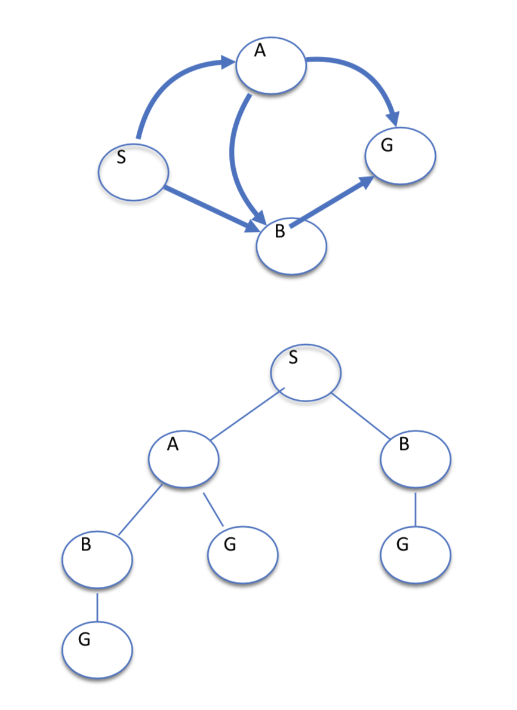

# CS 486 

- Prof 1: Kate Larson (AI Lab)
- Prof 2: Mathieu Doucet (Philisophy)
- Tutorials: ~every second Friday
    - 8:30 - 9:20 RCH 207 MUST ATTEND THIS ONE
- Office Hours: Mondays 1:30 - 3:30 DC2518

***

## Intro

- What is AI?
    - reasoning vs behaviour
    - fidelity to humans vs rationality
- We are interested in intelligent systems where ==a system is intelligent if and only if it acts rationally==
- Rational Agent Paradigm
    - agent: a function that maps from perceptions/information/input to actions
    - want them do be doing the right thing
    - performance measures: dependeont on context; goal achievement, resource consumption, etc
    - requires a task environment
- Task Environment
    - performance measures
    - environment
    - actuators: what actions are available
    - sensors: what information does it receive from the environment
- Properties of the Task Environment
    - Fully Observable vs Partially Observable
        - do sensors give agent access to complete state of environment?
    - Deterministic vs Stochastic
        - is next state completely determined by current state and action executed? or is there randomness?
    - Episodic vs Dynamic
    - Discrete vs Continuous
    - Static vs Dynamic: static means only we are changing the environment
    - Single Agent vs MultiAgent

## Chapter 1: Search

### Search Problem and States / Expansion

- Search Problem:
  - consists of
    - a state space
      - world state: includes every last detail of the environment
      - search state: keeps only the details needed for planning (is an abstraction)
    - a successor functon(actions, cost)
    - a start state and a goal test
  - a solution is a sequence of actions (plan) from the start state to a goal state
- E.g. Sliding Tile Toy Problem
  - states: all configs of tiles
  - actions: slide a tile to a legal adjacent space; must move blank tile NSEW (this way, you only ever need to look at blank spot, you don't need to scan all other spots and find out which of their NSEW moves are legal)
  - 3x3 grid has ~181,000 states
  - 4x4 grid has ~ 1.3 trillion states
  - 5x5 grid has ~ $10^{25}$ states

| [7]     | [2]       | [4]     |
| ------- | --------- | ------- |
| **[5]** | **BLANK** | **[6]** |
| **[8]** | **[3]**   | **[1]** |

- E.g. 8 Queen Problem
  - goal: place n queens on a n x n grid such that no queen can attack another
  - representation 1:
    - states v1: 0 to n queens on the board
    - initial: 0 on board
    - actions v1: add a queen to the board
    - state space: $1.8 \times 10^{14}$
  - representation 2: we know that, in the final solution, there must be 1 queen per column
    - states v2: 0 to n queens on the board in the first j columns, not attacking one another
    - actions v2: place a queen in the next empty column, not attacking another
    - state space: 2000
  - goal: place n queens on a n x n grid such that no queen can attack another

- Representing Search
  - state space graph
    - vertex corresponds to states
    - one vertex for each state
    - edge correspond to successors
  - we search for a solution by building a search tree and traversing it to find a goal state
- Search Tree
  - state start is the root
  - children are successors
  - a "plan" is a path in the tree
  - a "solution" is a path from root to a goal node
  - hopefully we don't actually generate the entire tree



- Expanding Nodes
  - apply all legal operators to the state contained in the node
  - genereate nodes for all corresponding successor states

### Search Implementations

- Generic Search Algorithm

  - types: start node, explored nodes, ==frontier==, unexplored nodes
  - if no candidate nodes can be expanded, report FAILURE
  - choose a leaf for expansion according to **search strategy**
  - if node contains goal, return SOLUTION

- Implementation Details

  ```
  insert start node
  repeat:
  	if q empty then return FAIL
  	dequeue
  ```

#### DFS

- recall: we transform our problem graph into our search graph

```
DFS(G, s)
	stack = [s]
	while stack not empty
		front = stack.pop()
		print("visited", front)
		visited.add(front)
		for n in G.neighbours(front) // recall: only visit a node once, don't need visited
			stack.push(n)
```
- Key Properties
  - completeness: is the algorithm guaranteed to find a solution if one exists?
  - optimality: does the algorithm find the optimal solution?
  - time complexity: suppose we have $b$, our branching factor (max number of nodes you can branch to) and $m$, our maximum depth. Then the time complexity of our algorithm is $O(b^m)$
  - space complexity
    - store **path** from start -> current node
    - store **fringe**, these are the unexplored siblings of nodes on path
    - $\in O(bm)$


#### BFS

- time complexity: $O(b^{d + 1})$ where $d$ is the depth of the goal node
- space complexity: $O(b^{d + 1})$

#### Iterative Deepening Search

- combines DFS and BFS
- outer loop which inreases depth of how far you are willing to search (do DFS but only expand down to $d_1$)
- Complete: yes
- optimal: will find the shallowest goal node fastest
- time complexity: $O(b^{d + 1})$
- space complexity: 
- comparisons:
  - $b = 10, d = 5$
  - N(BFS) = 1,111,000
  - N(IDS) = 125,000

#### Cost-Sensitive Search: Uniform Cost Search

- expand cheapest node first
- complete: yes, optimal: yes (as long as they aren't all 0; no negative costs)
- biased on little paths that have low-cost actions and puts-off larger costs branches

