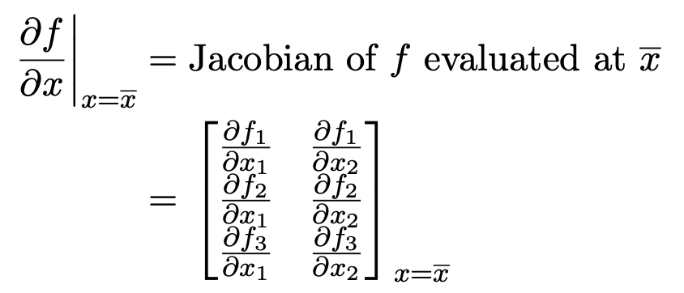
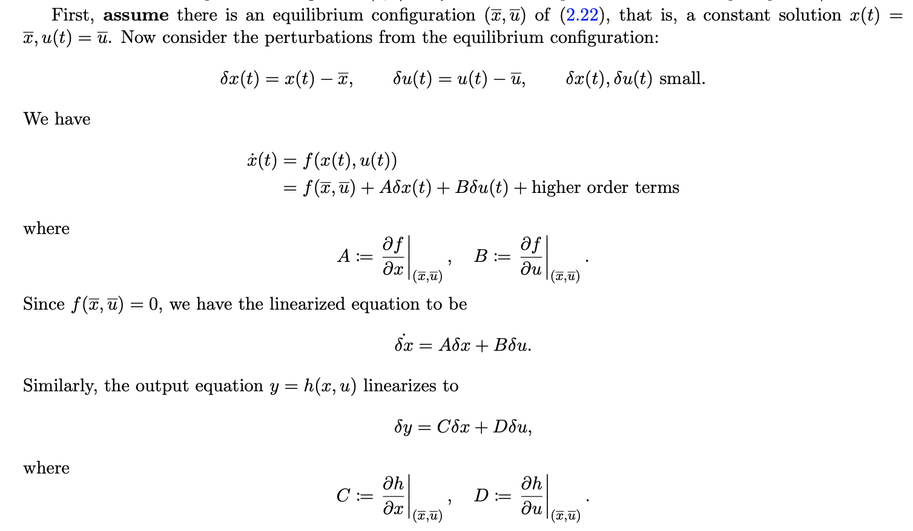
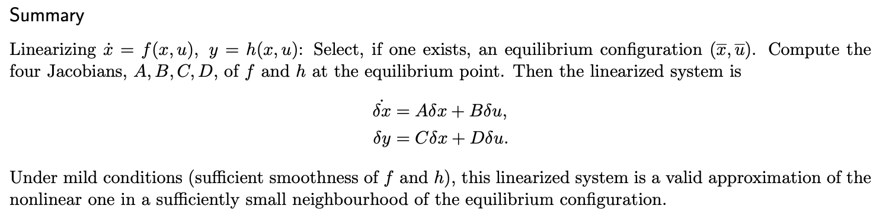
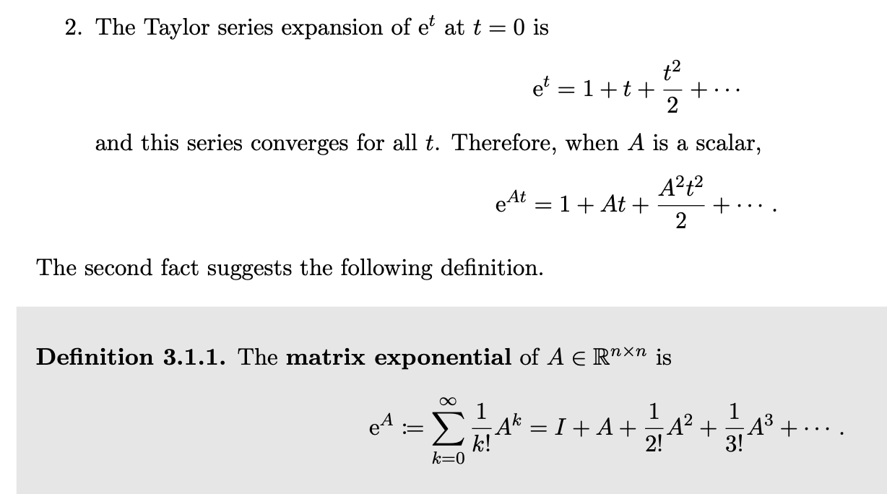
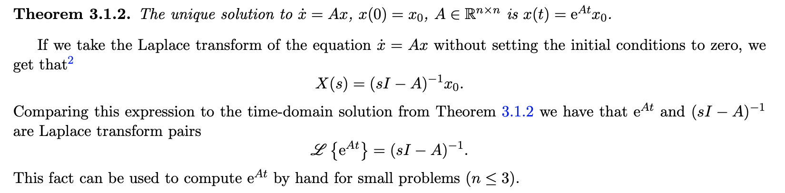
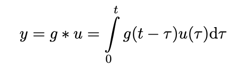
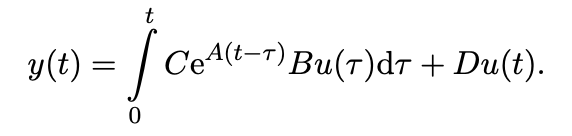
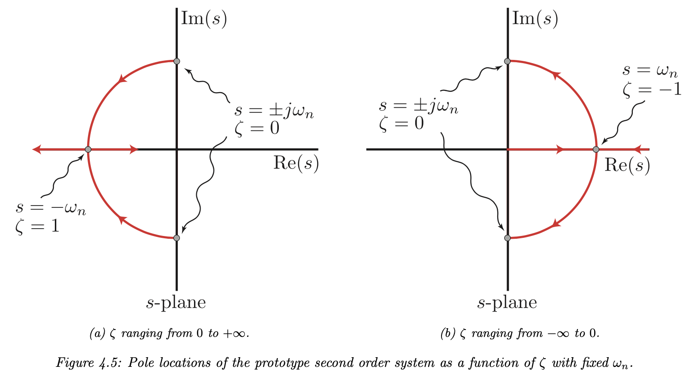
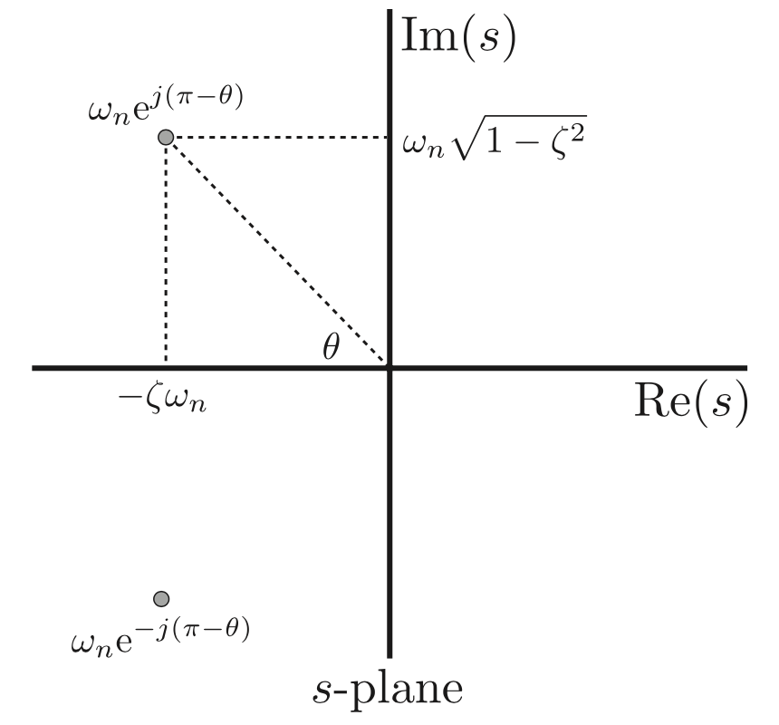

# SE 380

#### State-Space Models

- $x = \begin{bmatrix} x_1 \\ \dots \\ x_n \end{bmatrix}$ (Different equations needed to represent the state of the system)
- We want to calculate $\dot{x} = \begin{bmatrix} \dot{x_1} \\ \dots \\ \dot{x_n} \end{bmatrix}$  (derivative of $x$)
- $u$ is input to the system
- State equation: $x = f(x,u)$
- Output equation: $y = h(x,u)$
- DEFN Linear Time-Invariant state-space model:
  - $x = Ax + Bu$ and $y = Cx + Du$

#### Linearization (of state-space models)

- we will linearize about some point $\bar{x}$
- and approximate that $y = f(x) \approx f(\bar{x}) + \frac{\partial f}{\partial x} |_{x - \bar{x}}(x - \bar{x})$
- 
- DEFN a pair $(\bar{x}, \bar{u})$ is an equilibrium configuration of $f(x)$ if $f(\bar{x}, \bar{u}) = 0$
- 
- 

#### 2.8 Transfer Functions

- DEFN: a TF is rational is it is a polynomial divided by a polynomial
- DEFN: a TF is proper if degree(numerator) <= degree(denominator)
- DEFN: a TF is strictly proper if degree(numerator) < degree(denominator)
- DEFN: a complex number $p$ is a pole of a TF $G(s)$ if limit as $s \rightarrow p | G(s)| = \infin$
- DEFN: a complex number $p$ is a root of a TF $G(s)$ if limit as $s \rightarrow p | G(s)| = 0$
- Obtaining a TF from a State model:
  - Given $\dot{x}(t) = Ax(t) + Bu(t)$ and $y(t) = Cx(t) + Du(t)$
  - We get $sX(s) = AX(s) + BU(s)$ and $Y(s) = CX(s) + DU(s)$
  - And get $\frac{Y(s)}{U(s} = [X(Is - A)^{-1}B + D]$

#### 2.9 Block Diagram Manipulation

- Manipulations:
  - Series: multiply
  - Parallel: add
  - Feedback: U --- [] --> A ---- (loop back to [] via B) --> Y: $Y = \frac{A}{1 + AB}U$
- Systematic Formula
  - Introduce new variables {v1, v2, . . .} representing the output of every summing junction. 
  - Write down the expression for the inputs to each summing junction in terms of the signals {u, y, v1, v2, . . .} and the TF blocks. 
  - Write the equation of each summing junction using the expressions from the previous step. 
  - Eliminate the variables {v1, v2, . . .}. 

## Chapter 3: Linear System Theory

- Recall: if $\dot{x} = Ax, x(0) = x_0$ then $x(t) = e^{At}x_o$

- Recall:

  

- 

#### 3.2 Input Response

- Recall convolution:

  

- 

- EQN: single input single output system with impulse response input $y(t) = C^{eAt}B1(t) + Dδ(t)$

#### 3.4 Stability of state-space models

- DEFN the system $\dot{x}(t) = Ax(t)$ is asymptotically stable if for all initial conditions x(t) approaches 0 as t approaches infinity
- PROPOSITION: $e^{At} \rightarrow 0$ as $t \rightarrow \infin$ iff all the eigenvalues of A have negative real part
- DEFN: the eigenvalues of matrix A are the roots of $det(sI - A)$

#### 3.5 Bounded input Bounded output Stability

- DEFN: a real-bounded signal $u(t)$ is bounded if tehre exists a $b > 0$ such that for all t, $u(t) \leq b$
- DEFN: a linear time-invariant system with input $u$ and output $y$ is BIBO stable if every bounded input $u$ produces a boudned output $y$
- THEOREM: assume $G(s)$ is rational and strictly proper, then the following are all equivalent
  - system is BIBO stable
  - impulse response $g(t)$ is absolutely integrable (finite)
  - every pole of the transfer function $G(s)$ has a negative real part
- THEOREM: if $G(s)$ is impropert then $G(s)$ is not BIBO stable

#### Bringing Together Asymptotic and BIBO Stability

- recall: asymptotically stable if all poles of $G(s)$ have real parts < 0
- note that poles of $G(s) \subseteq$ eigenvalues of A
- PROPOSITION: asymptotic stability implies BIBO stability

- THEOREM: Final Value Theorem
  - If $sF(s)$ has all poles with Re(pole) < 0 then $f(t)$ approaches a constant which is  $lim_{t \rightarrow \infin} f(t) = lim_{s \rightarrow 0} s F(s)$
- THEOREM: if $G$ is BIBO stable and $u(t) = b \times 1(t)$ for real constant $b$ then $y_{ss} = bG(0)$

## Chapter 4: First and Second Order Systems

#### First Order

- $G(s) = \frac{K}{\tau s + 1} = \frac{Y(s)}{U(s)}$
- If we let $u(t) = 1(t)$ then $y(t) = K(1 - e^{-t / \tau})$
- Settling time is $4 \tau$
- Steady state value $y_{ss} = K$
- ==EQN: Bandwidth is $1 / \tau$==
- Further left the pole is, faster the response time

#### Second Order

- ==$G(s) = \frac{K w_n^2}{s^2 + 2 z w_n s + w_n^2}$==
- ==Poles at $s = -z w_n \pm w_n \sqrt{z^2 - 1}$==
- Categories of systems based on zeta
  - Un-damped: z = 0
  - Under damped: 0 < z < 1
  - Critically damped: z = 1
  - Over damped: z > 1
- 

- DEFN $\zeta$ or $z$: dampening ratio
- DEFN $K$: steady state gain
- DEFN $w_n$: undamped natural frequency
- DEFN $\theta$: angle from Re(s) to the pole, is $arccos(z)$
- Under Damped System
  - Poles at $s = -wz \pm jw\sqrt{1 - z^2}$
  - More imaginary implies more oscillations
  - 

- Over Damped Systems
  - Two real poles $b < -1, -1 < a < 0$, with z large enough it starts to look like a first order system
- Critical Damped
- DEFN steady state value $y_{ss}$ is value $y(t)$ converges to
- DEFN settling time $T_s$ is time it takes $y(t)$ to get and stay within 2% of $y_{ss}$
- DEFN Peak y val is $y_{max}$
- DEFN Overshoot OS $= \frac{y_{max} - y_{ss}}{y_{ss}}$
- Observation: more dampening --> z increases --> less overshoot
- ==EQN min zeta to guarantee max overshoot: $z_{min} = \frac{-ln(OS max)}{\sqrt{\pi^2 + ln^2(OS max)}}$==
- ==EQN settling time: $T_s = \frac{4}{z w}$==
  - ==In order to meet a $T_s$ specification we require that all poles of $G$ has $Re(pole) \leq \frac{-4}{T_s}$==
- ==EQN time to peak: $T_p = \frac{\pi}{w \sqrt{1 - z^2}}$==
  - Only depends on the imaginary part of the poles

#### Random Asides

- Bandwidth of a system is the frequency range over which the system lets $u(t)$ pass through

- For low pass systems, the bandwidth frequency range is the range $[0, w_{bw}]$

  