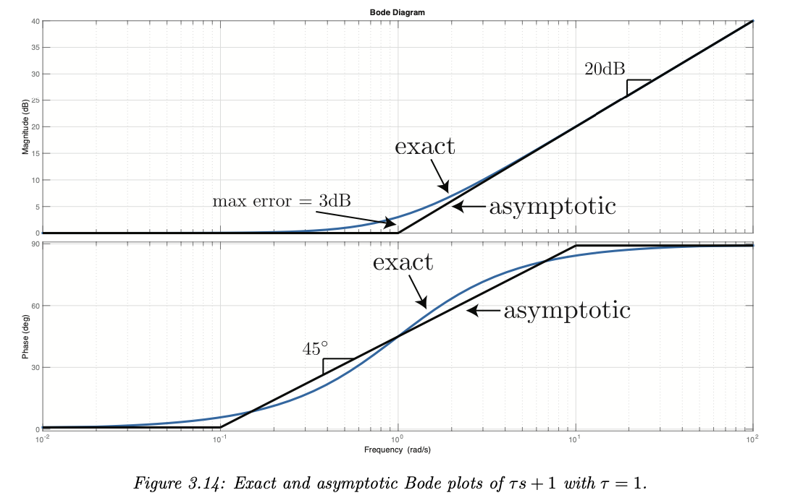

# SE 380

#### State-Space Models

- $x = \begin{bmatrix} x_1 \\ \dots \\ x_n \end{bmatrix}$ (Different equations needed to represent the state of the system)
- We want to calculate $\dot{x} = \begin{bmatrix} \dot{x_1} \\ \dots \\ \dot{x_n} \end{bmatrix}$  (derivative of $x$)
- $u$ is input to the system
- State equation: $x = f(x,u)$
- Output equation: $y = h(x,u)$
- DEFN Linear Time-Invariant state-space model:
  - $x = Ax + Bu$ and $y = Cx + Du$

#### Linearization (of state-space models)

- we will linearize about some point $\bar{x}$
- and approximate that $y = f(x) \approx f(\bar{x}) + \frac{\partial f}{\partial x} |_{x - \bar{x}}(x - \bar{x})$
- 
- DEFN a pair $(\bar{x}, \bar{u})$ is an equilibrium configuration of $f(x)$ if $f(\bar{x}, \bar{u}) = 0$
- 
- 

#### 2.8 Transfer Functions

- DEFN: a TF is rational is it is a polynomial divided by a polynomial
- DEFN: a TF is proper if degree(numerator) <= degree(denominator)
- DEFN: a TF is strictly proper if degree(numerator) < degree(denominator)
- DEFN: a complex number $p$ is a pole of a TF $G(s)$ if limit as $s \rightarrow p | G(s)| = \infin$
- DEFN: a complex number $p$ is a root of a TF $G(s)$ if limit as $s \rightarrow p | G(s)| = 0$
- Obtaining a TF from a State model:
  - Given $\dot{x}(t) = Ax(t) + Bu(t)$ and $y(t) = Cx(t) + Du(t)$
  - We get $sX(s) = AX(s) + BU(s)$ and $Y(s) = CX(s) + DU(s)$
  - And get $\frac{Y(s)}{U(s} = [C(Is - A)^{-1}B + D]$

#### 2.9 Block Diagram Manipulation

- Manipulations:
  - Series: multiply
  - Parallel: add
  - Feedback: U --- [] --> A ---- (loop back to [] via B) --> Y: $Y = \frac{A}{1 + AB}U$
- Systematic Formula
  - Introduce new variables {v1, v2, . . .} representing the output of every summing junction. 
  - Write down the expression for the inputs to each summing junction in terms of the signals {u, y, v1, v2, . . .} and the TF blocks. 
  - Write the equation of each summing junction using the expressions from the previous step. 
  - Eliminate the variables {v1, v2, . . .}. 

## Chapter 3: Linear System Theory

- Recall: if $\dot{x} = Ax, x(0) = x_0$ then $x(t) = e^{At}x_o$

- Recall:

  

- 

- 

#### 3.2 Input Response

- 

- but if $x_o$ is 0 then $x(t) = L^{-1}((sI - A)^{-1}BU(s))$

- Recall convolution:

  

- 

- EQN: single input single output system with impulse response input $y(t) = Ce^{At}B1(t) + Dδ(t)$

#### 3.4 Stability of state-space models

- DEFN the system $\dot{x}(t) = Ax(t)$ is asymptotically stable if for all initial conditions x(t) approaches 0 as t approaches infinity
- PROPOSITION: $e^{At} \rightarrow 0$ as $t \rightarrow \infin$ iff all the eigenvalues of A have negative real part
- DEFN: the eigenvalues of matrix A are the roots of $det(sI - A)$

#### 3.5 Bounded input Bounded output Stability

- DEFN: a real-bounded signal $u(t)$ is bounded if there exists a $b > 0$ such that for all t, $u(t) \leq b$
- DEFN: a linear time-invariant system with input $u$ and output $y$ is BIBO stable if every bounded input $u$ produces a boudned output $y$
- THEOREM: assume $G(s)$ is rational and strictly proper, then the following are all equivalent
  - system is BIBO stable
  - impulse response $g(t)$ is absolutely integrable (finite)
  - every pole of the transfer function $G(s)$ has a negative real part
- THEOREM: if $G(s)$ is improper then $G(s)$ is not BIBO stable
- FACT: poles of $G(s) \subseteq $ eigenvalues of A
- FACT: stability of state model $\implies$ BIBO stability

#### 3.7 Bringing Together Asymptotic and BIBO Stability

- recall: asymptotically stable if all poles of $G(s)$ have real parts < 0
- note that poles of $G(s) \subseteq$ eigenvalues of A
- PROPOSITION: asymptotic stability implies BIBO stability

- THEOREM: Final Value Theorem
  - If $sF(s)$ has all poles with Re(pole) < 0 then $f(t)$ approaches a constant which is  $lim_{t \rightarrow \infin} f(t) = lim_{s \rightarrow 0} s F(s)$
- THEOREM: if $G$ is BIBO stable and $u(t) = b \times 1(t)$ for real constant $b$ then $y_{ss} = bG(0)$
- THEOREM: Assume $G(s)$ is rational, proper, and has all its poles with Re < 0. Then the steady-state system response to the sinusoidal input $u(t) = cos(wt)$ is $y(t) = |G(jw)|cos(wt + \angle G(jw))$
- DEFN: Assume $G(s)$ is rational, proper, and has all its poles with Re < 0
  - the function $w \rightarrow G(jw)$ is the frequency response of G
  - the function $w \rightarrow |G(jw)|$ is the magnitude response of G
  - the function $w \rightarrow \angle G(jw)$ is the phase response of $G$

#### 3.8 Graphical Respresentations of the Freq Response

- Bode Plot

  - Mangitude Plot: $20 log_{10}(|G(jw|)$ vs $log_{10}(G(jw))$ 
  - Phase Plot: $\angle G(jw)$ vs $log_{10}(G(jw))$ 

- Polar Plot

  - $w \rightarrow \begin{bmatrix}Re(G(jw)) \\ Im(G(jw))\end{bmatrix}$

- 4 different cases to consider

  - **Case 1: Pure Gain**

  

  

  - **Case 2: Zero at the origin**

    - $G(s) = s^n$

    

    

  - **Case 3: Real Zero**

    - $G(s) = \tau s \pm 1$
    - For bode magnitude plot, we approximate that db is 0 up until $w \leq 0.1/ \tau$
    - For bode phase plot, we approximate that phase is 0 up until $w = 0.1 / \tau$ and that phase is 90 beyond $w > 10 / \tau$

    

    

  - **Case 4: Complex Conjugate Zeroes**

    - $G(s) = \frac{s^2}{w_n^2} + 2\frac{\zeta}{w_n}s + 1$
- For asymptotic bode plots it suffices to assume that $\zeta = 1$ and so $G(s) = (\frac{s}{w_n} + 1)^2$
  

## Chapter 4: First and Second Order Systems

#### First Order

- $G(s) = \frac{K}{\tau s + 1} = \frac{Y(s)}{U(s)}$
- If we let $u(t) = 1(t)$ then $y(t) = K(1 - e^{-t / \tau})$
- Settling time is $4 \tau$
- Steady state value $y_{ss} = K$
- ==EQN: Bandwidth is $1 / \tau$==
- Further left the pole is, faster the response time

#### Second Order

- ==$G(s) = \frac{K w_n^2}{s^2 + 2 z w_n s + w_n^2}$==
- ==Poles at $s = -z w_n \pm w_n \sqrt{z^2 - 1}$==
- Categories of systems based on zeta
  - Un-damped: z = 0
  - Under damped: 0 < z < 1
  - Critically damped: z = 1
  - Over damped: z > 1
- 
- DEFN $\zeta$ or $z$: dampening ratio
- DEFN $K$: steady state gain
- DEFN $w_n$: undamped natural frequency
- DEFN $\theta$: angle from Re(s) to the pole, is $arccos(z)$
- Under Damped System
  - Poles at $s = -wz \pm jw\sqrt{1 - z^2}$
  - More imaginary implies more oscillations
  - 
- Over Damped Systems
  - Two real poles $b < -1, -1 < a < 0$, with z large enough it starts to look like a first order system
- Critical Damped
- DEFN steady state value $y_{ss}$ is value $y(t)$ converges to
- DEFN settling time $T_s$ is time it takes $y(t)$ to get and stay within 2% of $y_{ss}$
  - in order to meet a $T_s$ specification we require that a 2nd order system have all poles to the left of $-4/T_s$
    - $pole \in \C^{-1} : Re(pole) \leq \frac{-4}{T_s^{max}}$
- DEFN Peak y val is $y_{max}$
- DEFN Overshoot OS $= \frac{y_{max} - y_{ss}}{y_{ss}}$
- Observation: more dampening --> z increases --> less overshoot
- ==EQN min zeta to guarantee max overshoot: $z_{min} = \frac{-ln(OS max)}{\sqrt{\pi^2 + ln^2(OS max)}}$==
- ==EQN settling time: $T_s = \frac{4}{z w}$==
  - ==In order to meet a $T_s$ specification we require that all poles of $G$ has $Re(pole) \leq \frac{-4}{T_s}$==
- ==EQN time to peak: $T_p = \frac{\pi}{w \sqrt{1 - z^2}}$==
  - Only depends on the imaginary part of the poles
  - ==all poles must be such that $Im(pole) \geq \pi/T_p$==

## Chapter 5: Feedback Control Theory

#### Closing the Loop

- Steps:
  - Have some design constraint (keep the pendulum upright)
  - Derive the state-space model
  - Find an equilibrium configuration
  - Linearize
  - Find the TF
  - Find the poles

#### Stability of Feedback Systems

- **internal stability**

  - set all inputs to 0 (reference input, disturbance input)
  - find closed-loop transfer functions? ex: (r,d) to (e,u) ?
    - Get equations for E(s), U(s), Y(s) in terms of R(s) and D(s)
    - then, isolate for R(s) and D(s)
    - Then, calculate
      - $\begin{bmatrix}a \ b \\ c \ d\end{bmatrix} \begin{bmatrix}E \\ U\end{bmatrix} = \begin{bmatrix}R \\ D\end{bmatrix}$
      - then calculate the inverse of the abcd matrix to get
      - $\begin{bmatrix}E \\ U\end{bmatrix} = \frac{1}{det(?? matrix)}\begin{bmatrix}e \ f \\ g \ h\end{bmatrix} \begin{bmatrix}R \\ D\end{bmatrix}$
      - then we can get transfer functions
      - from R to E: $\frac{e}{determinant}$
  - get equations for $\dot{x_p}$ and $\dot{x_c}$ and then let $\dot{x_{cl}} = \begin{bmatrix}\dot{x_p} \\ \dot{x_c}\end{bmatrix}$

  

  - DEFN: internally stable. how to solve? all eigenvalues of $A_{cl}$ must have Re < 0

  

- **input-output stability**
  
  - 

#### Random Asides

- Bandwidth of a system is the frequency range over which the system lets $u(t)$ pass through

- For low pass systems, the bandwidth frequency range is the range $[0, w_{bw}]$

- Cramer's Rule:

  - Say we have $Ax = b$ where $A$ has columns $[a_1, \dots, a_n]$ and $x$ is the input matrix $x = \begin{bmatrix} x_1 \\ \dots \\ x_n\end{bmatrix}$
  - then the solution for any $x_i$ is $x_i = \frac{det(a_1, \dots, a_{i-1}, b, a_{i + 1}, \dots, a_n)}{det(A)}$
  - Ex:

  

- quadratic romula
  
  - $x - \frac{-b \pm \sqrt{b^2 - 4ac}}{2a}$
  
- region of convergence for a laplace transform

  - recall $F(s) = \int_0^{\infin}f(t) e^{-st}dt$ 
  - converges for some values of s, but not others. this is the region of convergence (ROC)
  - always on open, right half-plane of the form $s \in \C : Re(s) > a$ for some real number a
  - important: within the ROC, F(s) has no poles

- $cos(t) = \frac{e^{jt} + e^{-jt}}{2}$

- $sin(t) = \frac{e^{jt} - e^{-jt}}{2j} = Im(e^{jt})$

- $e^{jt} = cos(t) + jsin(t)$

- impulse response: if we let the input be the impulse function $\delta(t)$ (dirac delta function, infinite at t = 0, 0 everywhere else). we know that $L\{ \delta(t)\} = 1$ so $Y(s) = G(s)U(s) = G(s)1$ so $y(t) = g(t)$ so $g(t)$ is the impulse response.

## Chapter 9

#### Lag Compensator

- goal:meet the phase margin by adjusting the magnitude plot, not by adjusting the phase
- If we dropped magnitude then the gain crossover freq would move to the left, increasing phase margin. But we have already set our low-freq-gain to meet error requirements
- Sample Lag C(s) Bode Plot:

- 
- Bode plot of a lag Controller, we see 0dB at low freq. so it doesn't change the gain at low freq. which is what we want
- Recall: we want to reduce gain of the system without changing the phase too much. On the right side of the bode plot we see that the phase change is minimal and the magnitude has been decreased significantly. This is what we want
- So we want to put THIS section of the lag compensator over the region of the plant that we want to adjust
- $w_{gc}$ Will be increased for a lead and decreased for a lag compensator
- $w_{gc}$ Is related to the speed of a control system. So with a LAG we have SLOWED down the system

#### Lead Compensator

- Bandwidth: when the gain drops to -3dB
- Goal: for K*P(s) bode plot we want to shift the phase margin up without disturbing the gain that much
- If you compare compensated system vs KP(s) you will see that gain is virtually the same for low frequency and only differs at high frequency slightly, despite large changes made to phase
- Lead Controller Bode plot:
- 

#### Notes from doing problem sets

- if $G(s)$ is over damped, then the response is not oscillatory ($\zeta > 1$)
- eigenvalues of a diagonal matrix (a matrix with non-zero numbers only from top-left to bottom-right) are the diagonal elements
- Want to prove that an improper system is unstable? (G(s), for example, = s) (degree numerator > degree denominator). Then use the input $u(t) = sin(t^2)$
- steady state gain of a BIBO system with a rational transfer function $G(s)$ is $G(0)$
  - if input $u(t) = b 1(t)$ and $G(s)$ is BIBO stable then $y_{ss} = bG(0)$
- if $G(s)$ is stable, and we have system r (input), controller, plant, output, with feedback; and $G$ is BIBO stable, then we know steady state gain is $G(0)$. If $r(t)$ is constant, then we know that $y_{ss} = r_0 \times G(0)$

